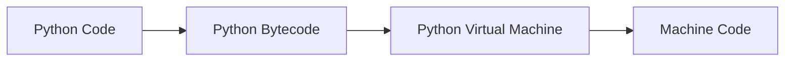

## Khóa học Python toàn diện cho người mới bắt đầu

### Giới thiệu về Python

Python là ngôn ngữ lập trình phát triển nhanh nhất và phổ biến nhất thế giới, không chỉ trong cộng đồng lập trình viên mà còn với các chuyên gia toán học, phân tích dữ liệu, kế toán, kỹ sư mạng và thậm chí cả trẻ em.[^1]

#### Tại sao nên học Python?

- **Đơn giản và mạnh mẽ**: Giải quyết vấn đề phức tạp với ít dòng code hơn nhiều ngôn ngữ khác[^1]
- **Đa năng**: Có thể dùng cho phân tích dữ liệu (data analysis), trí tuệ nhân tạo (AI), học máy (machine learning), viết script tự động hóa (automation scripts), xây dựng ứng dụng web/mobile/desktop, kiểm thử phần mềm (software testing)[^1]
- **Thu nhập cao**: Mức lương trung bình của lập trình viên Python tại Mỹ là hơn \$115,000/năm (tính đến tháng 3/2018)[^1]
- **Ngôn ngữ cấp cao**: Không cần lo về quản lý bộ nhớ (memory management) như trong C++[^1]
- **Đa nền tảng**: Chạy được trên Windows, Mac và Linux[^1]
- **Cộng đồng lớn**: Luôn có người sẵn sàng giúp đỡ khi gặp khó khăn[^1]
- **Hệ sinh thái phong phú**: Nhiều thư viện (libraries), framework và công cụ (tools)[^1]


#### Phiên bản Python

- **Python 2**: Phiên bản cũ, được hỗ trợ đến năm 2020[^1]
- **Python 3**: Phiên bản hiện tại và tương lai của Python (khóa học này sử dụng Python 3.13)[^1]


### Cài đặt Python

#### Các bước cài đặt

- Truy cập python.org và tải phiên bản mới nhất[^1]
- **Quan trọng trên Windows**: Đánh dấu vào "Add python to path" trước khi cài đặt[^1]
- Kiểm tra cài đặt thành công bằng terminal:
    - Windows: `python --version`[^1]
    - Mac/Linux: `python3 --version`[^1]


#### Python Interpreter

Python interpreter là chương trình thực thi code Python. Có thể sử dụng interactive shell để thử nghiệm nhanh:[^1]

```python
>>> 2 + 2
4
>>> 2 > 1
True
>>> 2 > 5
False
```


### Môi trường phát triển

#### VS Code và Python Extension

Khóa học sử dụng VS Code (Visual Studio Code) kết hợp với Python extension từ Microsoft.[^1]

**Các tính năng chính:**

- **Linting**: Phân tích code để tìm lỗi tiềm ẩn (sử dụng pylint)[^1]
- **Auto-completion**: Gợi ý code tự động[^1]
- **Code formatting**: Định dạng code tự động (sử dụng autopep8)[^1]
- **Debugging**: Tìm và sửa lỗi[^1]
- **Code snippets**: Các đoạn code có thể tái sử dụng[^1]


#### PEP 8 Style Guide

[[PEP 8]] là tài liệu hướng dẫn về phong cách code Python (style guide), giúp code nhất quán và dễ đọc.[^1]

**Quy tắc cơ bản:**

- Sử dụng 4 dấu cách (spaces) cho indentation[^1]
- Thêm dấu cách xung quanh toán tử gán (assignment operator)[^1]
- Tên biến sử dụng chữ thường và dấu gạch dưới[^1]

**Cấu hình format on save:**

- Mở Settings trong VS Code
- Tìm "format on save" và bật tùy chọn này[^1]


### Biến và kiểu dữ liệu nguyên thủy

#### Biến (Variables)

Biến được sử dụng để lưu trữ dữ liệu trong bộ nhớ máy tính.[^1]

```python
students_count = 1000
rating = 4.99
is_published = True
course_name = "Python Programming"
```

**Best practices cho đặt tên biến:**

- Sử dụng tên có ý nghĩa và mô tả rõ ràng[^1]
- Dùng chữ thường (lowercase)[^1]
- Dùng dấu gạch dưới (_) để ngăn cách các từ[^1]
- Thêm khoảng trắng xung quanh dấu bằng[^1]


#### Các kiểu dữ liệu nguyên thủy (Primitive Types)

- **Integer**: Số nguyên (ví dụ: 1000)[^1]
- **Float**: Số thực có dấu phẩy động (ví dụ: 4.99)[^1]
- **Boolean**: Giá trị True hoặc False (phân biệt chữ hoa/thường)[^1]
- **String**: Chuỗi ký tự, được đặt trong dấu ngoặc kép hoặc đơn[^1]


### Làm việc với Strings

#### Định dạng chuỗi

```python
# Chuỗi cơ bản
course = "Python Programming"

# Chuỗi nhiều dòng với triple quotes
message = """Hi John
This is Mosh
Blah blah blah"""
```


#### Các hàm và phương thức String hữu ích

```python
# Độ dài chuỗi
len(course)  # 18

# Truy cập ký tự
course[^0]    # 'P' (ký tự đầu tiên)
course[-1]   # 'g' (ký tự cuối cùng)

# Slicing (cắt chuỗi)
course[0:3]  # 'Pyt'
course[:3]   # 'Pyt' (từ đầu đến index 3)
course[0:]   # Toàn bộ chuỗi
course[:]    # Bản sao của chuỗi gốc
```


#### Escape Sequences

```python
# Escape characters với backslash
course = "Python \"Programming\""  # Python "Programming"
path = "C:\\Users\\Mosh"           # C:\Users\Mosh
message = "First\nSecond"          # Xuống dòng
```


#### Formatted Strings

```python
first = "Mosh"
last = "Hamedani"

# Cách cũ: Concatenation
full = first + " " + last

# Cách mới: F-strings
full = f"{first} {last}"  # Mosh Hamedani
full = f"{len(first)} {2 + 2}"  # 4 4
```


#### String Methods

```python
course = "  Python Programming  "

# Chuyển đổi
course.upper()    # IN HOA
course.lower()    # in thường
course.title()    # Viết Hoa Chữ Đầu

# Xóa khoảng trắng
course.strip()    # Xóa 2 đầu
course.lstrip()   # Xóa bên trái
course.rstrip()   # Xóa bên phải

# Tìm kiếm
course.find("Pro")     # Trả về index (9)
course.find("Swift")   # Không tìm thấy (-1)

# Thay thế
course.replace("P", "J")  # Jython Jrogramming

# Kiểm tra tồn tại
"Pro" in course      # True
"Swift" not in course # True
```


### Làm việc với Numbers

#### Các phép toán số học

```python
# Phép toán cơ bản
10 + 3   # 13 (cộng)
10 - 3   # 7 (trừ)
10 * 3   # 30 (nhân)
10 / 3   # 3.333... (chia)
10 // 3  # 3 (chia lấy phần nguyên)
10 % 3   # 1 (chia lấy phần dư - modulus)
10 ** 3  # 1000 (lũy thừa)

# Augmented assignment operator
x = 10
x += 3   # Tương đương x = x + 3
```


#### Các hàm số học

```python
# Built-in functions
round(2.9)    # 3
abs(-2.9)     # 2.9

# Math module
import math
math.ceil(2.2)   # 3 (làm tròn lên)
```


### Type Conversion

Python cung cấp các hàm để chuyển đổi kiểu dữ liệu (type conversion):[^1]

```python
# Input từ người dùng (luôn trả về string)
x = input("x: ")

# Chuyển đổi kiểu
int(x)     # String -> Integer
float(x)   # String -> Float
bool(x)    # String -> Boolean
str(x)     # Integer -> String
```

**Falsy values trong Python** (các giá trị được coi là False):

- Empty string: `""`
- Số 0: `0`
- None object: `None`

Tất cả giá trị khác đều là truthy (được coi là True).[^1]

### Toán tử so sánh (Comparison Operators)

```python
# So sánh số
10 > 3      # True (lớn hơn)
10 >= 3     # True (lớn hơn hoặc bằng)
10 < 20     # True (nhỏ hơn)
10 <= 20    # True (nhỏ hơn hoặc bằng)
10 == 10    # True (bằng)
10 != 10    # False (không bằng)

# So sánh string
"bag" > "apple"    # True (so sánh theo thứ tự alphabet)
"bag" == "BAG"     # False (phân biệt chữ hoa/thường)
```


### Câu lệnh điều kiện (Conditional Statements)

#### If Statement

```python
temperature = 35

if temperature > 30:
    print("It's warm")
    print("Drink water")
elif temperature > 20:
    print("It's nice")
else:
    print("It's cold")
print("Done")  # Luôn được thực thi
```

**Lưu ý quan trọng về indentation:**

- Sử dụng 4 dấu cách để thụt đầu dòng[^1]
- Code được thụt đầu dòng thuộc về block của if/elif/else[^1]


#### Ternary Operator

```python
# Cách viết ngắn gọn
age = 22
message = "Eligible" if age >= 18 else "Not eligible"
```


### Toán tử logic (Logical Operators)

```python
# AND operator - cả hai điều kiện phải True
high_income = True
good_credit = True
if high_income and good_credit:
    print("Eligible")

# OR operator - ít nhất một điều kiện True
if high_income or good_credit:
    print("Eligible")

# NOT operator - đảo ngược Boolean
student = False
if not student:
    print("Eligible")

# Kết hợp các operator
if (high_income or good_credit) and not student:
    print("Eligible")
```

**Short circuit evaluation**: Python dừng đánh giá biểu thức logic ngay khi có thể xác định kết quả.[^1]

#### Chaining Comparison Operators

```python
# Cách viết thông thường
age = 22
if age >= 18 and age < 65:
    print("Eligible")

# Cách viết ngắn gọn (giống toán học)
if 18 <= age < 65:
    print("Eligible")
```


### Vòng lặp (Loops)

#### For Loop

For loop được dùng để lặp qua các đối tượng iterable (có thể lặp).[^1]

```python
# Lặp với range
for number in range(1, 4):  # 1, 2, 3 (không bao gồm 4)
    print("Attempt", number)

# Range với step
for number in range(1, 10, 2):  # 1, 3, 5, 7, 9
    print(number)

# Lặp qua string
for char in "Python":
    print(char)

# Lặp qua list
for name in ["Mosh", "John", "Sarah"]:
    print(name)
```


#### For...Else Statement

```python
successful = False
for number in range(1, 4):
    print("Attempt", number)
    if successful:
        print("Successful")
        break
else:
    print("Attempted 3 times and failed")
```

Khối `else` chỉ thực thi nếu loop hoàn thành mà không bị `break`.[^1]

#### Nested Loops

```python
for x in range(5):
    for y in range(3):
        print(f"({x}, {y})")
# Output: (0,0), (0,1), (0,2), (1,0), (1,1), (1,2), ...
```


#### While Loop

While loop lặp lại khi điều kiện còn đúng.[^1]

```python
# Ví dụ cơ bản
number = 100
while number > 0:
    print(number)
    number //= 2  # Chia 2 mỗi lần

# Ví dụ thực tế: Command prompt
command = ""
while command != "quit":
    command = input("> ")
    print("Echo", command)

# Infinite loop với break
while True:
    command = input("> ")
    if command.lower() == "quit":
        break
    print("Echo", command)
```


### Functions (Hàm)

#### Định nghĩa Function

```python
# Function thực hiện task
def greet():
    print("Hi there")
    print("Welcome aboard")

# Gọi function
greet()
```


#### Parameters và Arguments

```python
# Function với parameters
def greet(first_name, last_name):
    print(f"Hi {first_name} {last_name}")

# Arguments khi gọi function
greet("Mosh", "Hamedani")  # Positional arguments
greet(last_name="Smith", first_name="John")  # Keyword arguments
```

**Thuật ngữ quan trọng:**

- **Parameter**: Biến đầu vào khi định nghĩa function[^1]
- **Argument**: Giá trị thực tế khi gọi function[^1]


#### Return Values

```python
# Function trả về giá trị
def get_greeting(name):
    return f"Hi {name}"

# Sử dụng giá trị trả về
message = get_greeting("Mosh")
print(message)

# Function không có return mặc định trả về None
def greet(name):
    print(f"Hi {name}")
    # Implicit return None

result = greet("Mosh")  # result = None
```


#### Default Parameters

```python
# Optional parameter với giá trị mặc định
def increment(number, by=1):
    return number + by

# Gọi với hoặc không có argument thứ 2
print(increment(2))      # 3
print(increment(2, 5))   # 7
```

**Quy tắc**: Tất cả optional parameters phải đứng sau required parameters.[^1]

#### Variable Arguments (*args)

```python
# Function nhận số lượng arguments bất kỳ
def multiply(*numbers):
    total = 1
    for number in numbers:
        total *= number
    return total

# Gọi với số lượng arguments khác nhau
print(multiply(2, 3, 4, 5))  # 120
```

Dấu `*` đóng gói tất cả arguments vào một tuple.[^1]

### Các khái niệm quan trọng khác

#### Python Implementations

- **CPython**: Implementation mặc định, viết bằng C[^1]
- **Jython**: Viết bằng Java, cho phép tái sử dụng Java code[^1]
- **IronPython**: Viết bằng C\#, cho phép tái sử dụng C\# code[^1]
- **PyPy**: Viết bằng subset của Python[^1]


#### Python Execution Process



CPython thực thi code Python qua hai bước:[^1]

1. Biên dịch Python code thành Python bytecode
2. Python Virtual Machine chuyển bytecode thành machine code và thực thi

#### Iterable Objects

Iterable objects là các đối tượng có thể lặp qua trong for loop:[^1]

- Range objects
- Strings
- Lists
- Custom objects (học sau)

***

**Liên kết:** [[Python]], [[Variables]], [[Functions]], [[Loops]], [[Conditional Statements]], [[Strings]], [[Data Types]], [[PEP 8]], [[Type Conversion]], [[Operators]], [[CPython]], [[Iterable]]

<div align="center">⁂</div>

[^1]: paste.txt

