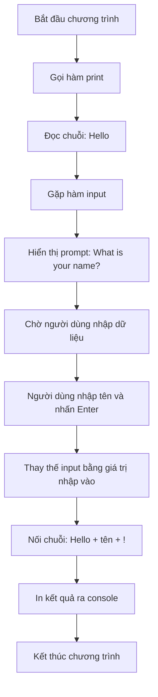

### Hàm Input() - Nhận Dữ Liệu Đầu Vào

**Hàm input()** cho phép chương trình nhận dữ liệu từ người dùng thông qua console.

**Cú pháp cơ bản:**

```python
input("What is your name? ")
```

**Cấu trúc:**

- Từ khóa `input` viết thường
- Dấu ngoặc đơn `()`
- Bên trong ngoặc đơn là **prompt** (câu nhắc) cho người dùng

**Cách hoạt động:**

- Khi chạy code, prompt sẽ hiển thị trong console
- Chương trình **tạm dừng** và chờ người dùng nhập dữ liệu
- Nút Stop sẽ được bật sáng, nút Play chuyển thành biểu tượng Rerun
- Sau khi người dùng nhập và nhấn Enter, chương trình tiếp tục thực thi
- Thông báo "Process finished with exit code 0" mới xuất hiện


### Kết Hợp Input() với Print()

Bạn có thể đặt hàm `input()` bên trong hàm `print()` để xử lý và hiển thị dữ liệu người dùng nhập vào.

**Ví dụ cơ bản:**

```python
print("Hello " + input("What is your name? "))
```

**Cách thức hoạt động:**

1. Hàm `input()` chạy trước, hiển thị prompt và chờ người dùng nhập tên
2. Giá trị người dùng nhập **thay thế** toàn bộ hàm `input()`
3. Chuỗi "Hello " được nối với tên người dùng
4. Hàm `print()` in ra kết quả cuối cùng

**Ví dụ thực tế:**

```python
# Người dùng nhập: Angela
print("Hello " + input("What is your name? "))
# Kết quả: Hello Angela
```


### Nối Chuỗi Phức Tạp với Input()

Bạn có thể thêm nhiều phần tử vào chuỗi kết quả bằng cách sử dụng toán tử `+`.

**Ví dụ - thêm dấu chấm than:**

```python
print("Hello " + input("What is your name? ") + "!")
```

**Phân tích:**

- `"Hello "` - Chuỗi đầu tiên
- `input("What is your name? ")` - Nhận input từ người dùng
- `"!"` - Chuỗi cuối cùng

**Kết quả khi nhập "Angela":** `Hello Angela!`

### Hiểu Cách Code Được Thực Thi - Công Cụ Thonny

**Thonny** là một IDE Python miễn phí giúp debug code theo từng bước (step-by-step debugging).

**Tải về:** [https://thonny.org](https://thonny.org) (có sẵn cho Windows, Mac, Linux)

**Cách sử dụng Thonny:**

1. Mở Thonny và paste đoạn code cần phân tích
2. Nhấn biểu tượng **Debug**
3. Nhấn nút **"Step Into"** để xem từng bước thực thi

**Ví dụ debug với Thonny:**

```python
print("Hello " + input("What is your name? ") + "!")
```

**Các bước thực thi:**

1. Máy tính nhận diện hàm `print()`
2. Kiểm tra nội dung bên trong ngoặc đơn
3. Đọc chuỗi `"Hello "`
4. Thực thi hàm `input()`, hiển thị prompt
5. Chờ người dùng nhập dữ liệu
6. Thay thế hàm `input()` bằng giá trị người dùng nhập
7. Nối tất cả các chuỗi lại: `"Hello " + "Angela" + "!"`
8. In kết quả cuối cùng: `Hello Angela!`

### Comment (Chú Thích) trong Python

**Comment** là dòng văn bản mà máy tính hoàn toàn bỏ qua khi chạy code. Dùng để ghi chú, giải thích code.

**Cú pháp:**

```python
# Đây là một comment - máy tính sẽ bỏ qua dòng này
print("Hello World")  # Comment cũng có thể đặt cuối dòng
```

**Tạo comment bằng phím tắt:**

- **Mac:** Command + /
- **Windows/Linux:** Ctrl + /

**Cách hoạt động:**

- Đặt con trỏ trên dòng code cần comment
- Hoặc bôi đen nhiều dòng code
- Nhấn tổ hợp phím → Code biến thành comment (và ngược lại)

**Lợi ích của Comment:**

- Giải thích ý nghĩa của đoạn code
- Ghi chú các khái niệm mới học
- Giúp bản thân hiểu lại code sau này
- Tạm vô hiệu hóa code mà không cần xóa

**Thực hành tốt:**

```python
# Hỏi tên người dùng và hiển thị lời chào
# input() nhận dữ liệu, print() hiển thị kết quả
print("Hello " + input("What is your name? ") + "!")
```


### Luồng Xử Lý Input-Output



**Giải thích sơ đồ:** Chương trình thực thi tuần tự từ trên xuống. Khi gặp hàm `input()`, chương trình tạm dừng để chờ dữ liệu từ người dùng. Sau khi nhận được input, chương trình tiếp tục xử lý và nối các chuỗi lại, cuối cùng in kết quả ra màn hình.

### Ghi Chú Thêm

**Hiện tượng khi chạy input():**

- Nút Stop được bật sáng (chương trình đang chạy)
- Nút Play chuyển thành Rerun
- Chưa có thông báo "Process finished" (chương trình chưa kết thúc)
- Cursor nhấp nháy trong console (sẵn sàng nhận input)

**Lưu ý quan trọng:** Hàm `input()` luôn trả về dữ liệu dưới dạng **string** (chuỗi ký tự), dù người dùng nhập số hay chữ.

***

**Liên kết:** [[Input Function]], [[Print Function]], [[String Concatenation]], [[Thonny]], [[Comment]], [[Debugging]], [[Step-by-Step Execution]], [[User Input]], [[Console Output]], [[IDE]]

