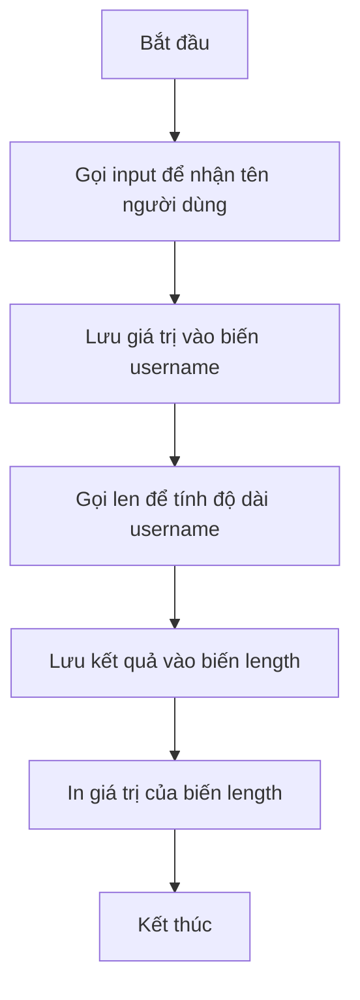

### Khái Niệm Biến

**Biến (Variable)** là tên gắn với một giá trị dữ liệu, giúp lưu trữ và tái sử dụng dữ liệu trong chương trình. Nếu không có biến, dữ liệu sẽ "biến mất" sau khi được xử lý và không thể tham chiếu lại.

**Tương tự thực tế:** Giống như danh bạ điện thoại - nếu chỉ ghi số điện thoại mà không có tên, bạn sẽ không biết số đó của ai. Biến chính là "tên" gắn với "số điện thoại" (dữ liệu).

**Cú pháp:**

```python
name = input("What is your name? ")
```

**Giải thích:**

- `name` là tên biến
- `=` là toán tử gán (assignment operator)
- Giá trị bên phải dấu `=` được gán cho biến bên trái


### Tạo và Sử Dụng Biến

**Ví dụ cơ bản:**

```python
name = "Jack"
print(name)  # In ra: Jack
```

**Lưu trữ input từ người dùng:**

```python
name = input("What is your name? ")
print(name)  # In ra tên người dùng vừa nhập
```


### Biến Có Thể Thay Đổi Giá Trị

Như tên gọi "variable" (có thể thay đổi), giá trị của biến có thể được gán lại trong quá trình chạy chương trình.

**Ví dụ:**

```python
name = "Jack"
print(name)     # In ra: Jack

name = "Angela"
print(name)     # In ra: Angela
```

**Giải thích:** Dù cùng in biến `name`, nhưng giá trị của biến đã thay đổi giữa hai lần print, nên kết quả khác nhau.

### Hàm len() - Đo Độ Dài Chuỗi

**Hàm len()** (length - độ dài) là hàm tích hợp sẵn trong Python, dùng để đếm số ký tự trong một chuỗi.

**Cú pháp:**

```python
len("Hello world!")  # Kết quả: 12
```

**Kết hợp với input():**

```python
print(len(input("What is your name? ")))
```

**Luồng thực thi:**

1. Hàm `input()` nhận tên từ người dùng
2. Hàm `len()` tính số ký tự của tên đó
3. Hàm `print()` hiển thị kết quả

**Ví dụ:** Nếu nhập "Angela" → Kết quả: 6

### Tìm Kiếm Tài Liệu và Tra Cứu

**Kỹ năng quan trọng:** Lập trình viên không thể nhớ hết mọi hàm. Biết cách tìm kiếm thông tin là kỹ năng thiết yếu.

**Cách tìm kiếm hiệu quả:**

```
how to find the length of a string Python
```

**Các nguồn tài liệu đáng tin cậy:**

- **W3Schools:** Tài liệu Python dễ hiểu, nhiều ví dụ
- **StackOverflow:** Diễn đàn Q\&A của lập trình viên toàn cầu

**Lời khuyên:** Não bộ dùng để suy nghĩ, không phải để lưu trữ. Tìm kiếm thông tin khi cần, đừng cố gằng học thuộc lòng mọi thứ.

### Sử Dụng Biến để Chia Nhỏ Code

Biến giúp chia code phức tạp thành các bước nhỏ, dễ hiểu hơn.

**Code gộp một dòng:**

```python
print(len(input("What is your name? ")))
```

**Code chia nhỏ bằng biến:**

```python
username = input("What is your name? ")
length = len(username)
print(length)
```

**So sánh:**


| Cách viết | Ưu điểm | Nhược điểm |
| :-- | :-- | :-- |
| Một dòng | Ngắn gọn | Khó đọc, khó debug |
| Nhiều dòng với biến | Dễ đọc, dễ hiểu, dễ bảo trì | Dài hơn |

### Tại Sao Cần Sử Dụng Biến?

**Lý do 1 - Tái sử dụng dữ liệu:**

```python
name = input("What is your name? ")
print("Hello " + name)
print("Welcome, " + name)
print("Goodbye, " + name)
```

Nếu không có biến, bạn phải gọi `input()` ba lần, gây phiền toái cho người dùng.

**Lý do 2 - Code dễ đọc (Readability):**

Biến có tên mô tả giúp code "tự giải thích" (self-documenting):

```python
username = input("What is your name? ")  # Rõ ràng: lưu tên người dùng
length = len(username)                    # Rõ ràng: tính độ dài tên
print(length)                              # Rõ ràng: in độ dài
```

**Lý do 3 - Dễ debug và bảo trì:**

Khi code phức tạp, việc chia nhỏ thành nhiều biến giúp dễ dàng tìm lỗi và sửa đổi.

### Quy Tắc Đặt Tên Biến

**Quy tắc bắt buộc:**

- Chỉ dùng chữ cái, số và dấu gạch dưới `_`
- Không bắt đầu bằng số
- Phân biệt chữ hoa/thường (`name` khác `Name`)
- Không dùng từ khóa của Python (`print`, `input`, `len`...)

**Thực hành tốt:**

- Đặt tên có ý nghĩa: `username` thay vì `x`
- Dùng chữ thường và gạch dưới: `user_name` (snake_case)
- Tránh tên quá ngắn hoặc quá dài


### Luồng Xử Lý với Biến



**Giải thích sơ đồ:** Chương trình lưu trữ dữ liệu vào các biến ở từng bước. Biến `username` lưu tên người dùng, biến `length` lưu độ dài của tên. Điều này giúp code có cấu trúc rõ ràng và dễ theo dõi luồng xử lý.

### Thực Hành

**Bài tập 1:** Viết code một dòng để nhận tên từ người dùng và in độ dài của tên đó.

**Bài tập 2:** Viết lại code trên bằng cách sử dụng hai biến: `username` và `length`.

**Bài tập 3:** Tạo biến lưu số điện thoại, sau đó thay đổi giá trị biến và in ra.

```python
# Ví dụ bài tập 3
phone = "0123456789"
print(phone)  # In số cũ

phone = "0987654321"
print(phone)  # In số mới
```


### Ghi Chú Thêm

- Biến là nền tảng quan trọng trong lập trình, dù ban đầu có vẻ đơn giản
- Khi code phức tạp hơn, biến trở nên không thể thiếu
- Sử dụng biến giúp code **modular** (chia nhỏ thành các module)
- Đừng lo lắng nếu chưa thấy hết lợi ích của biến - sẽ rõ ràng dần qua các bài học tiếp theo

***

**Liên kết:** [[Variables]], [[Assignment Operator]], [[len Function]], [[Input Function]], [[Print Function]], [[W3Schools]], [[StackOverflow]], [[Python Documentation]], [[Code Readability]], [[Snake Case]], [[Variable Naming]]

