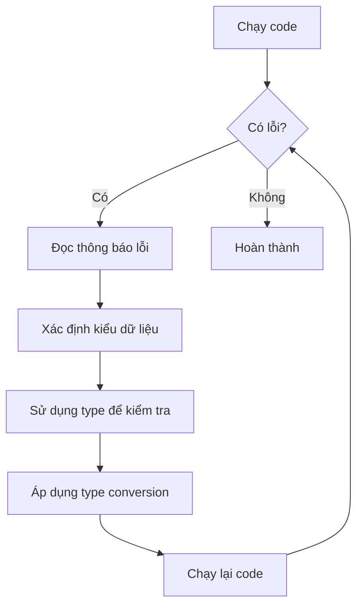

## 

### Vấn Đề TypeError với len()

Khi cố gắng sử dụng hàm `len()` với số thay vì chuỗi, chương trình sẽ báo lỗi:

```python
print(len(12345))  # TypeError!
```

**Giải thích bằng ẩn dụ:** Hàm (function) giống như một cỗ máy trong nhà máy. Ví dụ máy chế biến khoai tây thành khoai chiên - nó nhận khoai tây, rửa, gọt vỏ, cắt, chiên và trả ra khoai chiên. Nếu bạn cho đá vào máy này, nó sẽ báo lỗi vì không xử lý được!

Tương tự, `len()` chỉ chấp nhận các kiểu dữ liệu cụ thể (như string), không phải integer.

### Cách Kiểm Tra Kiểu Dữ Liệu Được Chấp Nhận

**Trong PyCharm:**

- Di chuột qua tên hàm để xem định nghĩa
- Kiểm tra kiểu dữ liệu mà hàm yêu cầu
- Xem cảnh báo màu vàng khi dùng sai kiểu

**Tra cứu documentation:**

Theo tài liệu chính thức Python (docs.python.org), hàm `len()` chấp nhận:

- Sequence: string, bytes, tuple, list, range
- Collection: dictionary, set, frozen set

Không có integer trong danh sách này!

**Giải pháp:** Thay đổi sang kiểu dữ liệu được chấp nhận:

```python
print(len("Hello"))  # Hoạt động bình thường
```


### Hàm type() - Kiểm Tra Kiểu Dữ Liệu

Sử dụng hàm `type()` để xác định kiểu dữ liệu của bất kỳ giá trị nào:

```python
print(type("Hello"))      # <class 'str'>
print(type(123))          # <class 'int'>
print(type(3.14))         # <class 'float'>
print(type(True))         # <class 'bool'>
```

Hàm `type()` có thể nhận bất kỳ kiểu dữ liệu nào và trả về thông tin về kiểu của nó. Đây được gọi là **type checking** (kiểm tra kiểu).

### Type Conversion - Chuyển Đổi Kiểu Dữ Liệu

Còn được gọi là **type casting** (ép kiểu), cho phép chuyển đổi dữ liệu từ kiểu này sang kiểu khác.

**Các hàm chuyển đổi cơ bản:**

```python
# Chuyển sang integer
int("123")        # Kết quả: 123 (số nguyên)

# Chuyển sang float  
float("3.14")     # Kết quả: 3.14 (số thập phân)

# Chuyển sang string
str(123)          # Kết quả: "123" (chuỗi)

# Chuyển sang boolean
bool(1)           # Kết quả: True
```

**Ví dụ thực tế - Phép cộng:**

```python
# Trước khi chuyển đổi (nối chuỗi)
print("123" + "456")  # Kết quả: 123456

# Sau khi chuyển đổi (phép cộng thực sự)
print(int("123") + int("456"))  # Kết quả: 579
```


### Lỗi Khi Chuyển Đổi Không Hợp Lệ

Không phải mọi chuyển đổi đều khả thi:

```python
int("ABC")  # ValueError! 
```

Không thể chuyển chữ cái thành số vì không có ý nghĩa logic. Python sẽ báo `ValueError` (lỗi giá trị không hợp lệ).

**Lưu ý quan trọng:** Luôn đảm bảo dữ liệu có thể chuyển đổi được trước khi thực hiện type casting.

### Bài Tập Thực Hành: Sửa Lỗi TypeError

**Đề bài:** Sửa đoạn code sau để chạy không lỗi:

```python
print("Number of letters in your name: " + len(input("Enter your name: ")))
# TypeError khi chạy!
```

**Phân tích lỗi:**

```python
# Tách thành các bước để dễ hiểu
name_of_the_user = input("Enter your name: ")
length_of_name = len(name_of_the_user)

# Kiểm tra kiểu dữ liệu
print(type("Number of letters in your name: "))  # <class 'str'>
print(type(length_of_name))                       # <class 'int'>
```

**Vấn đề:** Không thể nối (concatenate) chuỗi với số nguyên.

**Giải pháp:** Chuyển đổi integer thành string:

```python
name_of_the_user = input("Enter your name: ")
length_of_name = len(name_of_the_user)
print("Number of letters in your name: " + str(length_of_name))
```


### Quy Trình Xử Lý Lỗi



**Giải thích sơ đồ:** Quy trình debug (gỡ lỗi) bắt đầu từ việc chạy code. Nếu có lỗi, đọc thông báo lỗi để hiểu vấn đề. Sử dụng hàm `type()` để kiểm tra kiểu dữ liệu của các biến. Áp dụng type conversion phù hợp rồi chạy lại. Lặp lại cho đến khi không còn lỗi.

### Các Lỗi Thường Gặp

- **TypeError:** Sử dụng sai kiểu dữ liệu cho một hàm hoặc phép toán
- **ValueError:** Giá trị không hợp lệ khi chuyển đổi kiểu (ví dụ: `int("ABC")`)

**Mẹo:** Thu thập các loại lỗi vào sổ tay để dễ tra cứu sau này. Bạn sẽ gặp chúng thường xuyên trong sự nghiệp lập trình!

### Tóm Tắt Các Kiến Thức

- Mỗi hàm chỉ chấp nhận các kiểu dữ liệu cụ thể
- Sử dụng `type()` để kiểm tra kiểu dữ liệu
- Type conversion cho phép chuyển đổi giữa các kiểu
- Cẩn thận với các chuyển đổi không hợp lệ (ValueError)
- Đọc kỹ thông báo lỗi để hiểu vấn đề

**Liên kết:** [[Type Checking]], [[Type Conversion]], [[Type Casting]], [[TypeError]], [[ValueError]], [[len()]], [[type()]], [[int()]], [[str()]], [[float()]], [[bool()]], [[Data Types]], [[Function]]

***

Bạn muốn tôi làm rõ thêm phần nào, hoặc bổ sung thêm ví dụ thực tế không?

