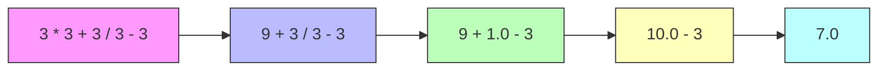

## 

### Các Toán Tử Cơ Bản

Python cung cấp nhiều toán tử để thực hiện phép tính toán học:

**Phép cộng (+):**

```python
print(7 + 3)  # Kết quả: 10
```

**Phép trừ (-):**

```python
print(7 - 3)  # Kết quả: 4
```

**Phép nhân (*):**

```python
print(3 * 2)  # Kết quả: 6
```

Lưu ý: Sử dụng dấu sao `*` thay vì dấu nhân `×`.

**Phép chia (/):**

```python
print(6 / 3)  # Kết quả: 2.0
```

**Đặc điểm quan trọng:** Phép chia luôn trả về số thập phân (float), ngay cả khi kết quả là số nguyên.

```python
print(type(6 / 3))  # <class 'float'>
```

Đây là **implicit typecasting** (ép kiểu ngầm định) - Python tự động chuyển kết quả thành float.

### Phép Chia Lấy Phần Nguyên (//)

Sử dụng hai dấu gạch chéo `//` để chia và loại bỏ phần thập phân:

```python
print(6 // 3)  # Kết quả: 2 (integer)
print(5 // 3)  # Kết quả: 1 (bỏ phần .666...)
```

**Cảnh báo:** Toán tử này loại bỏ tất cả chữ số thập phân, có thể gây mất dữ liệu khi làm việc với số khoa học.

**Khi nào sử dụng:**

- Khi cần kết quả là số nguyên
- Khi không quan tâm đến phần dư


### Phép Lũy Thừa (**)

Sử dụng hai dấu sao `**` để tính lũy thừa:

```python
print(2 ** 2)  # 2² = 4
print(2 ** 3)  # 2³ = 8
print(2 ** 4)  # 2⁴ = 16
```

Tính năng này làm Python trở nên phổ biến trong khoa học dữ liệu và toán học, vì được tối ưu hóa cho xử lý số.

### Thứ Tự Ưu Tiên - PEMDAS

Khi có nhiều phép toán trên cùng một dòng, Python tuân theo quy tắc **PEMDAS**:

1. **P**arentheses (Ngoặc đơn) - `( )`
2. **E**xponents (Lũy thừa) - `**`
3. **M**ultiplication (Phép nhân) - `*`
4. **D**ivision (Phép chia) - `/` hoặc `//`
5. **A**ddition (Phép cộng) - `+`
6. **S**ubtraction (Phép trừ) - `-`

**Quy tắc bổ sung - LR (Left to Right):**

Khi các phép toán có cùng mức ưu tiên (như nhân và chia, hoặc cộng và trừ), thực hiện từ **trái sang phải**.

Có thể nhớ là **PEMDASLR** (PEMDAS + Left to Right).

### Ví Dụ Thực Hành

**Bài toán:**

```python
print(3 * 3 + 3 / 3 - 3)
```

**Dự đoán kết quả trước khi chạy!**

**Phân tích từng bước:**



**Giải thích sơ đồ:** Quá trình tính toán diễn ra theo thứ tự ưu tiên PEMDAS. Bước 1: Nhân `3 * 3 = 9` (ưu tiên cao, bên trái). Bước 2: Chia `3 / 3 = 1.0` (ưu tiên cao, tiếp theo). Bước 3: Cộng `9 + 1.0 = 10.0` (ưu tiên thấp hơn, từ trái). Bước 4: Trừ `10.0 - 3 = 7.0` (cuối cùng).

**Thứ tự thực hiện:**

1. `3 * 3` = 9 (nhân - ưu tiên cao, bên trái nhất)
2. `3 / 3` = 1.0 (chia - cùng mức với nhân, tiếp theo từ trái)
3. `9 + 1.0` = 10.0 (cộng - ưu tiên thấp hơn)
4. `10.0 - 3` = 7.0 (trừ - cuối cùng)

**Kết quả:** 7.0

### Debug Bằng Thonny

Để hiểu rõ hơn thứ tự thực thi, sử dụng chức năng debug trong Thonny:

1. Dán code vào Thonny
2. Nhấn biểu tượng debug (con bọ)
3. Nhấn F7 hoặc "Step into" nhiều lần
4. Quan sát từng bước tính toán

### Thay Đổi Thứ Tự Bằng Ngoặc Đơn

**Thử thách:** Làm thế nào để kết quả thành 3 thay vì 7?

**Giải pháp:** Sử dụng ngoặc đơn để tăng ưu tiên:

```python
print(3 * (3 + 3) / 3 - 3)
```

**Phân tích:**

1. `(3 + 3)` = 6 (trong ngoặc - ưu tiên cao nhất)
2. `3 * 6` = 18 (nhân)
3. `18 / 3` = 6.0 (chia)
4. `6.0 - 3` = 3.0 (trừ)

**Kết quả:** 3.0

### Bảng Tóm Tắt Toán Tử

| Toán tử | Ý nghĩa | Ví dụ | Kết quả | Kiểu trả về |
| :-- | :-- | :-- | :-- | :-- |
| `+` | Cộng | `7 + 3` | 10 | int/float |
| `-` | Trừ | `7 - 3` | 4 | int/float |
| `*` | Nhân | `3 * 2` | 6 | int/float |
| `/` | Chia | `6 / 3` | 2.0 | float |
| `//` | Chia lấy nguyên | `5 // 3` | 1 | int |
| `**` | Lũy thừa | `2 ** 3` | 8 | int/float |

### Mẹo Ghi Nhớ

**PEMDAS-LR:**

- **P**arentheses first (Ngoặc trước)
- **E**xponents next (Lũy thừa tiếp)
- **M**ultiplication/**D**ivision equal (Nhân/Chia ngang nhau)
- **A**ddition/**S**ubtraction equal (Cộng/Trừ ngang nhau)
- **L**eft to **R**ight for equal priority (Trái sang phải khi cùng mức)

**Nguyên tắc vàng:** Khi không chắc, hãy dùng ngoặc đơn `( )` để làm rõ ý định!

### Lưu Ý Quan Trọng

- Phép chia `/` luôn trả về float, ngay cả khi chia hết
- Phép chia `//` loại bỏ phần thập phân - cẩn thận với dữ liệu khoa học
- Nhân và chia có cùng mức ưu tiên
- Cộng và trừ có cùng mức ưu tiên (thấp hơn nhân/chia)
- Sử dụng ngoặc đơn để kiểm soát thứ tự tính toán

**Liên kết:** [[Mathematical Operators]], [[PEMDAS]], [[Order of Operations]], [[Exponent]], [[Division]], [[Multiplication]], [[Parentheses]], [[Implicit Typecasting]], [[Float]], [[Integer]], [[Debug]], [[Thonny]]

***

Bạn có muốn tôi giải thích thêm về cách debug trong Thonny hoặc thêm ví dụ phức tạp hơn không?

