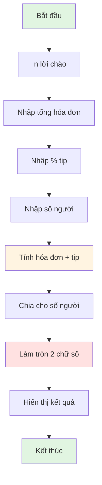

## 

### Mô Tả Dự Án

Xây dựng chương trình tính toán và chia đều hóa đơn bao gồm tiền tip giữa nhiều người.

**Kịch bản sử dụng:**

```
Welcome to the tip calculator!
What was the total bill? $124.56
What percentage tip would you like to give? 10, 12, or 15? 12
How many people to split the bill? 7
Each person should pay: $19.93
```


### Yêu Cầu Chức Năng

- Nhập tổng hóa đơn
- Nhập phần trăm tip (10, 12 hoặc 15%)
- Nhập số người chia bill
- Tính toán và hiển thị số tiền mỗi người trả (làm tròn 2 chữ số thập phân)


### Kiến Thức Cần Áp Dụng

- Input và lưu dữ liệu vào biến
- Chuyển đổi kiểu dữ liệu (Type Conversion)
- Phép toán số học và PEMDAS
- Làm tròn số với `round()`
- F-strings để định dạng output


### Công Thức Tính Toán

**Tính phần trăm:**

Để tính tip x% của số tiền, có nhiều cách:

```python
# Cách 1: Chia cho 100
bill = 150
tip_percent = 12
tip_decimal = tip_percent / 100  # 0.12
tip_amount = bill * tip_decimal  # 18
total = bill + tip_amount  # 168

# Cách 2: Rút gọn (khuyến khích)
total = bill * (1 + tip_percent / 100)  # 168

# Cách 3: Viết thẳng
total = bill * 1.12  # 168
```

**Lưu ý về Floating Point:**

Khi tính `150 * 1.12`, có thể thấy kết quả dạng `168.00000000000003`. Đây là cách Python xử lý số thập phân (floating point arithmetic), không phải lỗi. Sử dụng `round()` để giải quyết.

### Sơ Đồ Luồng Xử Lý



**Giải thích sơ đồ:** Chương trình bắt đầu bằng lời chào, sau đó thu thập 3 thông tin từ người dùng (hóa đơn, tip, số người). Tiếp theo thực hiện các phép tính: tính tổng tiền gồm tip (bước quan trọng - màu vàng), chia cho số người, làm tròn 2 chữ số (bước quan trọng - màu đỏ nhạt), và cuối cùng hiển thị kết quả.

### Giải Pháp Chi Tiết

**Bước 1: Lời chào mừng**

```python
print("Welcome to the tip calculator!")
```

**Bước 2: Thu thập dữ liệu người dùng**

```python
# Nhập tổng hóa đơn (float vì có thể có xu)
bill = float(input("What was the total bill? $"))

# Nhập phần trăm tip (int vì là số nguyên)
tip = int(input("What percentage tip would you like to give? 10, 12, or 15? "))

# Nhập số người (int vì không có 3.5 người)
people = int(input("How many people to split the bill? "))
```

**Lưu ý:**

- Không thêm ký hiệu `%` trong prompt để tránh nhầm lẫn
- Chuyển đổi kiểu ngay khi nhập để dễ xử lý

**Bước 3: Tính toán - Cách chi tiết (dễ hiểu)**

```python
# Chuyển % thành số thập phân
tip_as_percent = tip / 100

# Tính số tiền tip
total_tip_amount = bill * tip_as_percent

# Tính tổng hóa đơn (gốc + tip)
total_bill = bill + total_tip_amount

# Chia cho số người
bill_per_person = total_bill / people

# Làm tròn 2 chữ số thập phân
final_amount = round(bill_per_person, 2)
```

**Bước 3: Tính toán - Cách rút gọn (chuyên nghiệp)**

```python
# Tính tổng và chia luôn
bill_with_tip = bill * (1 + tip / 100)
bill_per_person = bill_with_tip / people
final_amount = round(bill_per_person, 2)
```

**Bước 4: Hiển thị kết quả**

```python
# Cách 1: F-string (khuyến khích)
print(f"Each person should pay: ${final_amount}")

# Cách 2: Concatenation (cũ)
print("Each person should pay: $" + str(final_amount))
```


### Code Hoàn Chỉnh

```python
print("Welcome to the tip calculator!")

# Thu thập input
bill = float(input("What was the total bill? $"))
tip = int(input("What percentage tip would you like to give? 10, 12, or 15? "))
people = int(input("How many people to split the bill? "))

# Tính toán
tip_as_percent = tip / 100
total_tip_amount = bill * tip_as_percent
total_bill = bill + total_tip_amount
bill_per_person = total_bill / people
final_amount = round(bill_per_person, 2)

# Hiển thị kết quả
print(f"Each person should pay: ${final_amount}")
```


### Ví Dụ Test

**Test case 1:**

- Bill: \$150.00
- Tip: 12%
- People: 5
- Kết quả mong đợi: \$33.60

**Tính toán:**

```
Tip: 150 * 0.12 = 18
Total: 150 + 18 = 168
Per person: 168 / 5 = 33.6
Rounded: 33.60
```

**Test case 2:**

- Bill: \$124.56
- Tip: 12%
- People: 7
- Kết quả: \$19.93


### Các Biến Thể Có Thể

**Code ngắn gọn nhất:**

```python
print("Welcome to the tip calculator!")
bill = float(input("What was the total bill? $"))
tip = int(input("What percentage tip would you like to give? 10, 12, or 15? "))
people = int(input("How many people to split the bill? "))
final_amount = round(bill * (1 + tip / 100) / people, 2)
print(f"Each person should pay: ${final_amount}")
```


### Những Sai Lầm Thường Gặp

**Lỗi 1: Quên chuyển đổi kiểu dữ liệu**

```python
bill = input("What was the total bill? $")  # ❌ String!
tip = input("Tip percentage? ")             # ❌ String!
# Không thể tính toán với string
```

**Lỗi 2: Tính toán sai công thức**

```python
# ❌ Sai: Chỉ tính tip, không cộng bill gốc
total = bill * (tip / 100)

# ✅ Đúng: Bill + tip
total = bill * (1 + tip / 100)
```

**Lỗi 3: Quên làm tròn**

```python
# ❌ Kết quả: 33.599999999999994
final = total / people

# ✅ Làm tròn 2 chữ số
final = round(total / people, 2)
```

**Lỗi 4: Concatenation sai kiểu**

```python
# ❌ TypeError
print("Each person pays: $" + final_amount)

# ✅ Chuyển thành string hoặc dùng f-string
print("Each person pays: $" + str(final_amount))
print(f"Each person pays: ${final_amount}")
```


### Kiểm Tra Hiểu Bài

Trả lời các câu hỏi sau để đảm bảo bạn hiểu dự án:

1. Tại sao cần chuyển input thành `float` cho bill?
2. Tại sao dùng `int` cho tip và people?
3. Công thức nào tính đúng bill có 15% tip?
4. Làm thế nào để làm tròn đến 2 chữ số thập phân?
5. F-string khác gì so với concatenation?

### Mở Rộng Thêm (Nâng Cao)

**Thêm validation:**

```python
# Kiểm tra tip có hợp lệ không
if tip not in [10, 12, 15]:
    print("Invalid tip percentage!")
    
# Kiểm tra số người > 0
if people <= 0:
    print("Must have at least 1 person!")
```

**Format số tiền đẹp hơn:**

```python
# Luôn hiển thị 2 chữ số thập phân
print(f"Each person should pay: ${final_amount:.2f}")
# 33.6 sẽ hiển thị 33.60
```


### Tổng Kết Kiến Thức Áp Dụng

Dự án này kết hợp tất cả kiến thức Ngày 2:

- ✅ Input và xử lý dữ liệu người dùng
- ✅ Type conversion (string → int/float)
- ✅ Các phép toán số học cơ bản
- ✅ PEMDAS và thứ tự ưu tiên
- ✅ Hàm `round()` để làm tròn
- ✅ F-strings để format output
- ✅ Biến và assignment operators

**Liên kết:** [[Tip Calculator]], [[Project]], [[Input]], [[Type Conversion]], [[round()]], [[F-Strings]], [[Mathematical Operations]], [[PEMDAS]], [[Float]], [[Integer]], [[User Input]], [[Bill Splitting]], [[Percentage Calculation]]

***

Chúc mừng bạn đã hoàn thành Ngày 2! Bạn có muốn tôi giải thích thêm phần nào hoặc thêm ví dụ nâng cao không?

