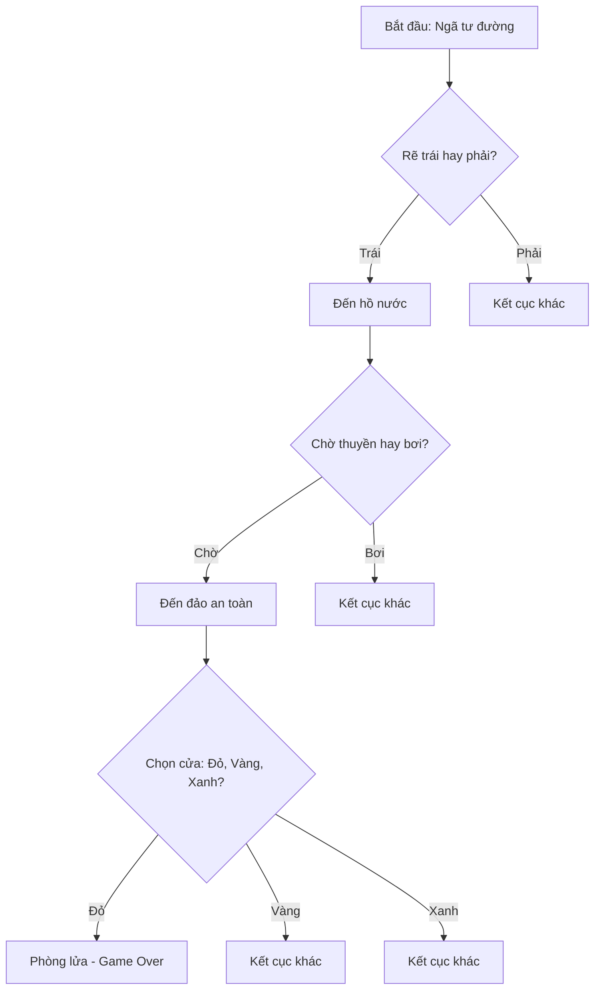

## Câu lệnh điều kiện (Conditional Statements) và Lập trình phân nhánh

Bài học này giới thiệu về các câu lệnh điều kiện trong Python và cách xây dựng một trò chơi phiêu lưu tương tác (choose-your-own-adventure game).

### Nội dung chính

Trong bài học ngày thứ 3, bạn sẽ học về:

- Câu lệnh điều kiện `if / else / elif`
- Toán tử logic (Logical Operators)
- Khối mã (Code Blocks)
- Phạm vi (Scope)
- Không gian tên toàn cục và cục bộ (Global and Local namespacing)

### Dự án thực hành: Trò chơi phiêu lưu

Sau khi hoàn thành bài học, bạn sẽ có đủ kiến thức để xây dựng một trò chơi phiêu lưu tương tác với các đặc điểm sau:

- Người chơi đưa ra quyết định tại các điểm phân nhánh
- Cốt truyện thay đổi dựa trên lựa chọn của người chơi
- Có nhiều kết cục khác nhau

### Ví dụ luồng chơi

Trò chơi bắt đầu với nhiệm vụ tìm kho báu và đưa ra các lựa chọn liên tiếp:

**Lựa chọn 1 - Ngã tư đường:**

- Đi về phía trái hoặc phải
- Nếu chọn trái → Đến hồ nước

**Lựa chọn 2 - Bên hồ:**

- `wait` (chờ thuyền) hoặc `swim` (bơi qua)
- Nếu chọn chờ → Đến đảo an toàn

**Lựa chọn 3 - Trước ngôi nhà:**

- Chọn cửa màu đỏ, vàng hoặc xanh
- Nếu chọn đỏ → "Phòng đầy lửa. Game over."

### Cơ chế hoạt động

Trò chơi sử dụng câu lệnh điều kiện để:

- Kiểm tra lựa chọn của người chơi
- Quyết định nhánh cốt truyện tiếp theo
- Xác định kết cục (thắng/thua)

### Ghi chú thêm

Bạn có thể truy cập và thử chơi game mẫu qua URL được cung cấp trong tài liệu khóa học trước khi bắt đầu học cách xây dựng. Các bài học tiếp theo sẽ hướng dẫn chi tiết từng kỹ năng cần thiết để tạo ra trò chơi này.

**Liên kết:** [[if/else/elif]], [[Logical Operators]], [[Code Blocks]], [[Scope]], [[Global namespace]], [[Local namespace]], [[Conditional Statements]], [[Choose-your-own-adventure game]]

