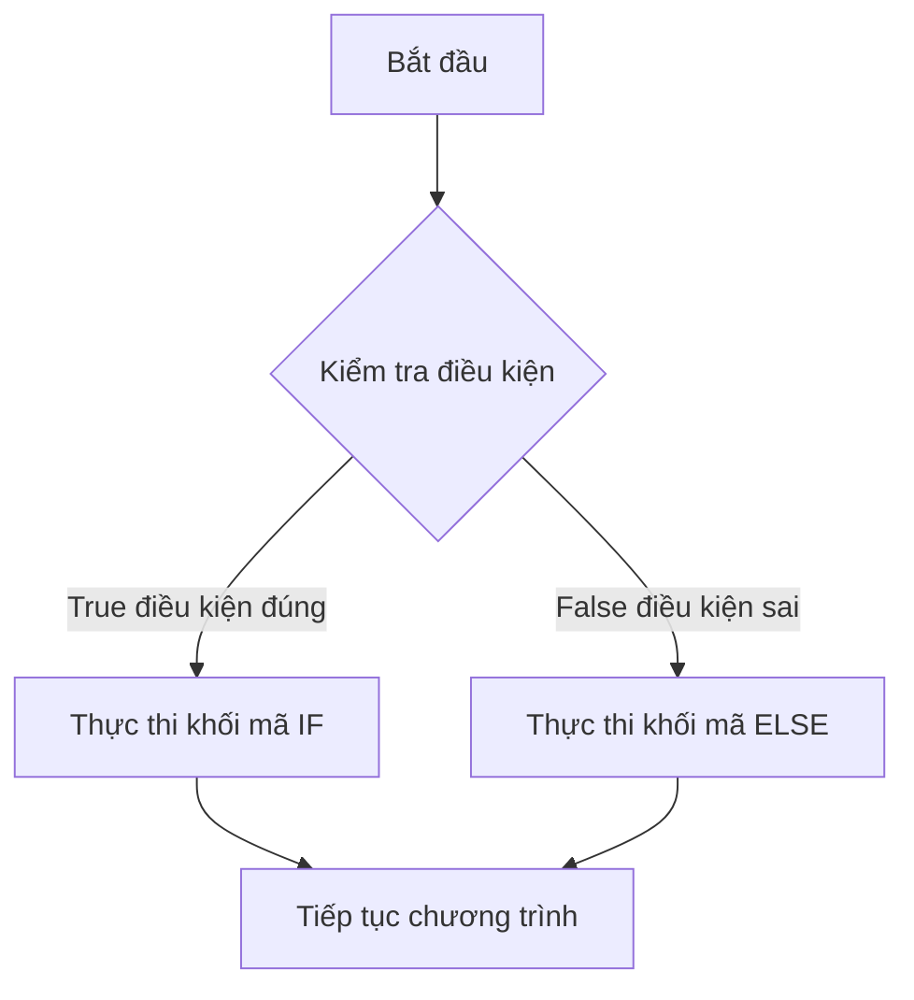

## 

Bài học này giới thiệu câu lệnh điều kiện (conditional statement) `if/else` trong Python thông qua ví dụ thực tế về cơ chế tràn bồn tắm và hệ thống bán vé tàu lượn siêu tốc (roller coaster) .

### Ví dụ thực tế: Cơ chế tràn bồn tắm

Lý do bồn tắm không bao giờ tràn là nhờ lỗ thoát nước dư thừa (overflow) - một thiết kế kỹ thuật thông minh . Khi mực nước vượt quá mức nhất định (ví dụ 80cm), nước sẽ tự động thoát ra, ngăn bồn tràn và gây phiền toái cho hàng xóm tầng dưới .

Cơ chế này có thể biểu diễn bằng câu lệnh điều kiện:

- **Nếu** mực nước > 80cm → Thoát nước
- **Ngược lại** → Tiếp tục đổ nước


### Cú pháp if/else

```python
if điều_kiện:
    # Khối mã thực thi khi điều kiện đúng (True)
    thực_hiện_hành_động_A()
else:
    # Khối mã thực thi khi điều kiện sai (False)
    thực_hiện_hành_động_B()
```

**Các thành phần quan trọng** :

- Từ khóa `if` và `else`
- Điều kiện cần kiểm tra (phải trả về `True` hoặc `False`)
- Dấu hai chấm `:` sau mỗi câu lệnh
- Thụt lề (indentation) để xác định khối mã (code block)


### Sơ đồ luồng thực thi




### Ví dụ minh họa: Bồn tắm

```python
water_level = 50

if water_level > 80:
    print("Thoát nước")  # Ngăn tràn
else:
    print("Tiếp tục đổ nước")  # Đổ đầy bồn
```

Kết quả: "Tiếp tục đổ nước" vì 50 không lớn hơn 80 .

### Dự án thực tế: Hệ thống bán vé tàu lượn siêu tốc

**Yêu cầu**: Chỉ bán vé cho người có chiều cao trên 120cm .

```python
print("Welcome to the roller coaster!")
height = int(input("What is your height in cm? "))

if height >= 120:
    print("You can ride the roller coaster.")
else:
    print("Sorry, you have to grow taller before you can ride.")
```

**Luồng xử lý** :

1. Nhập chiều cao từ người dùng
2. Chuyển đổi chuỗi (string) thành số nguyên (integer)
3. Kiểm tra điều kiện `height >= 120`
4. Thực thi khối mã tương ứng

### Toán tử so sánh (Comparison Operators)

| Toán tử | Tên gọi | Ví dụ | Kết quả (height=120) |
| :-- | :-- | :-- | :-- |
| `>` | Lớn hơn | `height > 120` | `False` |
| `<` | Nhỏ hơn | `height < 120` | `False` |
| `>=` | Lớn hơn hoặc bằng | `height >= 120` | `True` |
| `<=` | Nhỏ hơn hoặc bằng | `height <= 120` | `True` |
| `==` | Bằng | `height == 120` | `True` |
| `!=` | Không bằng | `height != 120` | `False` |

### Sự khác biệt quan trọng: > vs >=

**Trường hợp height = 120cm** :

```python
# Sử dụng > (không bao gồm 120)
if height > 120:  # False
    print("Được phép")  # KHÔNG thực thi
else:
    print("Không được phép")  # Thực thi

# Sử dụng >= (bao gồm 120)
if height >= 120:  # True
    print("Được phép")  # Thực thi
```

Để cho phép người có chiều cao chính xác 120cm lên tàu, phải sử dụng `>=` thay vì `>` .

### Phân biệt = và ==

Đây là điểm gây nhầm lẫn phổ biến với người mới học lập trình :


| Ký hiệu | Chức năng | Ví dụ |
| :-- | :-- | :-- |
| `=` | Gán giá trị (assignment) | `height = 120` - Gán giá trị 120 cho biến height |
| `==` | So sánh bằng (comparison) | `height == 120` - Kiểm tra height có bằng 120 không |

```python
# Gán giá trị
height = 120  # Lưu 120 vào biến height

# So sánh
if height == 120:  # Kiểm tra xem height có bằng 120?
    print("Đúng bằng 120")
```

**Lưu ý**: Điều kiện trong `if` phải là biểu thức trả về `True` hoặc `False` . Biểu thức `height = 120` không phải là điều kiện hợp lệ và sẽ gây lỗi cú pháp.

### Khối mã (Code Block) và Thụt lề (Indentation)

Python sử dụng thụt lề để xác định khối mã - đây là đặc điểm **rất quan trọng** :

```python
if height >= 120:
    # Khối mã IF (indented)
    print("You can ride the roller coaster.")
    print("Have fun!")  # Cũng thuộc khối IF
else:
    # Khối mã ELSE (indented)
    print("Sorry, you have to grow taller.")
```

**Quy tắc thụt lề** :

- `if` và `else` phải cùng mức thụt lề (là một cặp)
- Mã bên trong mỗi khối phải thụt lề vào một cấp
- Trình soạn thảo code thường tự động thụt lề sau dấu `:`


### Lỗi thường gặp

**1. Lỗi IndentationError** :

```python
# SAI - Thiếu thụt lề
if height >= 120:
print("OK")  # Lỗi!

# ĐÚNG
if height >= 120:
    print("OK")
```

**2. Thụt lề sai cho else** :

```python
# SAI - else bị thụt lề
if height >= 120:
    print("OK")
    else:  # Lỗi! else phải cùng cấp với if
        print("Not OK")

# ĐÚNG
if height >= 120:
    print("OK")
else:
    print("Not OK")
```

**3. Thiếu dấu hai chấm**:

```python
# SAI
if height >= 120
    print("OK")

# ĐÚNG
if height >= 120:
    print("OK")
```

**4. Nhầm = với ==**:

```python
# SAI - Gán giá trị thay vì so sánh
if height = 120:  # Lỗi cú pháp
    print("OK")

# ĐÚNG
if height == 120:
    print("OK")
```


### Kết quả chạy thử

**Test case 1**: height = 130cm

```
You can ride the roller coaster.
```

**Test case 2**: height = 90cm

```
Sorry you have to grow taller before you can ride.
```

**Test case 3**: height = 120cm với `>`

```
Sorry you have to grow taller before you can ride.
```

**Test case 4**: height = 120cm với `>=`

```
You can ride the roller coaster.
```


### Tóm tắt

Câu lệnh `if/else` cho phép chương trình phản hồi khác nhau dựa trên điều kiện đầu vào . Bằng cách sử dụng toán tử so sánh, bạn có thể tạo ra các chương trình thông minh phản ứng linh hoạt với nhiều tình huống khác nhau.

**Liên kết:** [[if/else]], [[Comparison Operators]], [[Code Block]], [[Indentation]], [[Boolean]], [[True]], [[False]], [[Conditional Statement]], [[Control Flow]], [[Syntax]], [[Integer]], [[String]]

