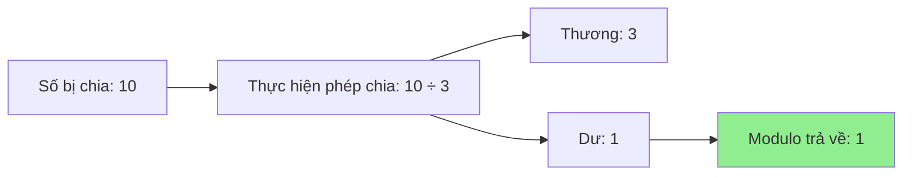

Bài học này giới thiệu toán tử modulo (modulo operator) trong Python, một công cụ quan trọng để tính phần dư sau phép chia và kiểm tra tính chẵn lẻ của số .

### Toán tử là gì?

Toán tử (operator) là ký hiệu trong lập trình có chức năng cụ thể . Tương tự như các toán tử toán học (`+`, `-`, `*`, `/`) và toán tử điều kiện (`>`, `<`, `==`), toán tử modulo cũng thực hiện một phép tính đặc biệt.

### Toán tử Modulo (%)

**Ký hiệu**: `%` (giống dấu phần trăm nhưng khác về chức năng)

**Chức năng**: Tính phần dư sau khi thực hiện phép chia

**Cú pháp**: `số_bị_chia % số_chia` (toán tử hai ngôi - binary operator)

### Cách hoạt động

```python
10 % 5  # Kết quả: 0
```

**Giải thích** :

- `10 / 5 = 2` (chia hết)
- 5 đi vào 10 được 2 lần, không còn dư
- Vậy `10 % 5 = 0` (không có phần dư)

```python
10 % 3  # Kết quả: 1
```

**Giải thích** :

- `10 / 3 = 3.333...` (không chia hết)
- 10 chia cho 3 được 3 dư 1
- Công thức: `10 = 3 × 3 + 1`
- Vậy `10 % 3 = 1` (phần dư là 1)


### Sơ đồ hoạt động Modulo




### Ứng dụng: Kiểm tra số chẵn/lẻ

**Nguyên lý** :

- Số chẵn (even number) chia 2 luôn dư 0
- Số lẻ (odd number) chia 2 luôn dư 1

**Ví dụ minh họa** :


| Số | Phép tính | Kết quả | Kết luận |
| :-- | :-- | :-- | :-- |
| 12 | `12 % 2` | 0 | Chẵn |
| 3 | `3 % 2` | 1 | Lẻ |
| 19 | `19 % 2` | 1 | Lẻ |
| 34 | `34 % 2` | 0 | Chẵn |

### Bài tập thực hành: Chương trình kiểm tra chẵn/lẻ

**Yêu cầu** :

- Nhận số từ người dùng
- Chuyển đổi thành số nguyên (integer)
- Sử dụng câu lệnh `if` và modulo để kiểm tra
- In ra kết quả chẵn hoặc lẻ


### Giải pháp từng bước

**Bước 1: Nhận input và chuyển đổi kiểu dữ liệu**

```python
# Nhận input từ người dùng
number_to_check = int(input("What is the number you want to check? "))
```

**Bước 2: Kiểm tra với modulo**

```python
# Thử nghiệm
print(number_to_check % 2)

# Test:
# 12 → Kết quả: 0 (chẵn)
# 3 → Kết quả: 1 (lẻ)
# 19 → Kết quả: 1 (lẻ)
```

**Bước 3: Sử dụng if/else để kết luận**

```python
number_to_check = int(input("What is the number you want to check? "))

if number_to_check % 2 == 0:
    print("This is an even number.")
else:
    print("This is an odd number.")
```


### Phân tích code

**Điều kiện kiểm tra** :

```python
if number_to_check % 2 == 0:
```

- `number_to_check % 2`: Tính phần dư khi chia cho 2
- `== 0`: So sánh xem phần dư có bằng 0 không
- Nếu `True` → Số chẵn
- Nếu `False` → Số lẻ


### Kết quả chạy thử

**Test case 1**: Nhập `45`

```
What is the number you want to check? 45
This is an odd number.
```

**Test case 2**: Nhập `34`

```
What is the number you want to check? 34
This is an even number.
```


### Các ứng dụng khác của Modulo

**1. Kiểm tra chia hết**:

```python
# Kiểm tra 15 có chia hết cho 3 không
if 15 % 3 == 0:
    print("15 chia hết cho 3")  # True
```

**2. Lấy chữ số cuối**:

```python
number = 12345
last_digit = number % 10  # Kết quả: 5
```

**3. Tạo chu kỳ lặp**:

```python
for i in range(10):
    position = i % 4  # Lặp lại: 0, 1, 2, 3, 0, 1, 2, 3...
```

**4. Kiểm tra năm nhuận**:

```python
year = 2024
if year % 4 == 0:
    print("Có thể là năm nhuận")
```


### Kết hợp kiến thức

Bài tập này kết hợp nhiều khái niệm đã học :

- Hàm `input()` để nhận dữ liệu
- Chuyển đổi kiểu dữ liệu với `int()`
- Toán tử modulo `%`
- Toán tử so sánh `==`
- Câu lệnh điều kiện `if/else`


### Lưu ý quan trọng

**Về quá trình học** :

- Không sao nếu không làm được ngay lần đầu
- Xem giải pháp là một phần của quá trình học
- Quan trọng là hiểu được giải thích và ghi chép lại
- Sau khi xem giải pháp, hãy tự viết lại code để củng cố


### Bảng tổng hợp Modulo

| Phép tính | Thương | Dư | Công thức |
| :-- | :-- | :-- | :-- |
| `10 % 2` | 5 | 0 | 10 = 2 × 5 + 0 |
| `10 % 3` | 3 | 1 | 10 = 3 × 3 + 1 |
| `10 % 4` | 2 | 2 | 10 = 4 × 2 + 2 |
| `15 % 4` | 3 | 3 | 15 = 4 × 3 + 3 |
| `20 % 6` | 3 | 2 | 20 = 6 × 3 + 2 |

### Code mẫu hoàn chỉnh

```python
# Chương trình kiểm tra số chẵn/lẻ
number_to_check = int(input("What is the number you want to check? "))

if number_to_check % 2 == 0:
    print("This is an even number.")
else:
    print("This is an odd number.")
```

**Liên kết:** [[Modulo Operator]], [[Operator]], [[Binary Operator]], [[Even Number]], [[Odd Number]], [[Remainder]], [[Division]], [[if/else]], [[Input]], [[Type Conversion]], [[Integer]], [[Comparison Operators]]

