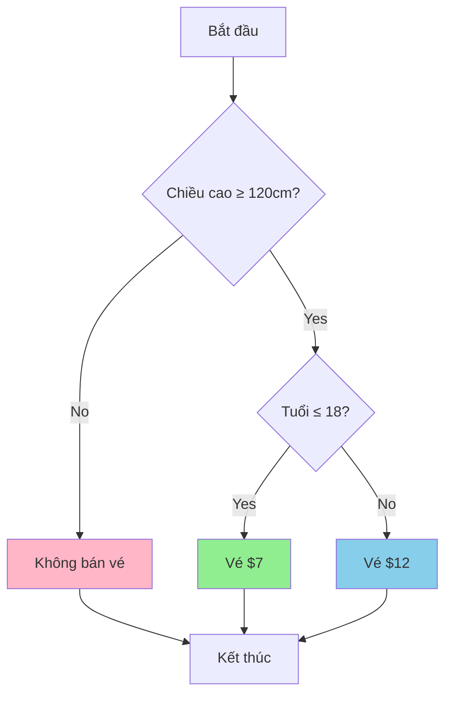
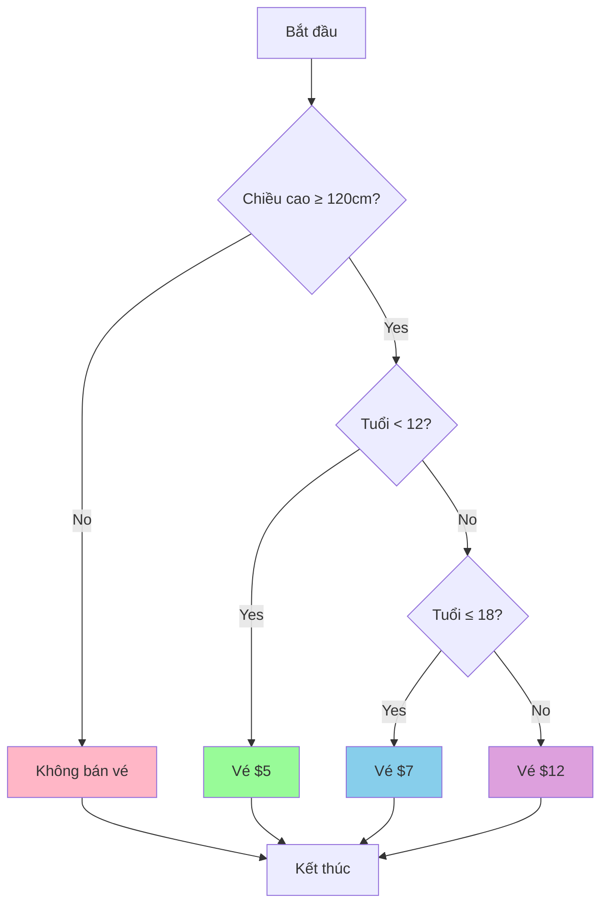

## 

Bài học này mở rộng kiến thức về câu lệnh điều kiện bằng cách giới thiệu nested if/else (câu lệnh lồng nhau) và `elif` (else-if) để xử lý nhiều điều kiện phức tạp trong hệ thống bán vé tàu lượn siêu tốc .

### Vấn đề mở rộng

Ngoài việc kiểm tra chiều cao (≥ 120cm), hệ thống cần kiểm tra thêm độ tuổi để tính giá vé :

- Từ 18 tuổi trở xuống: \$7
- Trên 18 tuổi: \$12


### Nested if/else - Câu lệnh lồng nhau

**Khái niệm**: Đặt một câu lệnh `if/else` bên trong một câu lệnh `if/else` khác .

**Cú pháp**:

```python
if điều_kiện_ngoài:
    # Khối mã cấp 1
    if điều_kiện_bên_trong:
        # Khối mã cấp 2 - Cả 2 điều kiện đều đúng
    else:
        # Khối mã cấp 2 - Điều kiện ngoài đúng, bên trong sai
else:
    # Khối mã cấp 1 - Điều kiện ngoài sai
```


### Sơ đồ logic Nested if/else




### Code mẫu: Nested if/else (2 mức giá)

```python
print("Welcome to the roller coaster!")
height = int(input("What is your height in cm? "))

if height >= 120:
    print("You can ride the roller coaster!")
    age = int(input("What is your age? "))
    
    if age <= 18:
        print("Please pay $7.")
    else:
        print("Please pay $12.")
else:
    print("Sorry, you can't ride the roller coaster.")
```

**Giải thích hoạt động** :

1. Máy tính kiểm tra điều kiện ngoài (`height >= 120`)
2. Nếu sai → Vào khối `else` ngoài → Không bán vé
3. Nếu đúng → Tiếp tục kiểm tra điều kiện bên trong (`age <= 18`)
4. Điều kiện bên trong chỉ được kiểm tra khi điều kiện ngoài đã đúng

### Mở rộng với elif - Xử lý nhiều điều kiện

**Yêu cầu mới từ sếp** :

- Dưới 12 tuổi: \$5
- Từ 12-18 tuổi: \$7
- Trên 18 tuổi: \$12

**Vấn đề**: Có 3 khả năng, không chỉ 2 như `if/else` đơn giản

**Giải pháp**: Sử dụng `elif` (else-if)

### Cú pháp elif

```python
if điều_kiện_1:
    # Thực thi A khi điều kiện 1 đúng
elif điều_kiện_2:
    # Thực thi B khi điều kiện 1 sai, điều kiện 2 đúng
elif điều_kiện_3:
    # Thực thi C khi điều kiện 1, 2 sai, điều kiện 3 đúng
else:
    # Thực thi D khi tất cả điều kiện trên đều sai
```

**Đặc điểm** :

- Có thể dùng nhiều `elif` tùy ý giữa `if` và `else`
- Các điều kiện được kiểm tra tuần tự từ trên xuống
- Chỉ thực thi khối mã đầu tiên có điều kiện đúng
- `else` cuối cùng là tùy chọn


### Sơ đồ luồng với elif




### Code hoàn chỉnh: Nested if với elif (3 mức giá)

```python
print("Welcome to the roller coaster!")
height = int(input("What is your height in cm? "))

if height >= 120:
    print("You can ride the roller coaster!")
    age = int(input("What is your age? "))
    
    if age < 12:
        print("Please pay $5.")
    elif age <= 18:
        print("Please pay $7.")
    else:
        print("Please pay $12.")
else:
    print("Sorry, you can't ride the roller coaster.")
```


### Phân tích logic elif

**Điều kiện 1**: `if age < 12`

- Bắt tất cả người dưới 12 tuổi
- Nếu đúng → \$5, kết thúc kiểm tra

**Điều kiện 2**: `elif age <= 18`

- Chỉ kiểm tra khi điều kiện 1 sai (tức age ≥ 12)
- Bắt người từ 12-18 tuổi
- Nếu đúng → \$7, kết thúc kiểm tra

**Điều kiện 3**: `else`

- Chỉ thực thi khi cả 2 điều kiện trên sai
- Bắt tất cả người trên 18 tuổi
- Không cần điều kiện → \$12


### Bảng phân loại giá vé

| Độ tuổi | Chiều cao | Điều kiện code | Giá vé | Ghi chú |
| :-- | :-- | :-- | :-- | :-- |
| < 12 | ≥ 120cm | `age < 12` | \$5 | Trẻ em |
| 12-18 | ≥ 120cm | `age <= 18` | \$7 | Thiếu niên |
| > 18 | ≥ 120cm | `else` | \$12 | Người lớn |
| Bất kỳ | < 120cm | - | Không bán | Không đủ cao |

### Thụt lề (Indentation) trong Nested if

**Cấu trúc thụt lề** :

```python
if height >= 120:              # Cấp 0
    print("Đủ cao")            # Cấp 1 - trong if ngoài
    if age < 12:               # Cấp 1 - if lồng bên trong
        print("Vé $5")         # Cấp 2 - trong if lồng
    elif age <= 18:            # Cấp 1 - cùng cấp với if lồng
        print("Vé $7")         # Cấp 2
    else:                      # Cấp 1 - cùng cấp với if lồng
        print("Vé $12")        # Cấp 2
else:                          # Cấp 0 - cùng cấp với if ngoài
    print("Không đủ cao")      # Cấp 1
```

**Quy tắc quan trọng** :

- If lồng bên trong phải thụt lề vào so với if ngoài
- `if`, `elif`, `else` trong cùng một nhóm phải cùng cấp thụt lề
- Mã bên trong mỗi khối phải thụt lề thêm một cấp


### Mở rộng: Thêm nhiều elif

Bạn có thể thêm bao nhiêu `elif` tùy thích :

```python
if age < 12:
    print("$5")
elif age < 18:
    print("$7")
elif age < 22:
    print("$10 - Giá sinh viên")  # Thêm mức giá mới
else:
    print("$12")
```


### Kết quả chạy thử

**Test case 1**: Height = 125cm, Age = 8

```
Welcome to the roller coaster!
What is your height in cm? 125
You can ride the roller coaster!
What is your age? 8
Please pay $5.
```

**Test case 2**: Height = 130cm, Age = 15

```
Welcome to the roller coaster!
What is your height in cm? 130
You can ride the roller coaster!
What is your age? 15
Please pay $7.
```

**Test case 3**: Height = 135cm, Age = 25

```
Welcome to the roller coaster!
What is your height in cm? 135
You can ride the roller coaster!
What is your age? 25
Please pay $12.
```

**Test case 4**: Height = 115cm, Age = 10

```
Welcome to the roller coaster!
What is your height in cm? 115
Sorry, you can't ride the roller coaster.
```


### So sánh if/else vs elif

| Đặc điểm | if/else đơn | elif |
| :-- | :-- | :-- |
| Số lựa chọn | 2 | Nhiều (3+) |
| Cú pháp | `if...else` | `if...elif...elif...else` |
| Ứng dụng | Quyết định nhị phân | Phân loại nhiều nhóm |

### Lưu ý quan trọng

**Thứ tự kiểm tra** :

- Điều kiện được kiểm tra từ trên xuống dưới
- Dừng ngay khi tìm thấy điều kiện đúng đầu tiên
- Các điều kiện sau không được kiểm tra nữa

**Thực hành** :

- Hãy tự viết lại code để hiểu rõ
- Thử nghiệm với nhiều giá trị khác nhau
- Thêm/bớt `elif` để thấy sự khác biệt

**Liên kết:** [[Nested if/else]], [[elif]], [[else-if]], [[Multiple Conditions]], [[Control Flow]], [[Indentation]], [[Code Block]], [[Conditional Logic]], [[Ticket System]]

