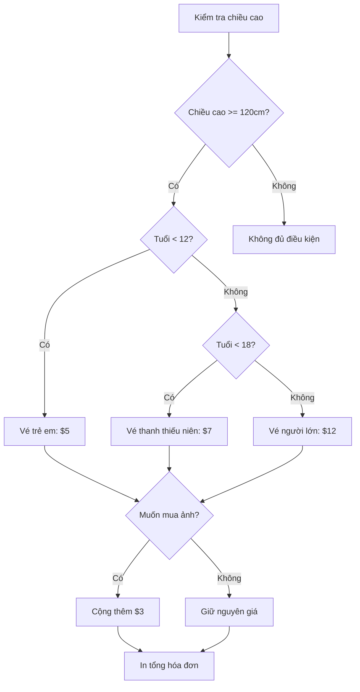

## 

### Khái niệm

Trong bài học trước, chúng ta đã sử dụng `if/elif/else` để kiểm tra nhiều điều kiện, nhưng chỉ **một điều kiện duy nhất** sẽ được thực thi. Khi điều kiện đầu tiên đúng, các điều kiện còn lại sẽ bị bỏ qua.

Tuy nhiên, trong một số trường hợp, bạn cần kiểm tra **nhiều điều kiện độc lập** - ngay cả khi điều kiện trước đó đã đúng. Đây là lúc sử dụng nhiều câu lệnh `if` riêng biệt.

### So Sánh: If/Elif/Else vs Nhiều If

**If/Elif/Else (Chỉ 1 điều kiện được thực thi):**

- Nếu điều kiện 1 đúng → thực hiện A, bỏ qua phần còn lại
- Nếu điều kiện 2 đúng → thực hiện B, bỏ qua phần còn lại
- Nếu điều kiện 3 đúng → thực hiện C
- **Kết quả:** Chỉ A, B hoặc C được thực thi

**Nhiều If độc lập (Tất cả điều kiện đều được kiểm tra):**

- Kiểm tra điều kiện 1 → nếu đúng thực hiện A
- Kiểm tra điều kiện 2 → nếu đúng thực hiện B
- Kiểm tra điều kiện 3 → nếu đúng thực hiện C
- **Kết quả:** A, B, và C có thể cùng được thực thi nếu tất cả điều kiện đều đúng


### Ví Dụ Thực Tế: Hệ Thống Vé Tàu Lượn

Giả sử hệ thống bán vé tàu lượn cần:

1. Kiểm tra chiều cao (height) và tuổi (age) để xác định giá vé
2. Hỏi khách có muốn mua ảnh kỷ niệm không (photo) - **độc lập với tuổi/chiều cao**

Nếu khách muốn mua ảnh, cộng thêm \$3 vào tổng hóa đơn, bất kể loại vé nào.

### Luồng Xử Lý



**Giải thích sơ đồ:** Sau khi xác định giá vé dựa trên tuổi (chỉ 1 trong 3 nhánh được chọn), hệ thống tiếp tục hỏi về ảnh - một điều kiện hoàn toàn độc lập áp dụng cho tất cả khách hàng.

### Code Mẫu

```python
# Khởi tạo biến bill
bill = 0

# Kiểm tra chiều cao
height = int(input("What is your height in cm? "))
if height >= 120:
    # Kiểm tra tuổi và gán giá vé tương ứng
    age = int(input("What is your age? "))
    if age < 12:
        print("Child tickets are $5.")
        bill = 5
    elif age < 18:
        print("Youth tickets are $7.")
        bill = 7
    else:
        print("Adult tickets are $12.")
        bill = 12
    
    # Kiểm tra có muốn mua ảnh không (điều kiện độc lập)
    wants_photo = input("Do you want a photo taken? Type y for yes or n for no. ")
    if wants_photo == "y":
        bill += 3  # Cộng thêm $3 vào bill hiện tại
    
    # In tổng hóa đơn
    print(f"Your final bill is ${bill}")
else:
    print("Sorry, you have to grow taller before you can ride.")
```


### Toán Tử += (Cộng Dồn)

Trong Python, khi bạn muốn cộng thêm một giá trị vào biến và lưu lại kết quả, có thể viết ngắn gọn:

```python
# Cách viết đầy đủ
bill = bill + 3

# Cách viết rút gọn (tương đương)
bill += 3
```

Ví dụ: Nếu `bill = 7`, sau khi thực hiện `bill += 3`, giá trị mới của `bill` là `10`.

### Ghi Chú Quan Trọng

**Indentation (Thụt Lề) Rất Quan Trọng:**

- Câu lệnh `if wants_photo` phải cùng cấp độ thụt lề với khối `if age` - điều này cho biết hai kiểm tra này độc lập với nhau
- Câu lệnh `bill += 3` thụt vào trong `if wants_photo` - chỉ thực thi khi điều kiện đúng
- Câu lệnh `print(f"Your final bill...")` nằm ngoài khối `if wants_photo` - luôn được thực thi sau khi kiểm tra xong

**Không Cần Else Khi Không Làm Gì:**
Nếu khách không muốn mua ảnh (`wants_photo == "n"`), ta không cần viết câu lệnh `else` vì không có hành động gì cần thực hiện. Code sẽ tự động bỏ qua và chạy tiếp phần in hóa đơn.

**Liên kết:** [[Python]], [[If Statement]], [[Elif]], [[Else]], [[Indentation]], [[Input]], [[Variables]], [[Operators]], [[String Formatting]], [[F-strings]], [[Conditional Logic]]

