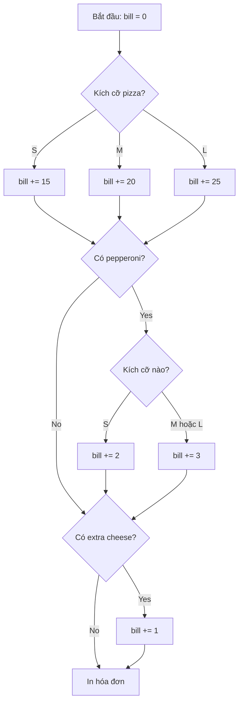

## 

### Đề Bài

Tạo một chương trình Python tính toán tự động hóa đơn giao pizza dựa trên các lựa chọn của khách hàng. Chương trình sẽ hỏi người dùng 3 câu hỏi và tính tổng tiền dựa trên bảng giá.

**Bảng Giá Pizza:**

- Pizza nhỏ (Small): \$15
- Pizza vừa (Medium): \$20
- Pizza lớn (Large): \$25

**Phụ Phí:**

- Pepperoni cho pizza nhỏ: +\$2
- Pepperoni cho pizza vừa/lớn: +\$3
- Phô mai thêm (Extra cheese): +\$1


### Các Câu Hỏi Đầu Vào

```python
size = input("What size pizza do you want? S, M or L: ")
pepperoni = input("Do you want pepperoni on your pizza? Y or N: ")
extra_cheese = input("Do you want extra cheese? Y or N: ")
```


### Luồng Logic



**Giải thích sơ đồ:** Chương trình tính giá theo 3 bước tuần tự - xác định giá cơ bản theo kích cỡ, kiểm tra pepperoni (nếu có thì tính phụ phí theo kích cỡ), và cuối cùng kiểm tra phô mai thêm.

### Giải Pháp Đầy Đủ

```python
# Khởi tạo biến hóa đơn
bill = 0

# Nhận đầu vào từ người dùng
size = input("What size pizza do you want? S, M or L: ")
pepperoni = input("Do you want pepperoni on your pizza? Y or N: ")
extra_cheese = input("Do you want extra cheese? Y or N: ")

# Bước 1: Tính giá dựa trên kích cỡ
if size == "S":
    bill += 15
elif size == "M":
    bill += 20
elif size == "L":
    bill += 25
else:
    print("You typed the wrong inputs.")

# Bước 2: Tính phụ phí pepperoni (sử dụng nested if)
if pepperoni == "Y":
    if size == "S":
        bill += 2
    else:  # M hoặc L
        bill += 3

# Bước 3: Tính phụ phí phô mai thêm (if statement độc lập)
if extra_cheese == "Y":
    bill += 1

# In kết quả
print(f"Your final bill is: ${bill}.")
```


### Phân Tích Kỹ Thuật

**Sử Dụng If/Elif/Else Cho Kích Cỡ:**

- Chỉ một trong ba điều kiện (S, M, L) được thực thi
- Có thể thêm `else` để bắt lỗi nhập liệu

**Nested If Statement Cho Pepperoni:**

- If ngoài: Kiểm tra có muốn pepperoni không
- If trong: Kiểm tra kích cỡ để tính đúng phụ phí
- Cấu trúc này chỉ chạy khi điều kiện ngoài (`pepperoni == "Y"`) đúng

**Multiple If Statement Cho Extra Cheese:**

- Hoàn toàn độc lập với các điều kiện trước
- Luôn được kiểm tra bất kể kích cỡ hay có pepperoni hay không


### Hai Cách Gán Giá Trị Hợp Lệ

**Cách 1: Sử dụng += ngay từ đầu**

```python
bill = 0
if size == "S":
    bill += 15  # Cộng dồn vào giá trị hiện tại
```

**Cách 2: Gán trực tiếp lần đầu**

```python
bill = 0
if size == "S":
    bill = 15  # Gán trực tiếp
```

Cả hai đều đúng, nhưng sử dụng `+=` nhất quán hơn vì sẽ dùng nó cho các phần còn lại.

### Lưu Ý Quan Trọng

**Indentation (Thụt Lề):**

- Mỗi cấp độ thụt lề phải có **4 khoảng trắng** (spaces)
- Các câu lệnh cùng cấp phải thẳng hàng với nhau
- Lỗi thụt lề sẽ khiến chương trình hoạt động sai hoặc báo lỗi

**Định Dạng Output:**
Khi in kết quả, cần đảm bảo format chính xác:

```python
print(f"Your final bill is: ${bill}.")
```

Lưu ý dấu hai chấm, dấu đô la, và dấu chấm cuối câu.

**Kiểm Tra Tự Động:**
Sau khi hoàn thành code, có thể nhấn nút "Check" để kiểm tra tự động với nhiều test case khác nhau.

### Ví Dụ Chạy Thử

**Input:**

- Size: L (Large)
- Pepperoni: Y (Yes)
- Extra cheese: N (No)

**Tính toán:**

- Large pizza: \$25
- Pepperoni on L: +\$3
- Extra cheese: \$0
- **Tổng: \$28**

**Output:**

```
Your final bill is: $28.
```

**Liên kết:** [[Python]], [[If Statement]], [[Elif]], [[Else]], [[Nested If]], [[Multiple If Statements]], [[Variables]], [[Input]], [[Operators]], [[F-strings]], [[Indentation]], [[Coding Challenge]]

