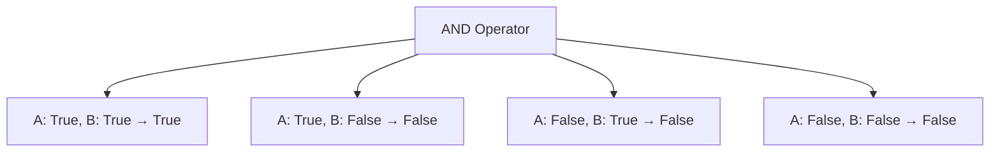
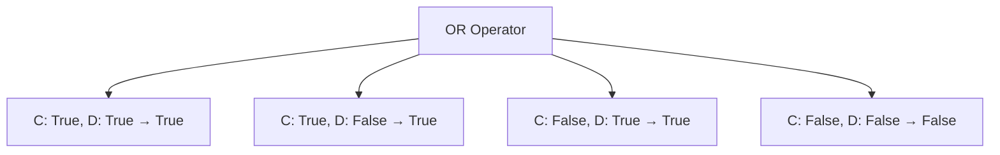

### Khái Niệm

Cho đến nay, chúng ta đã học cách sử dụng `if`, `elif`, `else`, nested if, và multiple if statements. Tuy nhiên, chúng ta chưa thể **kiểm tra nhiều điều kiện trong cùng một dòng code**.

Ví dụ: Làm sao để kiểm tra "pizza có kích cỡ lớn VÀ khách muốn pepperoni VÀ muốn phô mai thêm" tất cả trong một dòng?

Câu trả lời là sử dụng **Toán Tử Logic (Logical Operators)**. Python có 3 toán tử logic chính: `and`, `or`, và `not`.

### Toán Tử AND

**Cách hoạt động:** Cả hai điều kiện phải **đồng thời đúng** thì kết quả mới là `True`.

**Bảng Chân Trị (Truth Table):**



**Ví dụ thực hành:**

```python
a = 12

# Kiểm tra từng điều kiện riêng lẻ
print(a > 15)  # False
print(a > 10)  # True

# Kết hợp với AND - cả hai phải đúng
print(a > 10 and a < 13)  # True (vì 12 > 10 VÀ 12 < 13)
print(a > 15 and a < 13)  # False (vì 12 không > 15)
```


### Toán Tử OR

**Cách hoạt động:** Chỉ cần **một trong hai điều kiện đúng** thì kết quả là `True`. Chỉ khi cả hai đều `False` thì mới trả về `False`.

**Bảng Chân Trị:**



**Ví dụ thực hành:**

```python
a = 12

# Kiểm tra với OR
print(a > 10 or a < 10)  # True (vì 12 > 10 là đúng)
print(a > 15 or a < 10)  # False (vì cả hai đều sai)
```


### Toán Tử NOT

**Cách hoạt động:** Đảo ngược giá trị của điều kiện. `True` thành `False` và ngược lại.

**Ví dụ thực hành:**

```python
a = 12

# Điều kiện gốc
print(a < 0)      # False (12 không nhỏ hơn 0)

# Dùng NOT để đảo ngược
print(not a < 0)  # True (đảo ngược False thành True)
```


### Ứng Dụng Thực Tế: Vé Miễn Phí Cho Khủng Hoảng Tuổi Trung Niên

Giả sử công ty tàu lượn quyết định tặng vé miễn phí cho người đang trải qua khủng hoảng tuổi trung niên (45-55 tuổi). Cần kiểm tra **hai điều kiện đồng thời**: tuổi >= 45 VÀ tuổi <= 55.

**Code mẫu:**

```python
bill = 0
age = int(input("What is your age? "))

if age < 12:
    print("Child tickets are $5.")
    bill = 5
elif age < 18:
    print("Youth tickets are $7.")
    bill = 7
elif age >= 45 and age <= 55:
    print("Everything is going to be okay. Have a free ride on us!")
    bill = 0
else:
    print("Adult tickets are $12.")
    bill = 12

# Vẫn phải trả tiền ảnh nếu muốn
wants_photo = input("Do you want a photo? Y or N: ")
if wants_photo == "Y":
    bill += 3

print(f"Your final bill is ${bill}")
```


### Simplified Chained Comparison (So Sánh Chuỗi Rút Gọn)

Python cho phép viết điều kiện kiểm tra khoảng giá trị một cách ngắn gọn hơn:

**Cách thông thường:**

```python
if age >= 45 and age <= 55:
```

**Cách rút gọn:**

```python
if 45 <= age <= 55:
```

**Cả hai cách đều cho kết quả giống nhau**. Tuy nhiên, với người mới học, cách đầy đủ dễ hiểu hơn vì rõ ràng từng điều kiện đang được kiểm tra.

### So Sánh AND vs OR

| Điều Kiện | AND | OR |
| :-- | :-- | :-- |
| True và True | True | True |
| True và False | False | True |
| False và True | False | True |
| False và False | False | False |

**Khi nào dùng AND:**

- Khi cần tất cả điều kiện phải thỏa mãn
- Ví dụ: Tuổi trong khoảng 45-55 (phải >= 45 VÀ <= 55)

**Khi nào dùng OR:**

- Khi chỉ cần một trong các điều kiện thỏa mãn
- Ví dụ: Giảm giá cho trẻ em HOẶC người cao tuổi


### Ghi Chú Quan Trọng

**Thứ Tự Ưu Tiên (Operator Precedence):**
Python đánh giá các toán tử logic theo thứ tự: `not` → `and` → `or`

**Về Warnings Trong IDE:**
Khi học lập trình, không cần lo lắng quá về các cảnh báo (warnings). Hãy đọc, hiểu chúng đang gợi ý gì, rồi quyết định có nên áp dụng hay không. Ưu tiên **code dễ đọc, dễ hiểu** hơn là code "hoàn hảo" theo công cụ.

**Liên kết:** [[Python]], [[Logical Operators]], [[AND Operator]], [[OR Operator]], [[NOT Operator]], [[Conditional Logic]], [[If Statement]], [[Boolean]], [[Truth Tables]], [[Chained Comparison]]

