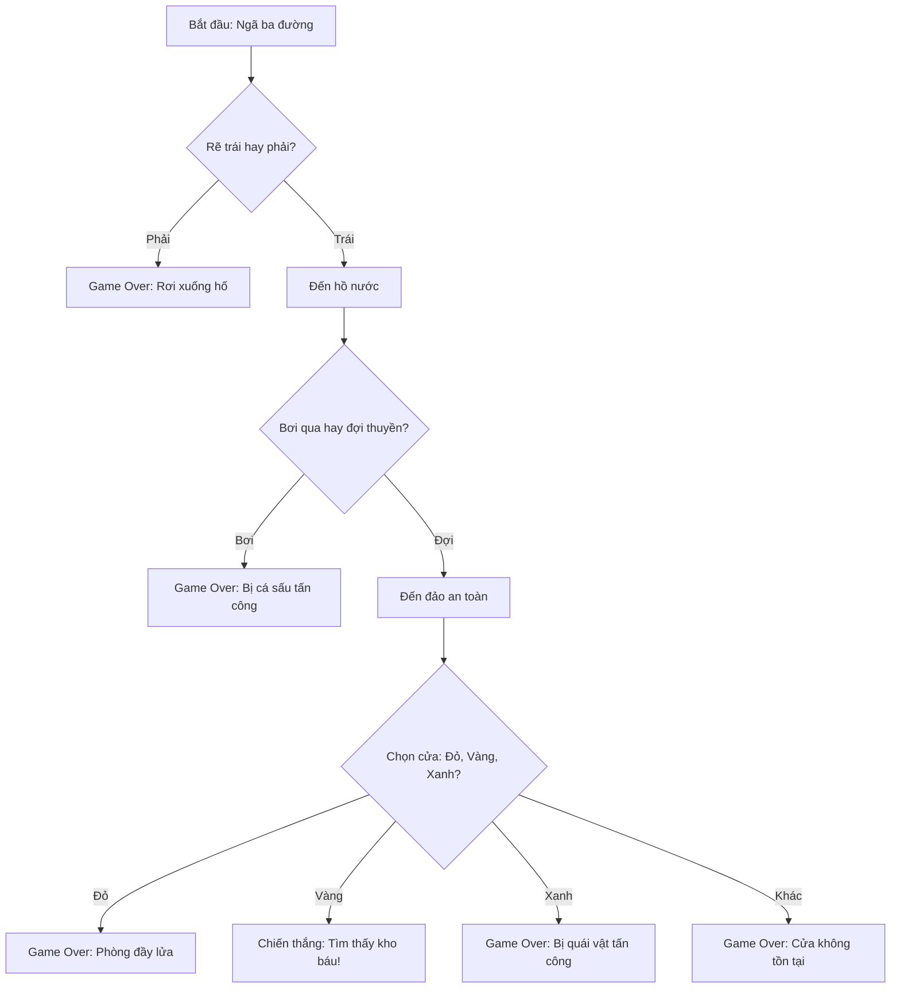

## 

### Giới Thiệu

Đây là dự án tổng hợp tất cả kiến thức đã học về câu lệnh điều kiện (conditional statements), bao gồm `if`, `elif`, `else`, và các toán tử logic. Mục tiêu là tạo một trò chơi văn bản tương tác, nơi người chơi đưa ra lựa chọn và câu chuyện phát triển theo hướng khác nhau tùy vào quyết định của họ.

**Cơ chế game:** Người chơi đối mặt với các tình huống và phải chọn giữa các phương án. Mỗi lựa chọn dẫn đến một hậu quả khác nhau - có thể tiếp tục cuộc phiêu lưu hoặc kết thúc game (Game Over).

### Luồng Game Logic



**Giải thích sơ đồ:** Game có 3 câu hỏi liên tiếp. Chỉ có 1 đường dẫn đến chiến thắng (Trái → Đợi → Vàng), tất cả các lựa chọn khác đều dẫn đến Game Over với lý do khác nhau.

### ASCII Art

**ASCII Art** là kỹ thuật tạo hình ảnh bằng các ký tự văn bản thông thường (dấu phẩy, dấu bằng, gạch ngang, v.v.).

**Nguồn ASCII Art:** [ascii.co.uk/art](http://ascii.co.uk/art)

**Sử dụng Multi-line String:**

```python
print('''
*******************************************************************************
          |                   |                  |                     |
 _________|________________.=""_;=.______________|_____________________|_______
|                   |  ,-"_,=""     `"=.|                  |
|___________________|__"=._o`"-._        `"=.______________|___________________
          |                `"=._o`"=._      _`"=._                     |
 _________|_____________________:=._o "=._."_.-="'"=.__________________|_______
|                   |    __.--" , ; `"=._o." ,-"""-._ ".   |
|___________________|_._"  ,. .` ` `` ,  `"-._"-._   ". '__|___________________
          |           |o`"=._` , "` `; .". ,  "-._"-._; ;              |
 _________|___________| ;`-.o`"=._; ." ` '`."\` . "-._ /_______________|_______
|                   | |o;    `"-.o`"=._``  '` " ,__.--o;   |
|___________________|_| ;     (#) `-.o `"=.`_.--"_o.-; ;___|___________________
____/______/______/___|o;._    "      `".o|o_.--"    ;o;____/______/______/____
/______/______/______/_"=._o--._        ; | ;        ; ;/______/______/______/_
____/______/______/______/__"=._o--._   ;o|o;     _._;o;____/______/______/____
/______/______/______/______/____"=._o._; | ;_.--"o.--"_/______/______/______/_
____/______/______/______/______/_____"=.o|o_.--""___/______/______/______/____
/______/______/______/______/______/______/______/______/______/______/_____ /
*******************************************************************************
''')
```

**Giải thích:** Ba dấu nháy đơn `'''` cho phép tạo chuỗi văn bản nhiều dòng (multi-line string), giữ nguyên format và xuống dòng.

### Xử Lý Input Từ Người Chơi

**Vấn đề 1: Escape Characters (Ký Tự Thoát)**

Khi câu input chứa dấu ngoặc kép hoặc dấu nháy đơn, cần xử lý đúng cách:

```python
# Lỗi: Dấu nháy đơn trong chuỗi
choice = input("You're at a crossroad...")  # Lỗi syntax

# Giải pháp 1: Dùng dấu ngoặc kép bên ngoài
choice = input("You're at a crossroad. Where do you want to go?")

# Giải pháp 2: Escape bằng backslash (\)
choice = input('You\'re at a crossroad. Where do you want to go?')

# Giải pháp 3: Kết hợp cả hai
choice = input('You\'re at a crossroad. Type "left" or "right".')
```

**Backslash (\)** là ký tự thoát (escape character) - báo cho Python biết ký tự tiếp theo không phải là code mà là text thông thường.

**Vấn đề 2: Xuống Dòng Input**

Để input xuất hiện trên dòng mới thay vì cuối câu hỏi:

```python
# Input cùng dòng
choice = input("Where do you want to go? ")

# Input dòng mới (dễ đọc hơn)
choice = input("Where do you want to go?\n")
```

`\n` là ký tự xuống dòng (newline character).

**Vấn đề 3: Dòng Code Quá Dài**

Khi dòng code vượt quá 79 ký tự (theo PEP 8), có thể xuống dòng:

```python
# Dòng quá dài
choice = input("You've come to a lake. There is an island in the middle of the lake. Type 'wait' to wait for a boat. Type 'swim' to swim across.")

# Xuống dòng (không ảnh hưởng output)
choice = input("You've come to a lake. There is an island in the middle of the lake. "
               "Type 'wait' to wait for a boat. Type 'swim' to swim across.")
```


### Chuẩn Hóa Input Với .lower()

Người dùng có thể nhập "Left", "LEFT", hoặc "left". Để xử lý nhất quán:

```python
# Chuyển input về chữ thường
choice1 = input("Type 'left' or 'right'.\n").lower()

# Giờ chỉ cần kiểm tra 1 trường hợp
if choice1 == "left":
    # Tiếp tục game
else:
    print("Game Over")
```

**Phương án thay thế:** Dùng toán tử `or`:

```python
if choice1 == "left" or choice1 == "Left" or choice1 == "LEFT":
    # Tiếp tục
```

Nhưng cách dùng `.lower()` ngắn gọn và dễ bảo trì hơn.

### Code Hoàn Chỉnh

```python
print('''
*******************************************************************************
          |                   |                  |                     |
 _________|________________.=""_;=.______________|_____________________|_______
|                   |  ,-"_,=""     `"=.|                  |
|___________________|__"=._o`"-._        `"=.______________|___________________
          |                `"=._o`"=._      _`"=._                     |
 _________|_____________________:=._o "=._."_.-="'"=.__________________|_______
*******************************************************************************
''')
print("Welcome to Treasure Island.")
print("Your mission is to find the treasure.")

# Câu hỏi 1: Trái hay phải?
choice1 = input('You\'re at a crossroad. Where do you want to go? '
                'Type "left" or "right".\n').lower()

if choice1 == "left":
    # Câu hỏi 2: Bơi hay đợi?
    choice2 = input('You\'ve come to a lake. There is an island in the middle of the lake. '
                    'Type "wait" to wait for a boat. Type "swim" to swim across.\n').lower()
    
    if choice2 == "wait":
        # Câu hỏi 3: Chọn cửa nào?
        choice3 = input("You arrive at the island unharmed. "
                        "There is a house with 3 doors. "
                        "One red, one yellow, one blue. "
                        "Which color do you choose?\n").lower()
        
        if choice3 == "red":
            print("It's a room full of fire. Game Over.")
        elif choice3 == "yellow":
            print("You found the treasure! You Win!")
        elif choice3 == "blue":
            print("You enter a room of beasts. Game Over.")
        else:
            print("You chose a door that doesn't exist. Game Over.")
    else:
        print("You got attacked by an angry trout. Game Over.")
else:
    print("You fell into a hole. Game Over.")
```


### Phân Tích Kỹ Thuật

**Nested If Statements (Câu Lệnh If Lồng Nhau):**

- `choice2` chỉ được hỏi nếu `choice1 == "left"`
- `choice3` chỉ được hỏi nếu `choice2 == "wait"`
- Tạo ra cấu trúc phân nhánh sâu

**If vs If/Elif/Else:**

- Dùng `if/elif/else` khi các điều kiện loại trừ lẫn nhau (chỉ 1 được thực thi)
- Ví dụ: Chọn cửa đỏ, vàng, hay xanh - không thể chọn nhiều cửa cùng lúc

**Indentation Quan Trọng:**

- Mỗi cấp độ lồng thêm 4 khoảng trắng
- Sai indentation → `IndentationError` hoặc logic sai


### PEP 8 Style Guide

**PEP 8** là hướng dẫn viết code Python chuẩn, bao gồm:

- Dòng code không quá 79 ký tự
- Thụt lề đúng 4 khoảng trắng
- Khoảng cách hợp lý giữa các phần code

IDE thường cảnh báo khi vi phạm PEP 8, nhưng đây chỉ là **gợi ý**, không phải lỗi cú pháp. Ưu tiên code dễ đọc hơn là tuân thủ 100% PEP 8.

### Gợi Ý Cải Tiến

**Tùy Chỉnh Câu Chuyện:**

- Thay đổi tình huống, địa điểm
- Thêm nhiều câu hỏi hơn (4, 5 cấp độ)
- Tạo nhiều đường dẫn chiến thắng

**Cải Thiện Trải Nghiệm:**

- Thêm nhiều ASCII art cho từng scene
- Viết mô tả sinh động, hấp dẫn hơn
- Thêm màu sắc cho text (sử dụng thư viện `colorama`)

**Tính Năng Nâng Cao:**

- Cho phép chơi lại (replay)
- Thêm điểm số (score)
- Lưu lịch sử lựa chọn

**Liên kết:** [[Python]], [[If Statement]], [[Elif]], [[Else]], [[Nested If]], [[Input]], [[String]], [[Escape Characters]], [[Lower Method]], [[ASCII Art]], [[PEP 8]], [[Indentation]], [[Multi-line String]], [[Choose Your Own Adventure]], [[Game Development]]

