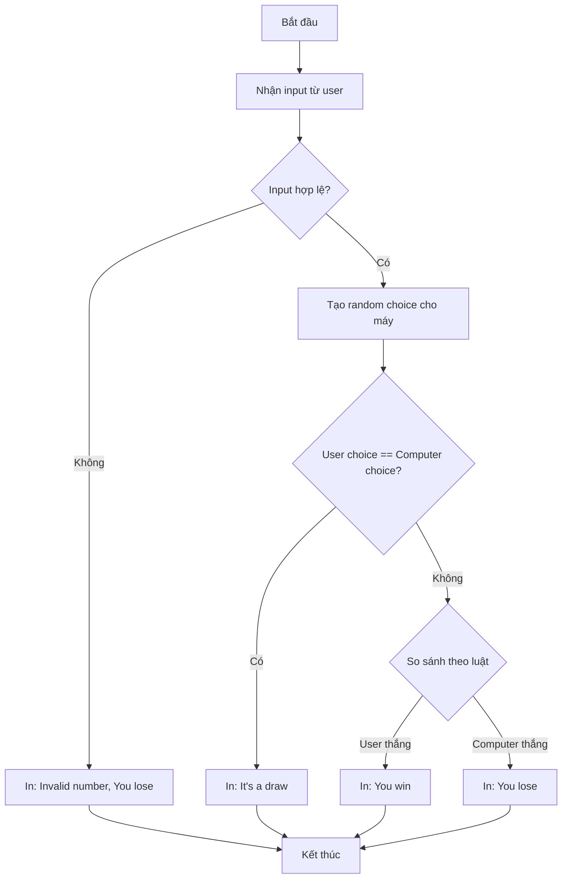

Bài học này hướng dẫn xây dựng trò chơi **Oẳn tù tì (Rock, Paper, Scissors)** hoàn chỉnh bằng Python, nơi người chơi đối đầu với máy tính. Đây là dự án tổng hợp kiến thức về biến, vòng lặp, điều kiện, danh sách và random.

### Mô tả trò chơi

Trò chơi yêu cầu người dùng nhập:

- `0` cho đá (rock)
- `1` cho giấy (paper)
- `2` cho kéo (scissors)

Sau đó hiển thị:

- Hình ASCII art của lựa chọn người dùng
- Hình ASCII art của lựa chọn máy tính
- Kết quả: thắng, thua hoặc hòa


### Luật chơi cơ bản

Theo **World Rock Paper Scissors Association**:

- Đá thắng kéo
- Kéo thắng giấy
- Giấy thắng đá


### Phân tích bài toán

Trước khi code, cần chia nhỏ vấn đề:

- Tạo số ngẫu nhiên từ 0-2 cho máy tính
- Nhận input từ người dùng
- So sánh hai lựa chọn theo luật chơi
- Hiển thị kết quả bằng ASCII art
- Xử lý trường hợp nhập sai




### Giải pháp từng bước

#### Bước 1: Nhận input và tạo random choice

```python
import random

# ASCII art đã có sẵn trong starter project
rock = '''
    _______
---'   ____)
      (_____)
      (_____)
      (____)
---.__(___)
'''

paper = '''
    _______
---'   ____)____
          ______)
          _______)
         _______)
---.__________)
'''

scissors = '''
    _______
---'   ____)____
          ______)
       __________)
      (____)
---.__(___)
'''

# Lấy lựa chọn từ user
user_choice = int(input("What do you choose? Type 0 for Rock, 1 for Paper or 2 for Scissors.\n"))

# Máy tính chọn ngẫu nhiên
computer_choice = random.randint(0, 2)
```

**Lưu ý quan trọng**: `input()` luôn trả về string, cần chuyển thành `int` để so sánh số.

#### Bước 2: Tạo danh sách chứa hình ảnh

```python
game_images = [rock, paper, scissors]
```

Sử dụng list để ánh xạ số với hình:

- `game_images[0]` → rock
- `game_images[1]` → paper
- `game_images[2]` → scissors


#### Bước 3: Hiển thị lựa chọn

```python
# Chỉ hiển thị nếu input hợp lệ (0-2)
if user_choice >= 0 and user_choice <= 2:
    print(game_images[user_choice])

print(f"Computer chose:")
print(game_images[computer_choice])
```


#### Bước 4: Xây dựng logic so sánh

```python
# Kiểm tra input không hợp lệ TRƯỚC
if user_choice >= 3 or user_choice < 0:
    print("You typed an invalid number. You lose!")

# Kiểm tra hòa
elif user_choice == computer_choice:
    print("It's a draw")

# Trường hợp đặc biệt: User chọn rock (0), máy chọn scissors (2)
elif user_choice == 0 and computer_choice == 2:
    print("You win!")

# Trường hợp đặc biệt: Computer chọn rock (0), user chọn scissors (2)
elif computer_choice == 0 and user_choice == 2:
    print("You lose")

# Quy tắc chung: Số lớn hơn thắng
elif computer_choice > user_choice:
    print("You lose")

elif user_choice > computer_choice:
    print("You win!")
```


### Giải thích logic phức tạp

**Tại sao cần xử lý trường hợp đặc biệt?**

Nếu chỉ dùng `computer_choice > user_choice`:

- Rock (0) vs Scissors (2): Sai! Vì 2 > 0 nhưng rock thắng scissors
- Cần bắt ngoại lệ này trước khi áp dụng quy tắc chung

**Thứ tự điều kiện quan trọng:**

1. Kiểm tra input không hợp lệ TRƯỚC để tránh crash
2. Kiểm tra hòa
3. Xử lý các ngoại lệ (rock vs scissors)
4. Áp dụng quy tắc chung cuối cùng

### Mã nguồn hoàn chỉnh

```python
import random

rock = '''
    _______
---'   ____)
      (_____)
      (_____)
      (____)
---.__(___)
'''

paper = '''
    _______
---'   ____)____
          ______)
          _______)
         _______)
---.__________)
'''

scissors = '''
    _______
---'   ____)____
          ______)
       __________)
      (____)
---.__(___)
'''

game_images = [rock, paper, scissors]

user_choice = int(input("What do you choose? Type 0 for Rock, 1 for Paper or 2 for Scissors.\n"))

if user_choice >= 0 and user_choice <= 2:
    print(game_images[user_choice])

computer_choice = random.randint(0, 2)
print(f"Computer chose:")
print(game_images[computer_choice])

if user_choice >= 3 or user_choice < 0:
    print("You typed an invalid number. You lose!")
elif user_choice == computer_choice:
    print("It's a draw")
elif user_choice == 0 and computer_choice == 2:
    print("You win!")
elif computer_choice == 0 and user_choice == 2:
    print("You lose")
elif computer_choice > user_choice:
    print("You lose")
elif user_choice > computer_choice:
    print("You win!")
```


### Kinh nghiệm debug

**Lỗi thường gặp và cách xử lý:**

- **Lỗi so sánh int và string**: Nhớ convert `input()` thành `int(input())`
- **Logic sai với trường hợp đặc biệt**: Test kỹ các case: 0 vs 2, 2 vs 0
- **IndexError khi truy cập list**: Kiểm tra input hợp lệ TRƯỚC khi dùng làm index
- **Thứ tự if-elif sai**: Điều kiện tổng quát phải để cuối, điều kiện đặc biệt lên đầu

**Chiến lược testing hiệu quả:**

- Test từng bước nhỏ, không đợi code xong mới chạy
- Thêm `print()` tạm để debug giá trị biến
- Test cả trường hợp biên (0, 2, số âm, số > 2)


### Kỹ năng cốt lõi được rèn luyện

- Sử dụng [[random module]] để tạo số ngẫu nhiên
- Xử lý [[input validation]] (kiểm tra dữ liệu đầu vào)
- Làm việc với [[list indexing]]
- Xây dựng [[conditional logic]] phức tạp với nhiều nhánh
- Kỹ thuật [[debugging]] và testing từng phần

**Liên kết:** [[Python]], [[random]], [[lists]], [[if-elif-else]], [[input()]], [[type conversion]], [[ASCII art]], [[game development]]

