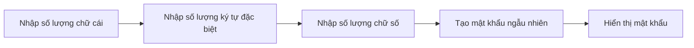

### Bối cảnh và động lực

Ngày nay, các công ty liên tục bị tấn công bởi tin tặc - từ Ashley Madison đến Verizon. Một trong những lý do chính khiến tài khoản người dùng bị xâm nhập là **tái sử dụng mật khẩu** (password reuse). Khi bạn dùng cùng một mật khẩu cho nhiều dịch vụ (Google, Facebook, Skype, Spotify...), nếu một trong số đó bị hack, tin tặc có thể dùng thông tin email và mật khẩu đó để thử đăng nhập vào các trang web khác.

### Kiểm tra tài khoản đã bị rò rỉ chưa

- Truy cập **haveibeenpwned.com**
- Nhập email của bạn để kiểm tra xem nó có xuất hiện trong cơ sở dữ liệu bị hack hay không
- Ví dụ: email `elon@tesla.com` đã xuất hiện trong nhiều vụ rò rỉ dữ liệu


### Giải pháp: Mật khẩu mạnh và duy nhất

Để bảo mật tốt hơn, bạn cần:

- Mật khẩu **duy nhất** cho mỗi trang web
- Mật khẩu **mạnh** - không phải là `123456` hay `qwerty`
- Kết hợp chữ cái, ký tự đặc biệt và số


### Dự án: Password Generator

Chương trình sẽ hoạt động như sau:



**Luồng xử lý:**

1. Người dùng nhập số lượng chữ cái mong muốn (ví dụ: 12)
2. Người dùng nhập số lượng ký tự đặc biệt (ví dụ: 2)
3. Người dùng nhập số lượng chữ số (ví dụ: 2)
4. Chương trình tạo mật khẩu ngẫu nhiên kết hợp các yếu tố trên
5. Hiển thị mật khẩu đã tạo cho người dùng

### Ví dụ chạy chương trình

```
How many letters would you like in your password?
12
How many symbols would you like?
2
How many numbers would you like?
2
[Enter]
Your generated password: aB7#xKm2pQr$tN
```


### Mục tiêu học tập

Trước khi xây dựng được Password Generator, bạn cần nắm vững một số kỹ năng và khái niệm mới trong Python. Hãy chuyển sang bài học tiếp theo để bắt đầu!

***

**Liên kết:** [[Password Generator]], [[Password Security]], [[Random Generation]], [[String Manipulation]], [[Python Lists]]

