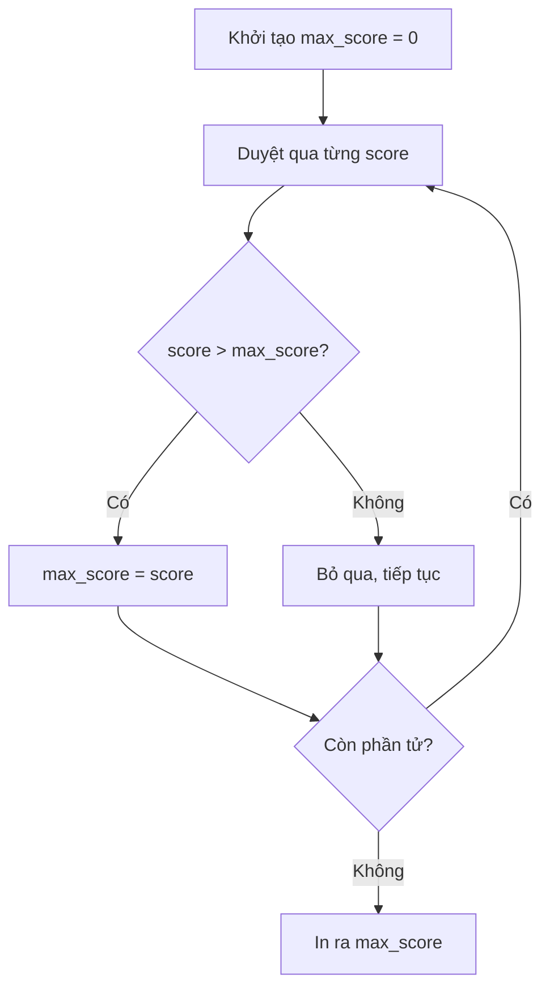

### Giới thiệu

Python là ngôn ngữ rất thân thiện với xử lý số (number). Nó cung cấp nhiều hàm tích hợp (built-in functions) để làm việc với dữ liệu số.

### Hàm sum() - Tính tổng các phần tử

Python có hàm `sum()` giúp tính tổng các phần tử trong một iterable (như list).

**Ví dụ:**

```python
student_scores = [150, 142, 185, 120, 171, 184, 149, 199, 165, 120, 183]
total_exam_score = sum(student_scores)
print(total_exam_score)  # Kết quả: 2068
```


### Tự tạo hàm tính tổng với For Loop

Chúng ta có thể tự xây dựng logic tính tổng bằng [[For Loop]]:

```python
student_scores = [150, 142, 185, 120, 171, 184, 149, 199, 165, 120, 183]
sum = 0

for score in student_scores:
    sum += score

print(sum)  # Kết quả: 2068
```

**Cách hoạt động:**

- Khởi tạo biến `sum = 0`
- Duyệt qua từng điểm số trong danh sách
- Cộng dồn từng giá trị vào biến `sum`
- Kết quả cuối cùng được lưu trong biến `sum`


### Hàm max() - Tìm giá trị lớn nhất

Hàm `max()` giúp tìm số lớn nhất trong một list:

```python
max_score = max(student_scores)
print(max_score)  # Kết quả: 199
```


### Tự tạo hàm tìm giá trị lớn nhất

Sử dụng [[For Loop]] và [[Conditional Statements]] để tìm giá trị lớn nhất:

```python
student_scores = [150, 142, 185, 120, 171, 184, 149, 199, 165, 120, 183]
max_score = 0

for score in student_scores:
    if score > max_score:
        max_score = score

print(max_score)  # Kết quả: 199
```

**Luồng xử lý:**



**Giải thích chi tiết:**

- **Bước 1:** Điểm đầu tiên = 150, so với max_score = 0 → 150 > 0 → max_score = 150
- **Bước 2:** Điểm tiếp theo = 142, so với max_score = 150 → 142 < 150 → Không thay đổi
- **Bước 3:** Tiếp tục cho đến khi gặp 199 → 199 > tất cả các max_score trước đó → max_score = 199


### Ghi chú quan trọng

- Các hàm như `sum()` và `max()` được xây dựng sẵn để tiện lợi
- Hiểu cách hoạt động bên trong giúp bạn tự xây dựng logic tương tự
- Cần nắm vững [[For Loop]], [[List]], và [[Conditional Statements]] để giải quyết các bài toán tương tự

**Liên kết:** [[Python]], [[For Loop]], [[List]], [[Conditional Statements]], [[Built-in Functions]], [[Iterable]]

