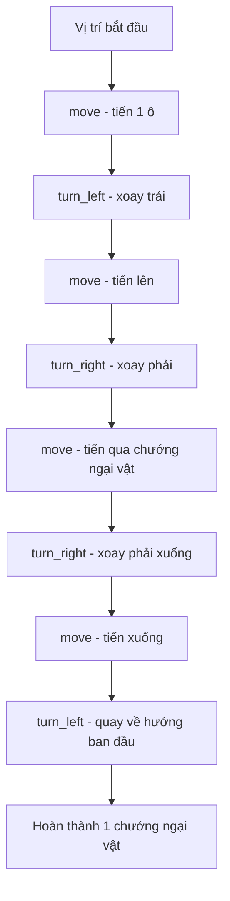

## Thử Thách Hurdle 1 - Robot Vượt Chướng Ngại Vật

### Mục Tiêu Bài Học

Áp dụng kiến thức về hàm (functions) và vòng lặp (for loop) để điều khiển robot vượt qua 6 chướng ngại vật và đến đích. Bài học tập trung vào việc viết code ngắn gọn, dễ đọc và tái sử dụng được.

### Các Lệnh Cơ Bản Của Robot

- `move()` - Di chuyển robot tiến 1 ô
- `turn_left()` - Xoay robot sang trái


### Bước 1: Tạo Hàm Turn Right

Vì robot không có hàm `turn_right()` sẵn, cần tự định nghĩa bằng cách xoay trái 3 lần:

```python
def turn_right():
    turn_left()
    turn_left()
    turn_left()
```

**Giải thích:** Khi xoay trái 3 lần liên tiếp, robot sẽ quay sang phải.

### Bước 2: Phân Tích Động Tác Vượt 1 Chướng Ngại Vật

Để vượt qua một chướng ngại vật, robot cần thực hiện các bước sau:




### Bước 3: Tạo Hàm Jump

Đóng gói chuỗi hành động vượt chướng ngại vật vào một hàm:

```python
def jump():
    move()
    turn_left()
    move()
    turn_right()
    move()
    turn_right()
    move()
    turn_left()
```


### Bước 4: Giải Pháp Chưa Tối Ưu

Gọi hàm `jump()` 6 lần để vượt qua 6 chướng ngại vật:

```python
def turn_right():
    turn_left()
    turn_left()
    turn_left()

def jump():
    move()
    turn_left()
    move()
    turn_right()
    move()
    turn_right()
    move()
    turn_left()

jump()
jump()
jump()
jump()
jump()
jump()
```

**Vấn đề:** Code có khoảng 21 dòng, vẫn còn lặp lại nhiều lần lệnh `jump()`.

### Bước 5: Tối Ưu Hóa Với Vòng Lặp For

Sử dụng vòng lặp (for loop) với hàm `range()` để giảm số dòng code:

```python
def turn_right():
    turn_left()
    turn_left()
    turn_left()

def jump():
    move()
    turn_left()
    move()
    turn_right()
    move()
    turn_right()
    move()
    turn_left()

for step in range(6):
    jump()
```

**Giải thích:**

- `range(6)` tạo chuỗi số từ 0 đến 5 (tổng 6 số)
- Vòng lặp sẽ gọi hàm `jump()` 6 lần
- Biến `step` tự động thay đổi giá trị mỗi lần lặp (0, 1, 2, 3, 4, 5)


### Các Nguyên Tắc Lập Trình Quan Trọng

- **Kiểm tra code từng bước:** Chạy thử code sau mỗi vài dòng để phát hiện lỗi sớm
- **DRY (Don't Repeat Yourself):** Không lặp lại code - sử dụng hàm và vòng lặp
- **Code dễ đọc:** Tên hàm phải mô tả rõ chức năng (`turn_right`, `jump`)
- **Tối ưu hóa:** Giảm số dòng code nhưng vẫn giữ tính dễ hiểu


### Kỹ Thuật Thụt Lề Code

**Windows:** Giữ `Ctrl` + `[` (thụt vào trái) hoặc `Ctrl` + `]` (thụt vào phải)

**Mac:** Giữ `Command` + `[` hoặc `Command` + `]`

### Ghi Chú Thêm

Khi hoàn thành thành công, sẽ nhận được thông báo màu xanh: "You're at the correct X and Y position" (Bạn đã đến đúng vị trí X và Y).

Nếu gặp khó khăn với vòng lặp, hãy xem lại bài học về `for loop` và hàm `range()` trước khi tiếp tục.

**Liên kết:** [[Functions]], [[For Loop]], [[Range Function]], [[Code Block]], [[Indentation]], [[DRY Principle]]

