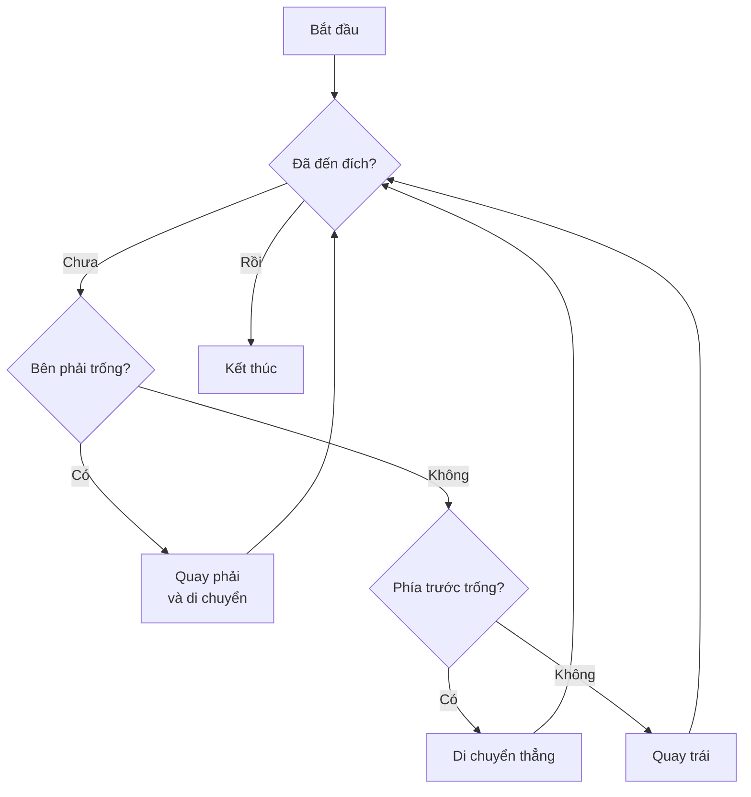

## Dự Án Cuối Cùng - Giải Mê Cung (Maze)

### Mục tiêu dự án

Viết code để robot Reeborg có thể tự động thoát khỏi mê cung bất kể:

- Vị trí xuất phát ngẫu nhiên
- Hướng quay ban đầu ngẫu nhiên
- Cấu trúc mê cung khác nhau

Mỗi lần khởi động lại, robot sẽ xuất hiện ở vị trí và hướng khác nhau trong mê cung, nhưng vẫn phải tìm được đường ra.

### Thuật toán giải mê cung

**Quy tắc "Đi theo tường bên phải" (Right-hand rule):**

Bí quyết để hoàn thành mê cung là luôn đi dọc theo cạnh tường bên phải. Nếu robot bắt đầu ở bất kỳ đâu trong mê cung và tiếp tục đi theo tường phải, nó sẽ cuối cùng đến được đích.

**Thứ tự ưu tiên hành động:**

1. **Ưu tiên cao nhất:** Nếu bên phải trống → quay phải và đi
2. **Ưu tiên trung bình:** Nếu không quay phải được nhưng phía trước trống → đi thẳng
3. **Phương án cuối cùng:** Nếu không thể quay phải hoặc đi thẳng → quay trái



### Giải pháp cơ bản

#### Code ban đầu

```python
def turn_right():
    turn_left()
    turn_left()
    turn_left()

while not at_goal():
    if right_is_clear():
        turn_right()
        move()
    elif front_is_clear():
        move()
    else:
        turn_left()
```


#### Giải thích logic

**Vòng lặp chính:**

- Sử dụng `while not at_goal()` để tiếp tục thực hiện cho đến khi đến đích

**Điều kiện phân nhánh:**

- `if right_is_clear()` - Kiểm tra bên phải có trống không, nếu có thì thực hiện "right move" (quay phải rồi tiến)
- `elif front_is_clear()` - Nếu không thể quay phải, kiểm tra phía trước có trống không
- `else` - Nếu cả hai điều kiện trên đều không thỏa mãn (bị bao vây), quay trái để tìm lối thoát


### Vấn đề: Vòng lặp vô hạn (Infinite Loop)

#### Khi nào xảy ra bug?

Code trên có thể rơi vào **infinite loop** trong một số trường hợp đặc biệt (edge cases). Ví dụ: robot bắt đầu ở vị trí mà bên phải luôn trống (như trong một ô vuông rỗng), robot sẽ cứ quay vòng tròn mãi vì:

- Bên phải trống → quay phải và di chuyển
- Lại bên phải trống → quay phải và di chuyển
- Cứ tiếp tục như vậy không bao giờ thoát ra

**Dấu hiệu nhận biết:** Khi chạy code, nếu số bước (steps) vượt quá 1000, đây thường là dấu hiệu của infinite loop.

#### File kiểm tra

Khóa học cung cấp 3 file **problem worlds** (tải về từ course resources) để test code với các tình huống khó:

- Problem World 1
- Problem World 2
- Problem World 3

Để mở: **Additional options → Open world from file**

### Giải pháp nâng cao - Debug Infinite Loop

#### Phân tích nguyên nhân

Vấn đề cốt lõi: Robot cần bắt đầu ở vị trí có tường ở bên phải. Nếu không có tường bên phải, robot có thể rơi vào vòng lặp.

#### Code giải quyết hoàn chỉnh

```python
def turn_right():
    turn_left()
    turn_left()
    turn_left()

# Bước chuẩn bị: Đảm bảo robot có tường bên phải
while front_is_clear():
    move()
turn_left()

# Vòng lặp chính giải mê cung
while not at_goal():
    if right_is_clear():
        turn_right()
        move()
    elif front_is_clear():
        move()
    else:
        turn_left()
```


#### Giải thích giải pháp

**Vòng lặp chuẩn bị (Setup loop):**

```python
while front_is_clear():
    move()
turn_left()
```

Đoạn code này thực hiện hai nhiệm vụ quan trọng:

1. **Tìm tường:** `while front_is_clear()` - Di chuyển tiếp tục cho đến khi robot chạm vào một bức tường phía trước
2. **Định vị tường về bên phải:** `turn_left()` - Sau khi tìm thấy tường phía trước, quay trái để tường đó nằm ở bên phải robot

Như vậy, trước khi bắt đầu thuật toán chính, robot đã được đảm bảo có một bức tường ở bên phải, tránh được tình trạng infinite loop.

### Kiểm tra giải pháp

Để đảm bảo code hoạt động đúng, cần test với cả 3 problem worlds:

- Mở từng file problem world
- Chạy code và kiểm tra số bước < 1000
- Robot phải tìm được đường ra mà không bị kẹt

Nếu tất cả 3 test cases đều pass, giải pháp của bạn đã hoàn chỉnh!

### Lời khuyên

**Dành cho người mới bắt đầu:**

- Nếu bạn vẫn đang làm quen với Python, hãy tập trung vào code cơ bản trước
- Đánh dấu phần debug nâng cao này và quay lại sau khi hoàn thành **Day 15** (mức intermediate)

**Dành cho người có kinh nghiệm:**

- Đây là bài tập debug khó, đòi hỏi tư duy về edge cases
- Nếu không giải được ngay, hãy quay lại sau 1 tuần để xem lại với góc nhìn mới
- Cố gắng hiểu logic giải pháp, sau đó tự viết lại code mà không nhìn

![[Pasted image 20260106154820.png]]

### Điểm mấu chốt

Đây là một bài toán debug thực sự khó và cần tư duy logic cao. Ngay cả giảng viên cũng mất khá nhiều thời gian để tìm ra giải pháp vừa ngắn gọn, vừa dễ hiểu, vừa dễ giải thích. Nếu bạn tự giải được, đó là thành tựu đáng tự hào!

**Bài học chính:**

- Testing giúp phát hiện edge cases mà ta không nghĩ đến
- Một giải pháp tốt phải hoạt động trong mọi tình huống
- Debug là kỹ năng quan trọng cần rèn luyện

***

**Liên kết:** [[while loops]], [[infinite loop]], [[edge cases]], [[algorithm]], [[debugging]], [[if elif else]], [[Reeborg maze]], [[right-hand rule]], [[problem worlds]]

