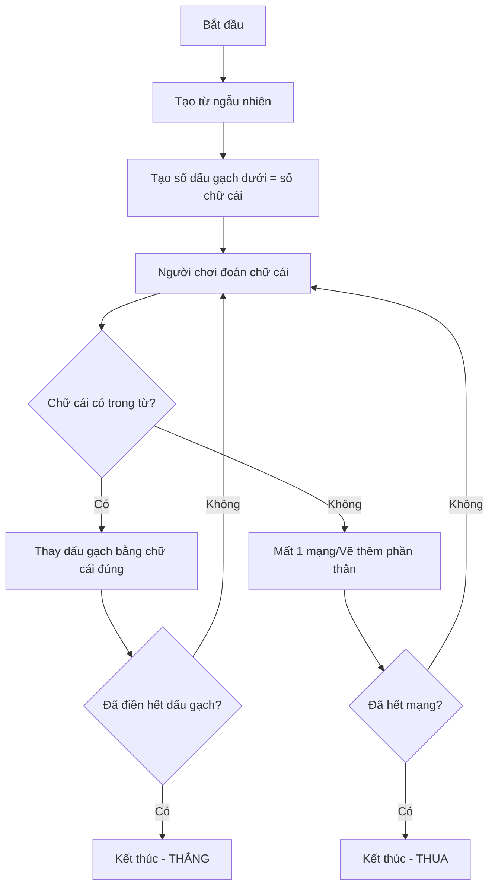

### Hiểu cách chơi

Trước khi bắt đầu lập trình, cần nắm rõ cách chơi game Hangman:

- Người chơi phải đoán một từ bí mật
- Chọn từng chữ cái một
- Nếu đúng: Chữ cái hiển thị ở vị trí tương ứng
- Nếu sai: Vẽ thêm một phần thân người treo cổ (gallows)
- Thắng: Đoán đúng toàn bộ từ trước khi hình người hoàn thành
- Thua: Hình người được vẽ hoàn chỉnh trước khi đoán hết từ

**Gợi ý:** Nếu chưa quen với game này, hãy thử chơi trực tuyến để hiểu rõ cơ chế trước khi lập trình.

### Flowchart Programming (Lập trình theo Sơ đồ Luồng)

Flowchart Programming là phương pháp vẽ sơ đồ luồng để biểu diễn logic của chương trình. Đây là bước quan trọng giúp:

- Phân tích bài toán thành các bước nhỏ
- Xác định trình tự thực hiện
- Xử lý các điều kiện rẽ nhánh
- Xác định điểm kết thúc chương trình

**Bài tập tự luyện:** Trước khi xem giải pháp, hãy tự vẽ flowchart cho game Hangman. Suy nghĩ về:

- Bước nào cần thực hiện đầu tiên?
- Điều gì xảy ra khi người chơi đoán đúng/sai?
- Khi nào game kết thúc?


### Sơ đồ luồng của Game Hangman




### Giải thích chi tiết từng bước

#### Bước 1: Khởi tạo Game

```
Từ được tạo: "mouse"
Hiển thị cho người chơi: _ _ _ _ _
```

- Hệ thống chọn ngẫu nhiên một từ (ví dụ: "mouse")
- Tạo số dấu gạch dưới bằng với số chữ cái trong từ


#### Bước 2: Người chơi đoán chữ cái

**Trường hợp 1: Đoán đúng**

```
Người chơi đoán: "O"
Kiểm tra: "O" có trong "mouse" → Có
Kết quả: _ O _ _ _
```

Sau khi thay thế:

- Kiểm tra: Đã điền hết dấu gạch chưa? → Chưa
- Quay lại cho người chơi đoán tiếp

**Trường hợp 2: Đoán sai**

```
Người chơi đoán: "Z"
Kiểm tra: "Z" có trong "mouse" → Không
Kết quả: Mất 1 mạng, vẽ thêm phần thân người
```

Sau khi mất mạng:

- Kiểm tra: Đã hết mạng chưa? → Chưa
- Quay lại cho người chơi đoán tiếp


#### Bước 3: Điều kiện kết thúc

**Kết thúc - Thắng:**

- Tất cả dấu gạch đã được điền đầy
- Ví dụ: `_ O _ _ _` → `M O U S E`

**Kết thúc - Thua:**

- Đã hết mạng (hình người vẽ hoàn chỉnh)
- Vẫn còn dấu gạch chưa điền


### Logic chính của chương trình

Có hai vòng lặp chính trong game:

- **Vòng lặp đoán chữ cái:** Tiếp tục cho đến khi thắng hoặc thua
- **Kiểm tra điều kiện:** Sau mỗi lượt đoán, kiểm tra hai điều kiện:
    - Đã đoán hết từ chưa?
    - Đã hết mạng chưa?


### Lưu ý quan trọng

- Không có câu trả lời duy nhất cho cách thiết kế flowchart
- Có nhiều cách tiếp cận khác nhau để giải quyết bài toán
- Flowchart giúp hình dung tổng thể trước khi code
- Nên tham khảo lại sơ đồ khi gặp khó khăn trong quá trình code


### Công cụ vẽ Flowchart

- Giấy và bút chì (Phương pháp truyền thống)
- Draw.io (Công cụ online miễn phí)
- Tài nguyên khóa học cung cấp sẵn flowchart hoàn chỉnh để tham khảo

***

**Liên kết:** [[Flowchart Programming]], [[Game Logic]], [[Conditional Statements]], [[While Loop]], [[Random Word Generation]], [[User Input]], [[Win-Lose Conditions]], [[Program Flow]]

