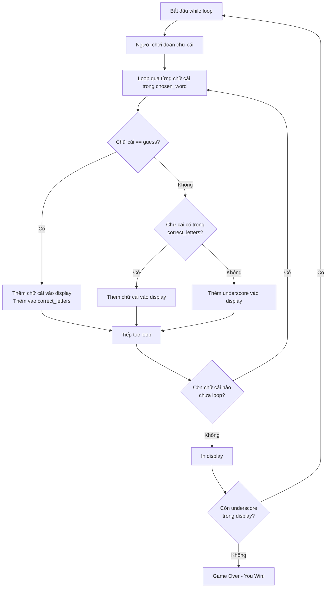

### Tổng quan

Step 3 nâng cấp game bằng cách cho phép người chơi đoán liên tục cho đến khi hoàn thành từ. Đây là bước quan trọng để biến chương trình thành một trò chơi thực sự.

### Mục tiêu Step 3

- Thêm vòng lặp while để người chơi đoán nhiều lần
- Giữ lại các chữ cái đã đoán đúng ở các lượt trước
- Kiểm tra điều kiện thắng (khi không còn dấu gạch dưới)


### Vấn đề cần giải quyết

**Vấn đề hiện tại:**

```
Lượt 1: Đoán "a" → aa___a__
Lượt 2: Đoán "r" → __r__r_ (Mất chữ "a" đã đoán)
```

**Mục tiêu:**

```
Lượt 1: Đoán "a" → aa___a__
Lượt 2: Đoán "r" → aar__ar_ (Giữ chữ "a" + thêm "r")
```


### TODO 1: Thêm While Loop

**Yêu cầu:** Sử dụng [[While Loop]] để người chơi tiếp tục đoán cho đến khi game kết thúc.

**Cách thực hiện:**

```python
# Khởi tạo biến điều kiện
game_over = False

# While loop chạy khi game chưa kết thúc
while not game_over:
    guess = input("Guess a letter: ").lower()
    
    display = ""
    for letter in chosen_word:
        if letter == guess:
            display += letter
        else:
            display += "_"
    
    print(display)
    
    # Kiểm tra điều kiện thắng
    if "_" not in display:
        game_over = True
        print("You win.")
```

**Giải thích chi tiết:**

**Khởi tạo biến game_over:**

```python
game_over = False
```

- Biến Boolean để kiểm soát vòng lặp
- Ban đầu set `False` vì game chưa kết thúc
- Đặt ngoài while loop để không bị reset

**Điều kiện while loop:**

```python
while not game_over:
```

- `not game_over` có nghĩa là "trong khi game_over là False"
- Vòng lặp tiếp tục chạy miễn là `game_over = False`
- Dừng lại khi `game_over = True`

**Indentation (Thụt lề):**

- Tất cả code từ input đến display phải thụt vào một level
- Code bên trong while loop phải nằm trong phạm vi của nó
- Đây là cách Python xác định code nào thuộc vòng lặp

**Kiểm tra điều kiện thắng:**

```python
if "_" not in display:
    game_over = True
    print("You win.")
```

- Toán tử `in` kiểm tra một giá trị có tồn tại trong chuỗi/list không
- `not in` kiểm tra một giá trị KHÔNG tồn tại
- Nếu không còn `_` trong display → người chơi đã đoán hết
- Set `game_over = True` để thoát vòng lặp


### TODO 2: Giữ Chữ Cái Đã Đoán Đúng

**Yêu cầu:** Cập nhật for loop để giữ lại các chữ cái đã đoán đúng ở lượt trước.

**Vấn đề với code hiện tại:**

Mỗi lần while loop chạy lại, `display` được tạo mới từ đầu chỉ dựa trên `guess` hiện tại, không nhớ các chữ cái đã đoán trước đó.

**Giải pháp: Sử dụng List để lưu chữ cái đúng**

```python
# Đặt NGOÀI while loop
correct_letters = []

game_over = False

while not game_over:
    guess = input("Guess a letter: ").lower()
    
    display = ""
    
    for letter in chosen_word:
        if letter == guess:
            display += letter
            correct_letters.append(letter)
        elif letter in correct_letters:
            display += letter
        else:
            display += "_"
    
    print(display)
    
    if "_" not in display:
        game_over = True
        print("You win.")
```

**Giải thích chi tiết:**

**Tạo list lưu chữ cái đúng:**

```python
correct_letters = []
```

- Khởi tạo empty list NGOÀI while loop
- Vị trí này quan trọng vì:
    - Trong while loop → list bị reset mỗi lần lặp
    - Ngoài while loop → list được giữ nguyên và tích lũy

**Logic kiểm tra với elif:**

```python
if letter == guess:
    display += letter
    correct_letters.append(letter)
```

- **Điều kiện 1:** Chữ cái hiện tại khớp với guess
- Thêm chữ cái vào display
- Thêm chữ cái vào `correct_letters` để nhớ lần sau

```python
elif letter in correct_letters:
    display += letter
```

- **Điều kiện 2:** Chữ cái không khớp guess nhưng đã được đoán đúng trước đó
- Kiểm tra chữ cái có trong `correct_letters` không
- Nếu có → thêm vào display (giữ lại chữ cái cũ)

```python
else:
    display += "_"
```

- **Điều kiện 3:** Chữ cái chưa được đoán
- Thêm underscore


### Sơ đồ luồng xử lý




### Ví dụ thực tế

**Từ cần đoán: "baboon"**

```python
# Trạng thái ban đầu
correct_letters = []
display = "______"

# Lượt 1: Đoán "b"
guess = "b"
# Loop: b==b? Yes → display="b", correct_letters=['b']
# Loop: a==b? No, a in []? No → display="b_"
# Loop: b==b? Yes → display="b_b", correct_letters=['b','b']
# ... tiếp tục
# Kết quả: display = "b_b___", correct_letters = ['b','b']

# Lượt 2: Đoán "a"
guess = "a"
# Loop: b==a? No, b in ['b','b']? Yes → display="b"
# Loop: a==a? Yes → display="ba", correct_letters=['b','b','a']
# Loop: b==a? No, b in ['b','b','a']? Yes → display="bab"
# ... tiếp tục
# Kết quả: display = "bab___", correct_letters = ['b','b','a']

# Lượt 3: Đoán "o"
# ... logic tương tự
# Kết quả: display = "baboo_"

# Lượt 4: Đoán "n"
# Kết quả: display = "baboon" → You win!
```


### Code hoàn chỉnh Step 3

```python
import random

word_list = ["aardvark", "baboon", "camel"]

chosen_word = random.choice(word_list)
print(chosen_word)

placeholder = ""
word_length = len(chosen_word)

for position in range(word_length):
    placeholder += "_"

print(placeholder)

# TODO 1: Tạo while loop
correct_letters = []
game_over = False

while not game_over:
    guess = input("Guess a letter: ").lower()
    
    # TODO 2: Giữ chữ cái đã đoán đúng
    display = ""
    
    for letter in chosen_word:
        if letter == guess:
            display += letter
            correct_letters.append(letter)
        elif letter in correct_letters:
            display += letter
        else:
            display += "_"
    
    print(display)
    
    # Kiểm tra điều kiện thắng
    if "_" not in display:
        game_over = True
        print("You win.")
```


### Khái niệm quan trọng

**Toán tử `in`:**

```python
# Kiểm tra trong string
if "a" in "apple":  # True
if "z" in "apple":  # False

# Kiểm tra trong list
if 5 in [1, 2, 3, 4, 5]:  # True
if 6 in [1, 2, 3, 4, 5]:  # False

# Kết hợp với not
if "_" not in display:  # True nếu không có underscore
```

**Vị trí khai báo biến:**

```python
# SAI - Trong while loop (bị reset)
while not game_over:
    correct_letters = []  # Reset mỗi lần lặp
    # Code...

# ĐÚNG - Ngoài while loop (giữ nguyên)
correct_letters = []
while not game_over:
    # Code sử dụng correct_letters
```


### Lưu ý về Infinite Loop

**Nguy cơ vòng lặp vô hạn:**

```python
while not game_over:
    # Code...
    # Quên không set game_over = True
    # → Loop chạy mãi mãi
```

**Cách tránh:**

- Luôn có điều kiện để thoát loop
- Kiểm tra logic set `game_over = True`
- Test với các trường hợp khác nhau


### Kỹ thuật Debug

**Thêm print để theo dõi:**

```python
print(f"Current guess: {guess}")
print(f"Correct letters so far: {correct_letters}")
print(f"Display: {display}")
```

**Sử dụng Thonny:**

- Chạy từng dòng để xem biến thay đổi thế nào
- Quan sát `correct_letters` tích lũy qua các lượt
- Kiểm tra điều kiện `if-elif-else`


### Tầm quan trọng của việc Struggle

**Lời khuyên từ giảng viên:**
> "Nếu bạn đang gặp khó khăn, điều đó có nghĩa là bạn đang học. Nếu không gặp khó khăn gì, có thể nội dung này quá dễ với bạn."

**Phương pháp học hiệu quả:**

- Thử giải quyết ít nhất 10-20 phút trước khi xem solution
- Không xem solution ngay lập tức
- Tư duy là kỹ năng quan trọng nhất của lập trình viên
- Học bằng cách làm, không phải bằng cách đọc code người khác


### Kiến thức áp dụng

Step 3 sử dụng các khái niệm:

- [[While Loop]] với điều kiện Boolean
- [[List]] để lưu trữ dữ liệu tạm thời
- [[append() Method]] để thêm phần tử vào list
- Toán tử `in` và `not in` để kiểm tra
- [[If-Elif-Else]] với nhiều điều kiện
- Scope của biến (trong/ngoài loop)
- Logic tích lũy dữ liệu qua các vòng lặp


### Chuẩn bị cho Step 4

Sau Step 3, game đã có:

- Vòng lặp cho phép đoán nhiều lần
- Hiển thị chữ cái đúng được giữ lại
- Điều kiện thắng khi đoán hết từ

Các bước tiếp theo sẽ thêm:

- Hệ thống mạng (lives)
- Điều kiện thua
- Hiển thị hình Hangman

***

**Liên kết:** [[While Loop]], [[Boolean Variables]], [[List]], [[append() Method]], [[In Operator]], [[Not Operator]], [[If-Elif-Else]], [[Infinite Loop]], [[Variable Scope]], [[String Methods]], [[Game Logic]], [[Accumulator Pattern]]

