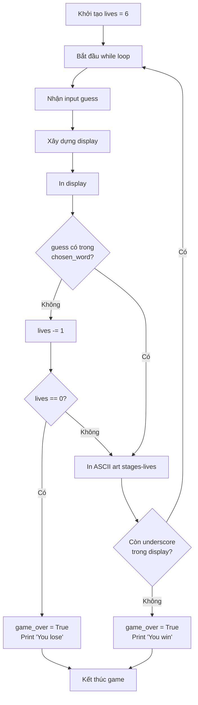

## 

### Tổng quan

Step 4 là bước gần cuối cùng, thêm các tính năng quan trọng để hoàn thiện game: hệ thống mạng (lives), điều kiện thua, và hiển thị hình Hangman bằng ASCII art.

### ASCII Art Stages

File cung cấp sẵn 7 hình ảnh ASCII art (từ stage 6 đến stage 0):

- **Stage 6:** Chỉ có giá treo (0 phần thân) - 6 mạng còn lại
- **Stage 5:** Đầu (1 phần thân) - 5 mạng còn lại
- **Stage 4:** Đầu + thân (2 phần) - 4 mạng còn lại
- **Stage 3:** Đầu + thân + tay trái - 3 mạng còn lại
- **Stage 2:** Đầu + thân + 2 tay - 2 mạng còn lại
- **Stage 1:** Đầu + thân + 2 tay + chân trái - 1 mạng còn lại
- **Stage 0:** Hoàn chỉnh (tất cả phần thân) - 0 mạng, Game Over


### Mục tiêu Step 4

Sau khi hoàn thành:

- Người chơi bắt đầu với 6 mạng
- Mỗi lần đoán sai mất 1 mạng
- Hiển thị hình Hangman tương ứng với số mạng
- Khi hết mạng (lives = 0) → Game Over, "You lose"
- Đoán đúng không ảnh hưởng đến số mạng

**Ví dụ gameplay:**

```
Từ: "baboon"
Đoán "b" → Đúng → Hình không đổi (stage 6)
Đoán "a" → Đúng → Hình không đổi (stage 6)  
Đoán "f" → Sai → Mất 1 mạng → Hiển thị stage 5
Đoán "x" → Sai → Mất 1 mạng → Hiển thị stage 4
... tiếp tục cho đến khi thắng hoặc thua
```


### TODO 1: Tạo Biến Lives

**Yêu cầu:** Tạo biến `lives` để theo dõi số mạng, bắt đầu với 6 mạng.

**Cách thực hiện:**

```python
lives = 6
```

**Giải thích:**

- Khai báo biến NGOÀI while loop (giống `correct_letters`)
- Giá trị ban đầu = 6 (người chơi có 6 cơ hội sai)
- Biến này sẽ giảm dần khi đoán sai


### TODO 2: Xử Lý Đoán Sai và Điều Kiện Thua

**Yêu cầu:**

- Nếu chữ cái đoán không có trong từ → giảm lives
- Khi lives = 0 → game over, in "You lose"

**Cách thực hiện:**

```python
while not game_over:
    guess = input("Guess a letter: ").lower()
    
    display = ""
    for letter in chosen_word:
        if letter == guess:
            display += letter
            correct_letters.append(letter)
        elif letter in correct_letters:
            display += letter
        else:
            display += "_"
    
    print(display)
    
    # TODO 2: Xử lý đoán sai
    if guess not in chosen_word:
        lives -= 1
        if lives == 0:
            game_over = True
            print("You lose.")
    
    # Kiểm tra thắng
    if "_" not in display:
        game_over = True
        print("You win.")
```

**Giải thích chi tiết:**

**Kiểm tra chữ cái không có trong từ:**

```python
if guess not in chosen_word:
```

- Toán tử `not in` kiểm tra chữ cái có tồn tại trong chuỗi không
- Khác với logic trong for loop (so sánh từng chữ cái)
- Đây là statement độc lập, không can thiệp vào logic hiển thị

**Giảm số mạng:**

```python
lives -= 1
```

- Tương đương với `lives = lives - 1`
- Mỗi lần đoán sai, trừ đi 1 mạng

**Kiểm tra điều kiện thua:**

```python
if lives == 0:
    game_over = True
    print("You lose.")
```

- Khi hết mạng → set `game_over = True`
- While loop sẽ dừng
- In thông báo thua cho người chơi

**Tại sao viết statement riêng?**

Thay vì sửa đổi `if-elif-else` hiện có:

```python
# Không nên làm thế này
for letter in chosen_word:
    if letter == guess:
        # ...
    else:
        lives -= 1  # SAI: Sẽ trừ mạng nhiều lần
```

Viết statement riêng:

- Logic rõ ràng hơn
- Dễ debug
- Chỉ trừ mạng 1 lần mỗi lượt đoán
- Tách biệt logic hiển thị và logic mạng


### TODO 3: Hiển Thị ASCII Art

**Yêu cầu:** In hình Hangman từ list `stages` tương ứng với số mạng còn lại.

**Cách thực hiện:**

```python
while not game_over:
    guess = input("Guess a letter: ").lower()
    
    # ... code xử lý display ...
    
    print(display)
    
    # TODO 3: In ASCII art
    print(stages[lives])
    
    # ... code kiểm tra lives và thắng/thua ...
```

**Giải thích:**

**Vị trí in ASCII art:**

- Đặt TRONG while loop
- In sau mỗi lượt đoán để cập nhật trạng thái
- Thường đặt sau `print(display)`

**Truy cập list stages:**

```python
print(stages[lives])
```

- `stages` là list chứa 7 hình ASCII art
- Index tương ứng với số mạng: `stages[6]`, `stages[5]`, ..., `stages[0]`
- Khi `lives = 6` → in `stages[6]` (chỉ có giá)
- Khi `lives = 0` → in `stages[0]` (hình hoàn chỉnh)

**Thứ tự trong list stages:**

```python
stages = [
    # Stage 0 - Game Over
    """
       ___
      |   |
      O   |
     /|\  |
     / \  |
          |
    =========
    """,
    # Stage 1 - 1 mạng
    """
       ___
      |   |
      O   |
     /|\  |
     /    |
          |
    =========
    """,
    # ... tiếp tục đến stage 6
]
```


### Code hoàn chỉnh Step 4

```python
import random

word_list = ["aardvark", "baboon", "camel"]

stages = ['''
  +---+
  |   |
  O   |
 /|\  |
 / \  |
      |
=========
''', '''
  +---+
  |   |
  O   |
 /|\  |
 /    |
      |
=========
''', '''
  +---+
  |   |
  O   |
 /|\  |
      |
      |
=========
''', '''
  +---+
  |   |
  O   |
  |   |
      |
      |
=========
''', '''
  +---+
  |   |
  O   |
      |
      |
      |
=========
''', '''
  +---+
  |   |
      |
      |
      |
      |
=========
''', '''
  +---+
  |   |
      |
      |
      |
      |
=========
''']

chosen_word = random.choice(word_list)
print(chosen_word)

placeholder = ""
word_length = len(chosen_word)

for position in range(word_length):
    placeholder += "_"

print(placeholder)

# TODO 1: Tạo biến lives
lives = 6

correct_letters = []
game_over = False

while not game_over:
    guess = input("Guess a letter: ").lower()
    
    display = ""
    
    for letter in chosen_word:
        if letter == guess:
            display += letter
            correct_letters.append(letter)
        elif letter in correct_letters:
            display += letter
        else:
            display += "_"
    
    print(display)
    
    # TODO 2: Giảm lives khi đoán sai
    if guess not in chosen_word:
        lives -= 1
        if lives == 0:
            game_over = True
            print("You lose.")
    
    # TODO 3: In ASCII art
    print(stages[lives])
    
    # Kiểm tra thắng
    if "_" not in display:
        game_over = True
        print("You win.")
```


### Sơ đồ luồng xử lý Step 4




### Phân tích kỹ thuật

**Hai điều kiện game over:**

```python
# Điều kiện 1: Thua (lives = 0)
if guess not in chosen_word:
    lives -= 1
    if lives == 0:
        game_over = True
        print("You lose.")

# Điều kiện 2: Thắng (đoán hết từ)
if "_" not in display:
    game_over = True
    print("You win.")
```

**Logic độc lập:**

- Kiểm tra đoán sai: Statement riêng với `not in`
- Kiểm tra hiển thị: Logic trong for loop với `if-elif-else`
- Hai phần không ảnh hưởng lẫn nhau
- Dễ maintain và debug

**Quan hệ giữa lives và stages:**


| Lives | Index stages | Mô tả hình |
| :-- | :-- | :-- |
| 6 | stages | Chỉ có giá treo |
| 5 | stages | Đầu |
| 4 | stages | Đầu + thân |
| 3 | stages | + Tay trái |
| 2 | stages | + Tay phải |
| 1 | stages | + Chân trái |
| 0 | stages | Hoàn chỉnh |

### Ví dụ gameplay hoàn chỉnh

```
Từ được chọn: baboon
Placeholder: ______

Guess a letter: b
Display: b_b___
ASCII: stages[6] (chỉ có giá)

Guess a letter: a
Display: ba_aa_
ASCII: stages[6] (không đổi vì đoán đúng)

Guess a letter: x
Display: ba_aa_
ASCII: stages[5] (xuất hiện đầu)
lives = 5

Guess a letter: y
Display: ba_aa_
ASCII: stages[4] (thêm thân)
lives = 4

... tiếp tục cho đến khi:

Option 1 - Thắng:
Guess a letter: n
Display: baboon
You win.

Option 2 - Thua:
lives = 0
ASCII: stages[0] (hình hoàn chỉnh)
You lose.
```


### Lưu ý quan trọng

**Thứ tự kiểm tra:**

- Kiểm tra lives TRƯỚC khi kiểm tra thắng
- Nếu cả hai điều kiện xảy ra cùng lúc, lives = 0 được ưu tiên
- Đảm bảo logic game chính xác

**Indentation:**

- `print(stages[lives])` phải trong while loop
- Cùng level với `print(display)`
- Nếu sai indentation → chỉ in 1 lần hoặc không in

**Index out of range:**

- Không xảy ra vì `lives` chỉ từ 0-6
- `stages` có đúng 7 phần tử (index 0-6)
- Luôn khớp với số mạng


### Mức độ khó

Theo giảng viên: Step 4 dễ hơn các step trước vì:

- TODO 1 chỉ là khai báo biến đơn giản
- TODO 2 sử dụng logic đã học (`not in`, giảm biến)
- TODO 3 chỉ cần truy cập list bằng index

**Lời khuyên:**

- Nếu chưa hiểu rõ các step trước, hãy xem lại
- Đảm bảo có thể viết lại code từ đầu
- Hiểu logic, không chỉ copy code


### Kiến thức áp dụng

Step 4 sử dụng các khái niệm:

- [[Variable Declaration]] và tracking state
- [[Not In Operator]] để kiểm tra chữ cái không tồn tại
- [[Decrement Operator]] (`-=`) để giảm giá trị
- [[List Indexing]] để truy cập ASCII art
- [[Nested If Statements]] cho logic phức tạp
- [[Game State Management]] với nhiều điều kiện kết thúc
- [[ASCII Art]] để tạo giao diện text-based


### Chuẩn bị cho Step 5

Sau Step 4, game gần như hoàn chỉnh với:

- Hệ thống mạng hoạt động
- Hiển thị hình Hangman
- Điều kiện thắng và thua
- Logic game đầy đủ

Step 5 (bước cuối) sẽ hoàn thiện:

- Tối ưu code
- Thêm tính năng phụ
- Polish game experience

***

**Liên kết:** [[Lives System]], [[ASCII Art]], [[List Indexing]], [[Not In Operator]], [[Game Over Conditions]], [[Decrement Operator]], [[Nested Conditions]], [[Game State]], [[User Feedback]], [[Text-Based UI]]

