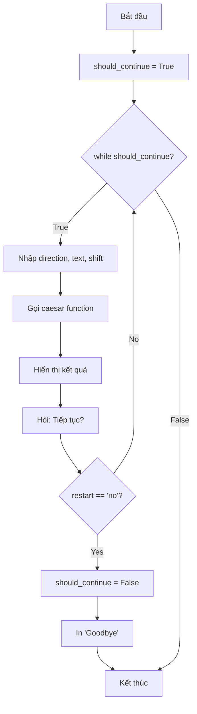

## Caesar Cipher - Phần 3: Hoàn thiện chương trình

### Mục tiêu phần cuối

Hoàn thiện Caesar Cipher với ba tính năng quan trọng:

- Import và hiển thị logo ASCII art
- Xử lý ký tự đặc biệt (số, ký hiệu, khoảng trắng)
- Thêm khả năng chạy lại chương trình


### TODO 1: Import và hiển thị logo

**Yêu cầu:** Import logo từ file `art.py` và hiển thị khi khởi động chương trình.

**Giải pháp:**

```python
import art

print(art.logo)
```

**Cách hoạt động:**

- File `art.py` chứa biến `logo` với ASCII art
- Import module `art` để truy cập biến này
- Sử dụng `art.logo` để in ra logo

**Cú pháp thay thế:**

```python
from art import logo
print(logo)
```


### TODO 2: Xử lý ký tự không phải chữ cái

**Vấn đề:** Khi người dùng nhập ký tự đặc biệt (số, khoảng trắng, ký hiệu), chương trình gặp lỗi hoặc mất ký tự đó.

**Ví dụ:**

```
Input: hello 123!
Kỳ vọng: Giữ nguyên số và ký hiệu, chỉ mã hóa chữ cái
```

**Logic xử lý:**

Trong vòng lặp, kiểm tra xem ký tự hiện tại có trong alphabet hay không:

- Nếu KHÔNG → Giữ nguyên ký tự
- Nếu CÓ → Thực hiện shift như bình thường

**Code cải tiến:**

```python
def caesar(original_text, shift_amount, encode_or_decode):
    output_text = ""
    
    if encode_or_decode == "decode":
        shift_amount *= -1
    
    for letter in original_text:
        # Kiểm tra ký tự có trong alphabet không
        if letter not in alphabet:
            # Giữ nguyên ký tự đặc biệt
            output_text += letter
        else:
            # Xử lý shift cho chữ cái
            position = alphabet.index(letter)
            shifted_position = (position + shift_amount) % len(alphabet)
            output_text += alphabet[shifted_position]
    
    print(f"Here is the {encode_or_decode}d result: {output_text}")
```

**Giải thích:**

**Trường hợp 1 - Ký tự đặc biệt:**

```python
letter = "1"
if "1" not in alphabet:  # True
    output_text += "1"  # Thêm trực tiếp vào kết quả
```

**Trường hợp 2 - Chữ cái:**

```python
letter = "a"
if "a" not in alphabet:  # False
    # Bỏ qua if, chạy else
    # Thực hiện shift bình thường
```

**Test với ký tự hỗn hợp:**

```
Input: encode
Message: hello 123!
Shift: 3
Output: khoor 123!
```


### TODO 3: Thêm tính năng restart

**Yêu cầu:** Sau khi encode/decode xong, hỏi người dùng có muốn tiếp tục không.

**Sử dụng while loop:**

```python
import art

print(art.logo)

alphabet = ['a', 'b', 'c', 'd', 'e', 'f', 'g', 'h', 'i', 'j', 'k', 'l', 
            'm', 'n', 'o', 'p', 'q', 'r', 's', 't', 'u', 'v', 'w', 'x', 'y', 'z']

def caesar(original_text, shift_amount, encode_or_decode):
    output_text = ""
    
    if encode_or_decode == "decode":
        shift_amount *= -1
    
    for letter in original_text:
        if letter not in alphabet:
            output_text += letter
        else:
            position = alphabet.index(letter)
            shifted_position = (position + shift_amount) % len(alphabet)
            output_text += alphabet[shifted_position]
    
    print(f"Here is the {encode_or_decode}d result: {output_text}")

# Biến điều khiển vòng lặp
should_continue = True

while should_continue:
    direction = input("Type 'encode' to encrypt, type 'decode' to decrypt:\n")
    text = input("Type your message:\n").lower()
    shift = int(input("Type the shift number:\n"))
    
    # Thực hiện mã hóa/giải mã
    caesar(original_text=text, shift_amount=shift, encode_or_decode=direction)
    
    # Hỏi có muốn tiếp tục không
    restart = input("Type 'yes' if you want to go again. Otherwise type 'no'.\n").lower()
    
    if restart == "no":
        should_continue = False
        print("Goodbye")
```

**Luồng hoạt động:**



**Giải thích vòng lặp:**

**Lần chạy 1:**

- `should_continue = True` → Vào while loop
- Nhập input và xử lý
- Hỏi tiếp tục → Người dùng nhập "yes"
- `restart != "no"` → Bỏ qua if statement
- Quay lại đầu while loop

**Lần chạy N:**

- Người dùng nhập "no"
- `restart == "no"` → True
- `should_continue = False`
- In "Goodbye"
- While loop kiểm tra → False → Kết thúc


### BUG quan trọng và cách fix

**Phát hiện bug:**

Khi test liên tục encode rồi decode:

```
Test 1:
encode → "ab" → shift 2 → "cd" ✓

Test 2:
decode → "cd" → shift 2 → "anf" ✗ (Kỳ vọng: "ab")
```

**Nguyên nhân:**

```python
def caesar(original_text, shift_amount, encode_or_decode):
    output_text = ""
    
    for letter in original_text:  # ← Vòng lặp bắt đầu
        if letter not in alphabet:
            output_text += letter
        else:
            if encode_or_decode == "decode":  # ← Vị trí SAI!
                shift_amount *= -1
            
            position = alphabet.index(letter)
            shifted_position = (position + shift_amount) % len(alphabet)
            output_text += alphabet[shifted_position]
```

**Vấn đề:**

- Dòng `shift_amount *= -1` nằm BÊN TRONG vòng lặp
- Mỗi lần lặp, shift_amount bị đảo dấu
- Vòng 1: 2 → -2
- Vòng 2: -2 → 2
- Vòng 3: 2 → -2
- ...cứ thế flip liên tục!

**Giải pháp:**

```python
def caesar(original_text, shift_amount, encode_or_decode):
    output_text = ""
    
    # Đưa RA NGOÀI vòng lặp - chỉ thực hiện 1 lần
    if encode_or_decode == "decode":
        shift_amount *= -1
    
    for letter in original_text:
        if letter not in alphabet:
            output_text += letter
        else:
            position = alphabet.index(letter)
            shifted_position = (position + shift_amount) % len(alphabet)
            output_text += alphabet[shifted_position]
    
    print(f"Here is the {encode_or_decode}d result: {output_text}")
```

**Test sau khi fix:**

```
encode → "ab" → shift 2 → "cd" ✓
decode → "cd" → shift 2 → "ab" ✓
```


### Code hoàn chỉnh cuối cùng

```python
import art

print(art.logo)

alphabet = ['a', 'b', 'c', 'd', 'e', 'f', 'g', 'h', 'i', 'j', 'k', 'l', 
            'm', 'n', 'o', 'p', 'q', 'r', 's', 't', 'u', 'v', 'w', 'x', 'y', 'z']

def caesar(original_text, shift_amount, encode_or_decode):
    output_text = ""
    
    # Fix bug: Đưa ra ngoài for loop
    if encode_or_decode == "decode":
        shift_amount *= -1
    
    for letter in original_text:
        if letter not in alphabet:
            output_text += letter
        else:
            position = alphabet.index(letter)
            shifted_position = (position + shift_amount) % len(alphabet)
            output_text += alphabet[shifted_position]
    
    print(f"Here is the {encode_or_decode}d result: {output_text}")

should_continue = True

while should_continue:
    direction = input("Type 'encode' to encrypt, type 'decode' to decrypt:\n")
    text = input("Type your message:\n").lower()
    shift = int(input("Type the shift number:\n"))
    
    caesar(original_text=text, shift_amount=shift, encode_or_decode=direction)
    
    restart = input("Type 'yes' if you want to go again. Otherwise type 'no'.\n").lower()
    
    if restart == "no":
        should_continue = False
        print("Goodbye")
```


### Kỹ thuật debugging

**Phương pháp phát hiện bug:**

- Test lặp đi lặp lại các chức năng
- So sánh kết quả thực tế với kỳ vọng
- Thêm `print()` ở các vị trí nghi ngờ để theo dõi giá trị biến

**Ví dụ debug:**

```python
for letter in original_text:
    print(f"Current shift_amount: {shift_amount}")  # Debug line
    if encode_or_decode == "decode":
        shift_amount *= -1
    print(f"After flip: {shift_amount}")  # Debug line
```


### Cải tiến thêm (Tùy chọn)

**Ý tưởng mở rộng:**

**1. Thêm số và ký hiệu vào alphabet:**

```python
alphabet = ['a', 'b', ..., 'z', '0', '1', ..., '9', ' ', '!', '?']
```

**2. Hỗ trợ chữ hoa:**

```python
if letter.isupper():
    # Xử lý riêng cho chữ hoa
    pass
```

**3. Validate shift number:**

```python
if shift > 26:
    shift = shift % 26  # Tối ưu shift number
```

**4. Lưu lịch sử encode/decode:**

```python
history = []
history.append({"input": text, "output": output_text, "shift": shift})
```


### Bài học rút ra

**Về placement trong code:**

- Vị trí đặt code ảnh hưởng lớn đến logic
- Code trong vòng lặp sẽ thực thi nhiều lần
- Cẩn thận với side effects (như `*= -1`)

**Về testing:**

- Luôn test nhiều lần với các input khác nhau
- Test cả edge cases
- Test liên tục các chức năng để phát hiện bug logic

**Về problem solving:**

- Chia nhỏ vấn đề lớn thành các vấn đề nhỏ
- Giải quyết từng TODO một
- Không ngại debugging và sửa lỗi


### Kết luận

Chúc mừng bạn đã hoàn thành dự án Caesar Cipher! Qua dự án này, bạn đã:

- Làm quen với functions có nhiều parameters
- Hiểu về positional và keyword arguments
- Xử lý string manipulation và list indexing
- Sử dụng while loop cho control flow
- Học cách debug và fix logic bugs
- Xử lý edge cases và input validation

Dự án này có thể khó, nhưng đó là dấu hiệu tốt - bạn đang xây dựng "cơ bắp lập trình"! Nếu gặp khó khăn, đó là điều bình thường và là một phần của quá trình học tập.

***

**Liên kết:** [[Caesar Cipher]], [[while loop]], [[Import Module]], [[ASCII Art]], [[String Manipulation]], [[Edge Cases]], [[Debugging]], [[Control Flow]], [[Boolean Variables]], [[Input Validation]], [[Logic Bugs]], [[Code Placement]]

