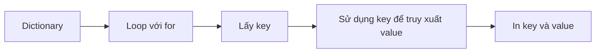

## Dictionary trong Python - Cơ bản và Thao tác

### Khái niệm Dictionary

**Dictionary** (từ điển) trong Python hoạt động tương tự từ điển thực tế. Khi tra từ "code" trong từ điển, bạn sẽ tìm thấy định nghĩa "program instructions for the computer".

Dictionary giúp nhóm và gắn nhãn các thông tin liên quan với nhau. Cấu trúc gồm hai phần:

- **Key** (khóa): Tương đương với từ cần tra
- **Value** (giá trị): Tương đương với định nghĩa của từ


### Cú pháp tạo Dictionary

Cú pháp cơ bản:

```python
{Key: Value}
```

Ví dụ đơn giản với một entry:

```python
{"Bug": "An error in a program that prevents the program from running as expected."}
```

Khi có nhiều entries, format theo chuẩn:

```python
programming_dictionary = {
    "Bug": "An error in a program that prevents the program from running as expected.",
    "Function": "A piece of code that you can easily call over and over again.",
    "Loop": "The action of doing something over and over again.",
}
```

**Lưu ý format:**

- Dấu mở `{` ở đầu dòng
- Mỗi entry thụt vào một indent
- Mỗi entry kết thúc bằng dấu phẩy `,`
- Dấu đóng `}` thẳng hàng với dòng đầu tiên
- Nên thêm dấu phẩy sau entry cuối cùng để dễ bổ sung sau này


### Truy xuất dữ liệu

Sử dụng cú pháp với square brackets `[]` và cung cấp key:

```python
programming_dictionary["Bug"]
# Output: "An error in a program that prevents the program from running as expected."
```

**Lỗi thường gặp:**

- **KeyError**: Xảy ra khi key không tồn tại (ví dụ: lỗi chính tả "Bog" thay vì "Bug")
- **Sai kiểu dữ liệu**: Key phải đúng kiểu dữ liệu khi khai báo (string phải có dấu ngoặc kép, số thì không cần)

```python
# Sai - thiếu dấu ngoặc kép
{Bug: "definition"}  # Error: undefined name bug

# Đúng
{"Bug": "definition"}
```


### Thêm entries mới

Thêm entry vào dictionary đã tồn tại:

```python
programming_dictionary["Loop"] = "The action of doing something over and over again."
```

Tạo empty dictionary để thêm sau:

```python
# Cách 1: Curly braces rỗng
empty_dict = {}

# Cách 2: Sau đó thêm entries
empty_dict["Key"] = "Value"
```


### Sửa giá trị của entry

Sử dụng cú pháp tương tự như thêm mới:

```python
# Giá trị cũ
print(programming_dictionary["Bug"])
# Output: "An error in a program that prevents the program from running as expected."

# Sửa giá trị
programming_dictionary["Bug"] = "A moth in your computer."

# Giá trị mới
print(programming_dictionary["Bug"])
# Output: "A moth in your computer."
```

**Cơ chế hoạt động:**

- Nếu key đã tồn tại → Sửa giá trị
- Nếu key chưa tồn tại → Tạo entry mới


### Xóa toàn bộ Dictionary

Gán lại dictionary bằng empty dictionary:

```python
programming_dictionary = {}
```

Hữu ích khi cần reset dữ liệu người dùng hoặc khởi động lại game.

### Loop qua Dictionary

Khi loop qua dictionary, mặc định bạn chỉ nhận được **keys**:

```python
for key in programming_dictionary:
    print(key)
# Output: Bug, Function, Loop
```

Để lấy cả key và value:

```python
for key in programming_dictionary:
    print(key)  # In ra key
    print(programming_dictionary[key])  # In ra value tương ứng
```

**Luồng xử lý:**



**Giải thích sơ đồ:** Khi loop qua dictionary, vòng lặp sẽ duyệt qua từng key. Với mỗi key, ta có thể sử dụng cú pháp `dictionary[key]` để truy xuất value tương ứng.

### Các lỗi phổ biến cần tránh

- Viết sai chính tả key khi truy xuất
- Quên dấu ngoặc kép cho string key
- Cố truy xuất key không tồn tại
- Nhầm lẫn giữa thêm mới và chỉnh sửa


### Ví dụ thực hành đầy đủ

```python
# Tạo dictionary
programming_dictionary = {
    "Bug": "An error in a program",
    "Function": "A piece of code",
}

# Truy xuất
print(programming_dictionary["Bug"])

# Thêm mới
programming_dictionary["Loop"] = "Doing something repeatedly"

# Sửa
programming_dictionary["Bug"] = "A moth in computer"

# Loop
for key in programming_dictionary:
    print(f"{key}: {programming_dictionary[key]}")

# Xóa toàn bộ
programming_dictionary = {}
```

**Liên kết:** [[Dictionary]], [[Key-Value Pair]], [[Loop]], [[Data Structure]], [[Python Syntax]], [[KeyError]]

