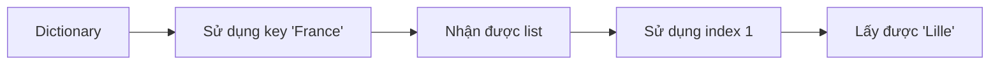
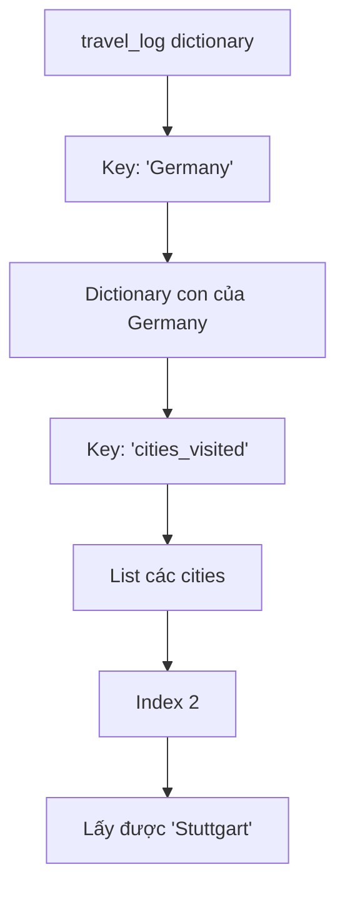

## Nesting trong Python - Lồng ghép cấu trúc dữ liệu

### Khái niệm Nesting

**Nesting** (lồng ghép) là việc đặt một cấu trúc dữ liệu bên trong một cấu trúc khác. Hãy tưởng tượng list hoặc dictionary như một folder có thể chứa nhiều thứ bên trong - nesting chính là việc đặt folder này vào folder khác.

Cấu trúc cơ bản:

```python
{
    "key": ["value1", "value2"],  # List làm value
    "key2": {"nested_key": "nested_value"}  # Dictionary làm value
}
```

Điều này cho phép lưu trữ dữ liệu phức tạp hơn với nhiều tầng lớp thông tin.

### Nesting List trong Dictionary

Khi một key cần lưu nhiều giá trị, ta sử dụng list làm value:

**Ví dụ đơn giản:**

```python
# Dictionary đơn giản
capital = {
    "France": "Paris",
    "Germany": "Berlin"
}
```

**Nesting list để lưu nhiều cities:**

```python
travel_log = {
    "France": ["Paris", "Lille", "Dijon"],
    "Germany": ["Berlin", "Hamburg", "Stuttgart"]
}
```

**Lưu ý quan trọng:** Mỗi key chỉ có thể có **một value**. Để lưu nhiều giá trị, phải gộp chúng thành một list.

### Truy xuất dữ liệu từ List trong Dictionary

**Thử thách:** In ra "Lille" từ travel_log

**Cách giải:**

```python
travel_log = {
    "France": ["Paris", "Lille", "Dijon"]
}

# Bước 1: Truy xuất list
print(travel_log["France"])  # Output: ["Paris", "Lille", "Dijon"]

# Bước 2: Truy xuất phần tử trong list
print(travel_log["France"][1])  # Output: "Lille"
```

**Luồng truy xuất:**



**Giải thích:** Đầu tiên dùng key để lấy list, sau đó dùng index để lấy phần tử cụ thể trong list.

### Nesting List trong List - 2D List

**2D List** (danh sách hai chiều) là list chứa list khác bên trong:

```python
nested_list = ["A", "B", ["C", "D"]]
# Index:      0    1      2
```

**Thử thách:** In ra chữ "D"

**Cách giải:**

```python
# Bước 1: Truy xuất list con
print(nested_list[2])  # Output: ["C", "D"]

# Bước 2: Truy xuất phần tử trong list con
print(nested_list[2][1])  # Output: "D"
```

**Nguyên tắc:** `nested_list[2]` trả về list `["C", "D"]`, sau đó `[1]` lấy phần tử thứ 2.

### Nesting Dictionary trong Dictionary

Cấu trúc phức tạp nhất - dictionary chứa dictionary khác:

```python
travel_log = {
    "France": {
        "num_times_visited": 8,
        "cities_visited": ["Paris", "Lille", "Dijon"]
    },
    "Germany": {
        "num_times_visited": 5,
        "cities_visited": ["Berlin", "Hamburg", "Stuttgart"]
    }
}
```

**Ưu điểm:** Tổ chức dữ liệu tốt hơn, có thể lưu nhiều thông tin liên quan cho mỗi key.

### Truy xuất dữ liệu từ cấu trúc phức tạp

**Thử thách:** In ra "Stuttgart" từ travel_log phức tạp

**Phân tích từng bước:**

```python
# Bước 1: Truy xuất dictionary của Germany
print(travel_log["Germany"])
# Output: {"num_times_visited": 5, "cities_visited": ["Berlin", "Hamburg", "Stuttgart"]}

# Bước 2: Truy xuất list cities_visited
print(travel_log["Germany"]["cities_visited"])
# Output: ["Berlin", "Hamburg", "Stuttgart"]

# Bước 3: Truy xuất phần tử thứ 3 (index 2)
print(travel_log["Germany"]["cities_visited"][2])
# Output: "Stuttgart"
```

**Sơ đồ luồng truy xuất:**



**Giải thích:** Mỗi cặp ngoặc vuông `[]` đại diện cho một tầng truy xuất. Từ ngoài vào trong: dictionary cha → dictionary con → list → phần tử trong list.

### Tổng hợp các kiểu Nesting

**List trong List:**

```python
nested_list = [["A", "B"], ["C", "D"]]
print(nested_list[1][0])  # Output: "C"
```

**List trong Dictionary:**

```python
data = {"key": ["value1", "value2"]}
print(data["key"][0])  # Output: "value1"
```

**Dictionary trong Dictionary:**

```python
data = {"outer": {"inner": "value"}}
print(data["outer"]["inner"])  # Output: "value"
```

**List trong Dictionary trong Dictionary:**

```python
data = {
    "country": {
        "cities": ["City1", "City2"]
    }
}
print(data["country"]["cities"][1])  # Output: "City2"
```


### Mẹo thực hành

- **Đi từng bước:** Truy xuất từng tầng và in ra để kiểm tra
- **Copy-paste key:** Tránh lỗi chính tả khi truy xuất
- **Chú ý index:** Nhớ rằng index bắt đầu từ 0
- **Hiểu cấu trúc:** Vẽ sơ đồ cấu trúc data để dễ hình dung


### Lưu ý quan trọng

Nesting có thể gây nhầm lẫn ban đầu vì có nhiều tầng lớp. Để thành thạo:

- Thực hành với nhiều ví dụ khác nhau
- Thử truy xuất các phần tử khác trong cấu trúc
- Hiểu từng bước truy xuất thay vì học thuộc


### Ví dụ thực hành đầy đủ

```python
# Tạo cấu trúc phức tạp
student_scores = {
    "Alice": {
        "subjects": ["Math", "Science", "English"],
        "scores": [95, 88, 92]
    },
    "Bob": {
        "subjects": ["Math", "Science", "English"],
        "scores": [78, 85, 80]
    }
}

# Truy xuất điểm Science của Alice
# Bước 1: Lấy dictionary của Alice
alice_data = student_scores["Alice"]

# Bước 2: Lấy list scores
alice_scores = alice_data["scores"]

# Bước 3: Lấy điểm Science (index 1)
science_score = alice_scores[1]
print(science_score)  # Output: 88

# Hoặc viết gọn:
print(student_scores["Alice"]["scores"][1])  # Output: 88
```

**Liên kết:** [[Nesting]], [[Dictionary]], [[List]], [[2D List]], [[Data Structure]], [[Index]], [[Key-Value Pair]]

