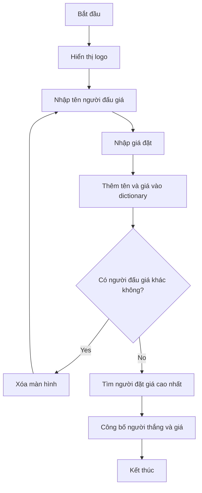

## Dự án: Chương trình Đấu giá thầm lặng (Blind Auction)

### Tổng quan dự án

Xây dựng chương trình **Blind Auction** (đấu giá thầm lặng) - nơi mọi người đặt giá bí mật và chỉ công bố người thắng cuộc ở cuối. Điểm khác biệt so với đấu giá thông thường:

- **Đấu giá thông thường**: Mọi người thấy giá của nhau, cạnh tranh trả giá cao hơn
- **Đấu giá thầm lặng**: Mọi người đặt giá bí mật, không ai biết giá của người khác, mọi người đưa ra giá cao nhất họ sẵn sàng trả


### Cách hoạt động chương trình

**Luồng xử lý:**

1. **Hiển thị logo** búa đấu giá (ASCII art) và thông báo chương trình
2. **Nhập thông tin người đấu giá đầu tiên:**
    - Tên (ví dụ: Angela)
    - Giá đặt (ví dụ: \$12)
3. **Hỏi có người đấu giá khác không?**
    - Nếu "yes": Xóa màn hình → Người tiếp theo nhập
    - Nếu "no": Tính toán và công bố người thắng
4. **Lặp lại** cho người thứ 2 (John - \$3), người thứ 3 (Kate - \$1)...
5. **Kết thúc:** Khi chọn "no", hiển thị: "The winner is Angela with a bid of \$12."

### Flowchart của chương trình

**Sơ đồ luồng xử lý:**



**Giải thích luồng:**

- Dictionary lưu trữ tất cả bids với cấu trúc `{name: bid}`
- Vòng lặp tiếp tục cho đến khi user chọn "no"
- Function riêng để tìm highest bid trong dictionary


### Phân tích các bước thực hiện

**To-do list chính:**

1. Yêu cầu user nhập input (tên, giá đặt, có tiếp tục không)
2. Lưu dữ liệu vào dictionary với tên là key, giá là value
3. Kiểm tra có bidder mới không → Sử dụng loop
4. So sánh tất cả bids và tìm highest bid

### Implementation Code

**Bước 1: Nhập thông tin user**

```python
# Khởi tạo dictionary rỗng để lưu bids
bids = {}

# Input từ user
name = input("What is your name? ")
price = int(input("What is your bid? $"))
```

**Lưu ý:** Convert input thành `int()` vì input trả về string, cần số để so sánh. Nếu cần decimal, dùng `float()`.

**Bước 2: Lưu data vào dictionary**

```python
# Thêm entry vào dictionary
bids[name] = price
```

Cấu trúc dictionary: `{"Angela": 12, "John": 3, "Kate": 1}`

**Bước 3: Tạo loop để tiếp tục nhận bids**

```python
continue_bidding = True

while continue_bidding:
    # Input tên và giá
    name = input("What is your name? ")
    price = int(input("What is your bid? $"))
    
    # Lưu vào dictionary
    bids[name] = price
    
    # Hỏi có tiếp tục không
    should_continue = input("Are there any other bidders? Type 'yes' or 'no'.\n").lower()
    
    if should_continue == "no":
        continue_bidding = False
        # Gọi function tìm highest bidder
        find_highest_bidder(bids)
    elif should_continue == "yes":
        # Clear screen
        print("\n" * 100)
```

**Giải thích quan trọng:**

- Dictionary `bids` phải ở **ngoài while loop** để tích lũy dữ liệu
- Nếu đặt bên trong loop → Reset về empty mỗi lần lặp → Mất data trước đó
- Dùng `.lower()` để chuẩn hóa input thành lowercase

**Bước 4: Function tìm highest bidder**

```python
def find_highest_bidder(bidding_dictionary):
    highest_bid = 0
    winner = ""
    
    # Loop qua dictionary
    for bidder in bidding_dictionary:
        bid_amount = bidding_dictionary[bidder]
        
        # So sánh với highest bid hiện tại
        if bid_amount > highest_bid:
            highest_bid = bid_amount
            winner = bidder
    
    # In kết quả
    print(f"The winner is {winner} with a bid of ${highest_bid}.")
```

**Logic tìm highest bid:**

1. Khởi tạo `highest_bid = 0` và `winner = ""`
2. Loop qua từng bidder trong dictionary
3. Lấy `bid_amount` của bidder đó: `bidding_dictionary[bidder]`
4. Nếu `bid_amount > highest_bid`:
    - Cập nhật `highest_bid = bid_amount`
    - Cập nhật `winner = bidder`
5. Sau khi loop xong, `winner` chứa người có bid cao nhất

**Lưu ý khi loop qua dictionary:**

```python
for bidder in bidding_dictionary:
    # bidder là KEY (tên người)
    # Lấy VALUE (giá) bằng: bidding_dictionary[bidder]
```


### Kỹ thuật xóa màn hình (Clear Screen)

**Phương pháp đơn giản:**

```python
print("\n" * 100)
```

**Cách hoạt động:**

- `\n` là ký tự new line (xuống dòng)
- Nhân với 100 tạo ra 100 dòng trống
- Đẩy nội dung cũ lên trên, user không thấy được trừ khi scroll up

**Ví dụ minh họa:**

```python
print("Hello")
input("Type something: ")
print("\n" * 100)  # Clear screen
# User chỉ thấy phần từ đây trở xuống
```


### Phương pháp thay thế: Hàm max()

Python có hàm `max()` tích hợp để tìm giá trị lớn nhất:

```python
fruits = {
    "apple": 5,
    "banana": 3,
    "orange": 7
}

# Tìm fruit có số lượng nhiều nhất
max_fruit = max(fruits, key=fruits.get)
print(max_fruit)  # Output: "orange"
```

**So sánh hai cách:**

- **Cách tự code** (khuyến nghị cho người học): Dễ hiểu logic, học được cách tư duy
- **Hàm max()**: Ngắn gọn nhưng khó hiểu với người mới

**Lời khuyên:** Với người học, nên code từ first principles (nguyên tắc cơ bản) thay vì copy code từ internet để hiểu rõ logic.

### Code hoàn chỉnh

```python
import art

# Hiển thị logo
print(art.logo)

bids = {}
continue_bidding = True

def find_highest_bidder(bidding_dictionary):
    highest_bid = 0
    winner = ""
    
    for bidder in bidding_dictionary:
        bid_amount = bidding_dictionary[bidder]
        if bid_amount > highest_bid:
            highest_bid = bid_amount
            winner = bidder
    
    print(f"The winner is {winner} with a bid of ${highest_bid}.")

while continue_bidding:
    name = input("What is your name? ")
    price = int(input("What is your bid? $"))
    bids[name] = price
    
    should_continue = input("Are there any other bidders? Type 'yes' or 'no'.\n").lower()
    
    if should_continue == "no":
        continue_bidding = False
        find_highest_bidder(bids)
    elif should_continue == "yes":
        print("\n" * 100)
```

**Thứ tự quan trọng:**

- Function `find_highest_bidder()` phải **được định nghĩa trước** khi sử dụng
- Import `art` ở đầu file
- Dictionary `bids` khởi tạo trước while loop


### Ví dụ chạy thử

**Input:**

```
What is your name? Angela
What is your bid? $12
Are there any other bidders? yes

What is your name? John  
What is your bid? $3
Are there any other bidders? yes

What is your name? Kate
What is your bid? $1
Are there any other bidders? no
```

**Output:**

```
The winner is Angela with a bid of $12.
```


### Ứng dụng thực tế

Chương trình này hữu ích cho:

- Đấu giá tác phẩm nghệ thuật
- Cạnh tranh trong gia đình (ai được dùng trampoline trước)
- Đấu giá giữa bạn bè, đồng nghiệp
- Ngành xây dựng, chính phủ (đấu thầu)


### Điểm cần lưu ý

**Common pitfalls (lỗi thường gặp):**

1. **Đặt dictionary trong while loop** → Mất data mỗi lần lặp
2. **Quên convert input thành int** → So sánh string thay vì số
3. **Function chưa được define** trước khi gọi → Error
4. **Quên .lower()** cho input → "Yes" khác "yes"

**Best practices:**

- Tạo function riêng cho logic phức tạp (modular code)
- Đặt tên biến rõ ràng: `highest_bid`, `winner`, `bidding_dictionary`
- Comment code để giải thích logic
- Test với nhiều trường hợp khác nhau


### Cải tiến thêm

Có thể nâng cấp chương trình:

- Xử lý input không hợp lệ (user nhập chữ thay vì số)
- Thêm validation cho giá đặt (phải > 0)
- Lưu kết quả vào file
- Hiển thị top 3 bidders
- Thêm reserve price (giá khởi điểm)

**Liên kết:** [[Dictionary]], [[While Loop]], [[Function]], [[Input Validation]], [[Clear Screen]], [[Max Function]], [[Blind Auction]], [[ASCII Art]], [[Modular Code]]

