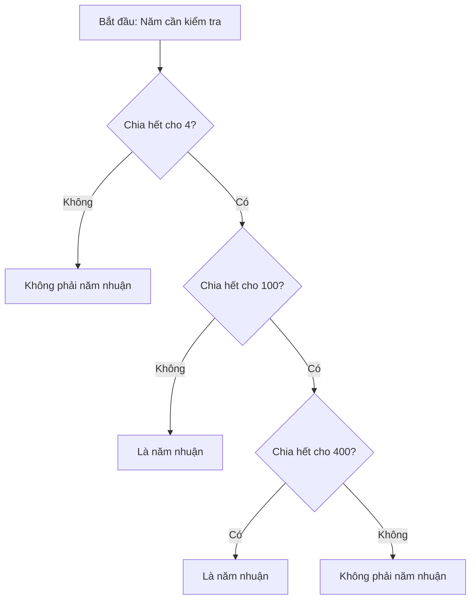

## Thử thách: Kiểm tra Năm Nhuận (Leap Year)

### Mô tả bài toán

Viết một chương trình trả về `True` hoặc `False` để kiểm tra xem một năm có phải là năm nhuận hay không.

**Năm nhuận là gì?**

- Năm thường có 365 ngày
- Năm nhuận có 366 ngày (tháng 2 có thêm 1 ngày)
- Lý do tồn tại năm nhuận rất thú vị, có thể xem [video giải thích](https://www.youtube.com/watch?v=xX96xng7sAE)


### Quy tắc xác định năm nhuận

Một năm là năm nhuận khi thỏa mãn các điều kiện sau:

1. Chia hết cho 4 không có dư
2. **TRỪ KHI** chia hết cho 100 không có dư
3. **TRỪ PHI** cũng chia hết cho 400 không có dư

**Sơ đồ quyết định:**



**Giải thích sơ đồ:**

- Bước 1: Kiểm tra chia hết cho 4 → nếu không thì chắc chắn không phải năm nhuận
- Bước 2: Nếu chia hết cho 4, kiểm tra tiếp chia hết cho 100 → nếu không thì là năm nhuận
- Bước 3: Nếu chia hết cho 100, kiểm tra cuối cùng chia hết cho 400 → nếu có thì là năm nhuận, nếu không thì không phải


### Ví dụ minh họa

**Ví dụ 1: Năm 2000**

- 2000 ÷ 4 = 500 (Leap - Chia hết)
- 2000 ÷ 100 = 20 (Not Leap - Chia hết)
- 2000 ÷ 400 = 5 (Leap! - Chia hết)

→ **Kết quả: 2000 là năm nhuận** ✓

**Ví dụ 2: Năm 2100**

- 2100 ÷ 4 = 525 (Leap - Chia hết)
- 2100 ÷ 100 = 21 (Not Leap - Chia hết)
- 2100 ÷ 400 = 5.25 (Not Leap - Không chia hết)

→ **Kết quả: 2100 không phải năm nhuận** ✗

### Yêu cầu đầu ra

**Lưu ý quan trọng:**

- Hàm phải **return** giá trị boolean (`True` hoặc `False`)
- Phải khớp chính xác với định dạng output mẫu (bao gồm cả chính tả và dấu câu)

**Input/Output mẫu:**

```python
# Input 1
2400
# Return 1
True

# Input 2
1989
# Return 2
False
```


### Cách test code

Vì bài tập trên Udemy không có console, bạn không thể dùng `input()`. Thay vào đó, gọi hàm với giá trị cố định (hard-coded values):

```python
def is_leap_year(year):
    # Code của bạn ở đây
    pass

# Gọi hàm với giá trị cụ thể để test
is_leap_year(2024)  # True
is_leap_year(1989)  # False
is_leap_year(2000)  # True
is_leap_year(2100)  # False
```


### Gợi ý giải quyết

**Bước 1:** Kiểm tra chia hết sử dụng toán tử modulo `%`

- `year % 4 == 0` → chia hết cho 4
- `year % 100 == 0` → chia hết cho 100
- `year % 400 == 0` → chia hết cho 400

**Bước 2:** Sử dụng câu lệnh điều kiện `if/elif/else` theo logic trên

**Bước 3:** Return `True` hoặc `False` tùy theo kết quả

### Kiến thức liên quan

Bài tập này rèn luyện:

- Sử dụng hàm với đầu ra (return boolean)
- Logic điều kiện lồng nhau (nested conditions)
- Toán tử modulo `%` để kiểm tra chia hết
- Early return để tối ưu code


Dưới đây là code mẫu cho bài toán kiểm tra năm nhuận với 2 cách tiếp cận:

### Cách 1: Sử dụng nested if (dễ hiểu)

```python
def is_leap_year(year):
    # Kiểm tra chia hết cho 4
    if year % 4 == 0:
        # Nếu chia hết cho 100
        if year % 100 == 0:
            # Kiểm tra chia hết cho 400
            if year % 400 == 0:
                return True  # Là năm nhuận
            else:
                return False  # Không phải năm nhuận
        else:
            return True  # Là năm nhuận
    else:
        return False  # Không phải năm nhuận

# Test cases
print(is_leap_year(2400))  # True
print(is_leap_year(1989))  # False
print(is_leap_year(2000))  # True
print(is_leap_year(2100))  # False
print(is_leap_year(2024))  # True
```


### Cách 2: Sử dụng logic điều kiện kết hợp (code ngắn gọn hơn)

```python
def is_leap_year(year):
    # Kiểm tra theo thứ tự ưu tiên
    if year % 400 == 0:
        return True
    if year % 100 == 0:
        return False
    if year % 4 == 0:
        return True
    return False

# Hoặc viết gọn hơn trong 1 dòng
def is_leap_year(year):
    return year % 400 == 0 or (year % 4 == 0 and year % 100 != 0)
```


### Giải thích logic

**Cách 1 - Nested if:**

- Kiểm tra từng điều kiện theo thứ tự: 4 → 100 → 400
- Dễ đọc, dễ theo dõi logic
- Phù hợp cho người mới học

**Cách 2 - Early return:**

- Chia hết cho 400: chắc chắn là năm nhuận → return True ngay
- Chia hết cho 100 (nhưng không chia hết cho 400): chắc chắn không phải → return False
- Chia hết cho 4 (nhưng không chia hết cho 100): là năm nhuận → return True
- Còn lại: không phải năm nhuận → return False

**Cách 2 - One-liner:**

- `year % 400 == 0`: chia hết cho 400 → True
- `or`: hoặc
- `(year % 4 == 0 and year % 100 != 0)`: chia hết cho 4 VÀ không chia hết cho 100 → True


### Kiểm tra kết quả

```python
# Test với các năm đặc biệt
test_years = [2000, 2100, 2400, 1989, 2024, 1900, 2004]

for year in test_years:
    result = is_leap_year(year)
    print(f"{year}: {result}")

# Output:
# 2000: True  (chia hết cho 400)
# 2100: False (chia hết cho 100 nhưng không chia hết cho 400)
# 2400: True  (chia hết cho 400)
# 1989: False (không chia hết cho 4)
# 2024: True  (chia hết cho 4 nhưng không chia hết cho 100)
# 1900: False (chia hết cho 100 nhưng không chia hết cho 400)
# 2004: True  (chia hết cho 4 nhưng không chia hết cho 100)
```

Bạn muốn tôi giải thích thêm về cách nào, hoặc bạn có thắc mắc về logic của thuật toán không?


