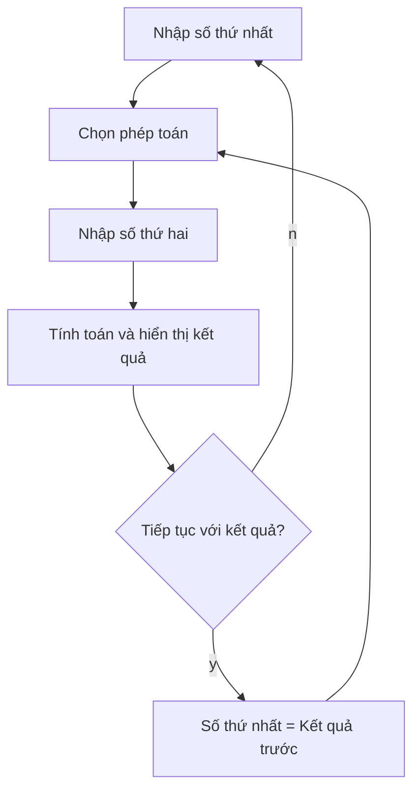

## Dự án: Xây dựng Ứng dụng Calculator

### Giới thiệu dự án

Đây là dự án cuối cùng của Ngày 10 - xây dựng chương trình máy tính (Calculator program) hoàn chỉnh.

**Chức năng chính:**

- Nhập số đầu tiên
- Chọn phép toán: `+`, `-`, `*`, `/`
- Nhập số thứ hai
- Hiển thị kết quả đầy đủ: `5 * 3 = 15.0`
- Cho phép tiếp tục tính với kết quả trước đó hoặc bắt đầu phép tính mới

**Luồng hoạt động:**




### Lưu trữ Function trong Biến

Python cho phép lưu trữ function như một giá trị (value) trong biến:

```python
def add(n1, n2):
    return n1 + n2

# Lưu function vào biến (KHÔNG có dấu ngoặc đơn)
my_favourite_operation = add

# Sử dụng function thông qua biến
result = my_favourite_operation(2, 3)
print(result)  # 5
```

**Lưu ý quan trọng:**

- **Không** thêm dấu ngoặc đơn `()` khi lưu function vào biến
- Dấu ngoặc đơn sẽ **kích hoạt** (trigger) function ngay lập tức
- Chỉ dùng tên function để tham chiếu (reference) đến nó


### Bước 1: Tạo các Function cho Phép toán

Tạo 4 function cho các phép toán cơ bản:

```python
def add(n1, n2):
    return n1 + n2

def subtract(n1, n2):
    return n1 - n2

def multiply(n1, n2):
    return n1 * n2

def divide(n1, n2):
    return n1 / n2
```


### Bước 2: Lưu Function vào Dictionary

Tạo dictionary với key là ký hiệu phép toán, value là function tương ứng:

```python
operations = {
    "+": add,
    "-": subtract,
    "*": multiply,
    "/": divide
}
```

**Lưu ý:** Không thêm dấu ngoặc đơn sau tên function - chúng ta đang lưu trữ, không phải gọi function.

### Bước 3: Sử dụng Dictionary để gọi Function

Truy cập và thực thi function từ dictionary:

```python
# Lấy function thông qua key
operation_function = operations["*"]

# Gọi function với tham số
result = operation_function(4, 8)
print(result)  # 32

# Hoặc gọi trực tiếp
result = operations["*"](4, 8)
print(result)  # 32
```

**Giải thích:**

- `operations["*"]` → trả về function `multiply`
- Thêm `(4, 8)` ngay sau để gọi function với tham số


### Xây dựng Calculator - Từng bước

**Bước 1: Tạo function calculator chính**

```python
from art import logo

def calculator():
    print(logo)
    
    # Nhập số đầu tiên
    num1 = float(input("What is the first number? "))
    
    # Hiển thị các phép toán có sẵn
    for symbol in operations:
        print(symbol)
    
    # Biến điều khiển vòng lặp
    should_accumulate = True
    
    while should_accumulate:
        # Chọn phép toán
        operation_symbol = input("Pick an operation: ")
        
        # Nhập số thứ hai
        num2 = float(input("What is the next number? "))
        
        # Tính toán
        answer = operations[operation_symbol](num1, num2)
        
        # Hiển thị kết quả
        print(f"{num1} {operation_symbol} {num2} = {answer}")
        
        # Hỏi có tiếp tục không
        choice = input(f"Type 'y' to continue calculating with {answer}, or type 'n' to start a new calculation: ")
        
        if choice == "y":
            num1 = answer  # Kết quả trở thành số đầu tiên
        else:
            should_accumulate = False
            print("\n" * 20)  # Tạo khoảng trống
            calculator()  # Recursion - gọi lại function

# Khởi động calculator
calculator()
```


### Giải thích các kỹ thuật quan trọng

**1. Sử dụng While Loop**

- Biến `should_accumulate` điều khiển vòng lặp
- Khi `True`: tiếp tục tính với kết quả cũ
- Khi `False`: thoát vòng lặp

**2. Chuyển đổi sang Float**

- `float(input(...))` để xử lý cả số nguyên và số thập phân
- Quan trọng cho phép chia và các phép toán khoa học

**3. F-string để Format Output**

```python
print(f"{num1} {operation_symbol} {num2} = {answer}")
# Output: 5.0 * 3.0 = 15.0
```

**4. Recursion (Đệ quy)**

- Function `calculator()` gọi chính nó bên trong
- Tạo hiệu ứng "khởi động lại" từ đầu
- Thay thế cho việc dùng while loop lồng nhau


### Code hoàn chỉnh

```python
from art import logo

def add(n1, n2):
    return n1 + n2

def subtract(n1, n2):
    return n1 - n2

def multiply(n1, n2):
    return n1 * n2

def divide(n1, n2):
    return n1 / n2

operations = {
    "+": add,
    "-": subtract,
    "*": multiply,
    "/": divide
}

def calculator():
    print(logo)
    num1 = float(input("What is the first number? "))
    
    for symbol in operations:
        print(symbol)
    
    should_accumulate = True
    
    while should_accumulate:
        operation_symbol = input("Pick an operation: ")
        num2 = float(input("What is the next number? "))
        answer = operations[operation_symbol](num1, num2)
        
        print(f"{num1} {operation_symbol} {num2} = {answer}")
        
        choice = input(f"Type 'y' to continue calculating with {answer}, or type 'n' to start a new calculation: ")
        
        if choice == "y":
            num1 = answer
        else:
            should_accumulate = False
            print("\n" * 20)
            calculator()

calculator()
```


### So sánh: While Loop vs Recursion

| Phương pháp | Ưu điểm | Nhược điểm |
| :-- | :-- | :-- |
| **While Loop lồng nhau** | Dễ hiểu, tường minh | Code dài hơn, nhiều indent |
| **Recursion** | Code ngắn gọn, thanh lịch | Khó hiểu hơn cho người mới |

Cả hai cách đều hợp lệ và cho kết quả giống nhau.

### Cải tiến có thể thực hiện

- Xử lý lỗi khi chia cho 0
- Thêm các phép toán nâng cao (lũy thừa, căn bậc hai)
- Lưu lịch sử các phép tính
- Tạo giao diện đồ họa (GUI)
- Xử lý input không hợp lệ


### Kiến thức đã áp dụng

Dự án này kết hợp tất cả kiến thức đã học:

- Functions with inputs và outputs
- Dictionaries
- While loops
- Conditional statements (if/else)
- Type conversion (float)
- F-strings
- Recursion
- Import modules


### Ghi chú quan trọng

- Đây là **learning project** - tập trung vào học tập, không phải sản phẩm hoàn hảo
- Có thể cải tiến và mở rộng theo ý muốn
- Hiểu solution code quan trọng hơn việc viết hoàn hảo ngay lần đầu
- Function có thể được lưu trong biến và dictionary như các value khác

***

**Liên kết:** [[Functions with Outputs]], [[Dictionary]], [[Recursion]], [[While Loop]], [[Calculator Project]], [[Function as Values]], [[Type Conversion]], [[F-strings]], [[User Input]], [[Conditional Logic]]

