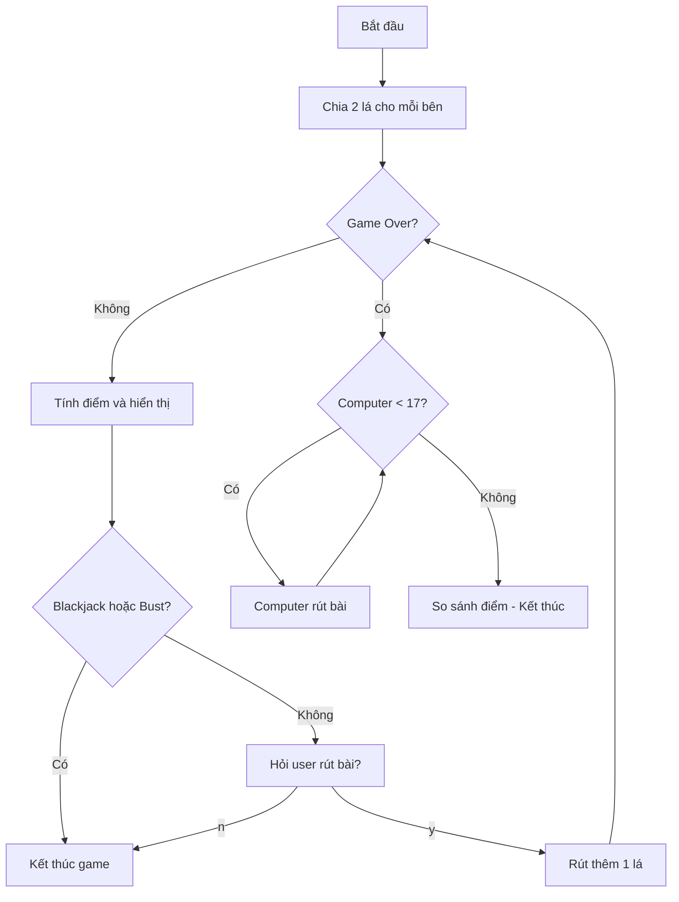

## Giải Pháp Blackjack - Phần 4: Vòng Lặp Game và Logic Computer

### Bước 10: Hỏi User Có Muốn Rút Thêm Bài

**Điều kiện:** Chỉ hỏi khi game chưa kết thúc (không có Blackjack, không Bust).

```python
if user_score == 0 or computer_score == 0 or user_score > 21:
    is_game_over = True
else:
    user_should_deal = input("Type 'y' to get another card, type 'n' to pass: ")
    if user_should_deal == 'y':
        user_cards.append(deal_card())
    else:
        is_game_over = True
```

**Luồng xử lý:**

- Nếu game kết thúc → đặt `is_game_over = True`
- Nếu game tiếp tục → hỏi user
- User nhập 'y' → rút thêm 1 lá bài
- User nhập 'n' → kết thúc game

**Giải thích code:**

- `input()` nhận input từ người dùng
- Lưu vào biến `user_should_deal`
- Kiểm tra giá trị với `if == 'y'`
- `user_cards.append(deal_card())` thêm lá mới vào danh sách


### Bước 11: Tạo Vòng Lặp Game

**Vấn đề:** Cần tính lại điểm và kiểm tra điều kiện sau mỗi lần rút bài.

**Giải pháp:** Sử dụng while loop với flag `is_game_over`.

```python
is_game_over = False

while not is_game_over:
    # Tính điểm
    user_score = calculate_score(user_cards)
    computer_score = calculate_score(computer_cards)
    
    # Hiển thị thông tin
    print(f"Your cards: {user_cards}, current score: {user_score}")
    print(f"Computer's first card: {computer_cards[0]}")
    
    # Kiểm tra điều kiện kết thúc
    if user_score == 0 or computer_score == 0 or user_score > 21:
        is_game_over = True
    else:
        # Hỏi user
        user_should_deal = input("Type 'y' to get another card, type 'n' to pass: ")
        if user_should_deal == 'y':
            user_cards.append(deal_card())
        else:
            is_game_over = True
```

**Cách hoạt động của while loop:**

- `while not is_game_over`: Lặp khi game chưa kết thúc
- Mỗi lượt: tính điểm → kiểm tra → hỏi user
- Khi `is_game_over = True` → vòng lặp dừng

**Ví dụ chạy thử:**

```
Your cards: [10, 5], current score: 15
Computer's first card: 7
Type 'y' to get another card, type 'n' to pass: y

Your cards: [10, 5, 10], current score: 25
Computer's first card: 7
```

→ Tổng 25 > 21 → Game kết thúc (Bust)

### Bước 12: Logic Chơi của Computer

**Quy tắc:** Computer phải rút bài liên tục khi điểm < 17 (trừ khi có Blackjack).

```python
while computer_score != 0 and computer_score < 17:
    computer_cards.append(deal_card())
    computer_score = calculate_score(computer_cards)
```

**Điều kiện while loop:**

- `computer_score != 0`: Không phải Blackjack
- `computer_score < 17`: Điểm nhỏ hơn 17

**Hành động trong loop:**

- Rút thêm 1 lá bài cho computer
- Tính lại điểm ngay lập tức
- Kiểm tra lại điều kiện với điểm mới

**Ví dụ minh họa:**

```
Lượt 1: computer_cards = [5, 8], computer_score = 13
→ 13 < 17 → Rút thêm

Lượt 2: computer_cards = [5, 8, 6], computer_score = 19
→ 19 >= 17 → Dừng
```


### Xử Lý Lỗi: Undefined Variable Warning

**Vấn đề phát sinh:**

```python
while not is_game_over:
    user_score = calculate_score(user_cards)  # Định nghĩa trong while
    computer_score = calculate_score(computer_cards)

# Ở đây sử dụng computer_score
while computer_score != 0 and computer_score < 17:
    # ...
```

**Cảnh báo:** "Name 'computer_score' can be undefined"

**Nguyên nhân:**

- Biến chỉ được tạo bên trong while loop đầu tiên
- Nếu while loop bị bỏ qua → biến không tồn tại
- Gây lỗi khi sử dụng biến ở while loop thứ hai

**Giải pháp: Khởi tạo biến trước**

```python
# Khởi tạo ở đầu chương trình
user_cards = []
computer_cards = []
is_game_over = False
user_score = -1
computer_score = -1
```

**Tại sao dùng -1?**

- Không thể dùng 0 (0 = Blackjack trong game)
- -1 là giá trị không hợp lệ → dễ phát hiện lỗi khi debug
- Cho biết biến chưa được tính toán thực sự


### Vị Trí Code sau Bước 12

```python
import random

def deal_card():
    """Returns a random card from the deck."""
    cards = [11, 2, 3, 4, 5, 6, 7, 8, 9, 10, 10, 10, 10]
    return random.choice(cards)

def calculate_score(cards):
    """Take a list of cards and return the score calculated from the cards"""
    if sum(cards) == 21 and len(cards) == 2:
        return 0
    if 11 in cards and sum(cards) > 21:
        cards.remove(11)
        cards.append(1)
    return sum(cards)

# Khởi tạo biến
user_cards = []
computer_cards = []
is_game_over = False
user_score = -1
computer_score = -1

# Chia 2 lá ban đầu
for _ in range(2):
    user_cards.append(deal_card())
    computer_cards.append(deal_card())

# Lượt chơi của user
while not is_game_over:
    user_score = calculate_score(user_cards)
    computer_score = calculate_score(computer_cards)
    
    print(f"Your cards: {user_cards}, current score: {user_score}")
    print(f"Computer's first card: {computer_cards[0]}")
    
    if user_score == 0 or computer_score == 0 or user_score > 21:
        is_game_over = True
    else:
        user_should_deal = input("Type 'y' to get another card, type 'n' to pass: ")
        if user_should_deal == 'y':
            user_cards.append(deal_card())
        else:
            is_game_over = True

# Lượt chơi của computer
while computer_score != 0 and computer_score < 17:
    computer_cards.append(deal_card())
    computer_score = calculate_score(computer_cards)
```


### Sơ Đồ Luồng Xử Lý



**Giải thích sơ đồ:**

- Luồng user: Lặp cho đến khi dừng hoặc Bust
- Luồng computer: Tự động rút bài đến khi >= 17
- Hai vòng while độc lập, chạy tuần tự


### Kiểm Tra và Debug

**Test case 1 - User Bust:**

- User:  → nhập 'y' →  = 25 → Bust
- Kết quả: Game kết thúc ngay, không đến lượt computer

**Test case 2 - User dừng sớm:**

- User:  = 15 → nhập 'n' → dừng
- Computer:  = 15 → rút thêm →  = 18
- Kết quả: Computer thắng (18 > 15)

**Test case 3 - Blackjack:**

- User:  = 21 (Blackjack, score = 0)
- Kết quả: Game kết thúc ngay


### Ghi Chú Thêm

**Về nested logic:**

- While loop bên ngoài: Điều khiển lượt user
- While loop riêng: Xử lý lượt computer
- Không lồng nhau, chạy tuần tự

**Về variable scope:**

- Biến được khởi tạo bên ngoài function/loop có scope rộng hơn
- Luôn khởi tạo biến flag và score trước khi dùng
- Giá trị mặc định giúp tránh undefined error

**Best practice:**

- Test sau mỗi bước phát triển
- Kiểm tra cả trường hợp thắng và thua
- Đảm bảo logic computer hoạt động độc lập

**Liên kết:** [[while loop]], [[Game Loop]], [[Flag Variable]], [[Variable Scope]], [[Computer AI]], [[Input Validation]], [[Undefined Variable]], [[Debugging]], [[Nested Logic]], [[Game State Management]]

