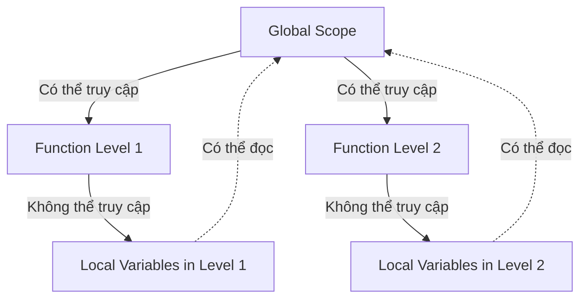

## Khái niệm Scope trong Python

### Giới thiệu về Scope

**[[Scope]]** (Phạm vi) là một khái niệm quan trọng trong lập trình, xác định phạm vi mà một biến hoặc hàm có thể được truy cập và sử dụng trong chương trình.

**Ví dụ minh họa**: Hãy tưởng tượng bạn có một ngôi nhà được rào quanh. Nếu bạn trồng một cây táo trong vườn nhà, chỉ bạn và gia đình có thể hái táo. Nhưng nếu cây táo được trồng ở vỉa hè bên ngoài, bất kỳ ai cũng có thể tiếp cận. Đây chính là cách hiểu cơ bản về Scope.

### Ví dụ khởi động

```python
enemies = 1

def increase_enemies():
    enemies = 2
    print(f"enemies inside function: {enemies}")

increase_enemies()
print(f"enemies outside function: {enemies}")
```

**Kết quả:**

```
enemies inside function: 2
enemies outside function: 1
```

**Giải thích**: Biến `enemies` bên trong hàm và bên ngoài hàm là hai biến khác nhau do phạm vi (scope) khác nhau.

### Local Scope (Phạm vi cục bộ)

**[[Local Scope]]** là phạm vi tồn tại bên trong một hàm. Biến được tạo trong hàm chỉ có thể truy cập được trong hàm đó.

```python
def drink_potion():
    potion_strength = 2
    print(potion_strength)  # Hoạt động bình thường

drink_potion()
print(potion_strength)  # LỖI: NameError
```

**Đặc điểm:**

- Biến cục bộ chỉ tồn tại trong "bốn bức tường" của hàm
- Không thể truy cập từ bên ngoài hàm
- Khi cố gắng truy cập từ ngoài, sẽ nhận lỗi `NameError: name 'potion_strength' is not defined`


### Global Scope (Phạm vi toàn cục)

**[[Global Scope]]** là phạm vi của biến được định nghĩa ở mức cao nhất của file (không nằm trong bất kỳ hàm nào). Biến này có thể được truy cập từ bất kỳ đâu trong file.

```python
player_health = 10  # Biến toàn cục

def drink_potion():
    potion_strength = 2  # Biến cục bộ
    print(player_health)  # Truy cập biến toàn cục thành công

drink_potion()  # In ra: 10
print(player_health)  # In ra: 10
```

**Đặc điểm:**

- Biến toàn cục có thể được đọc từ bất kỳ đâu trong file
- Có thể truy cập bên trong và bên ngoài hàm
- Được định nghĩa ở "top level" (mức cao nhất) của file


### Namespace (Không gian tên)

**[[Namespace]]** là khái niệm áp dụng cho mọi thứ bạn đặt tên trong Python:

- Biến (variables)
- Hàm (functions)
- Lớp (classes)
- Bất kỳ đối tượng nào có tên

```python
def game():
    def drink_potion():  # Hàm này có local scope trong game()
        potion_strength = 2
        print(potion_strength)
    
    drink_potion()  # Chỉ gọi được ở đây

game()
drink_potion()  # LỖI: Không thể gọi từ bên ngoài game()
```


### Quy tắc quan trọng

**Xác định scope của biến:**

- Scope được quyết định tại nơi bạn **tạo/định nghĩa** biến lần đầu
- Biến được tạo bên ngoài mọi hàm → Global scope
- Biến được tạo bên trong hàm → Local scope của hàm đó
- Biến lồng nhiều cấp → Local scope của hàm chứa nó

**Lưu ý:**

- "Top level" không có nghĩa là dòng đầu tiên của file
- "Top level" có nghĩa là không nằm trong bất kỳ hàm nào
- Các hàm lồng nhau có thể tạo ra nhiều cấp độ scope khác nhau


### Sơ đồ phạm vi truy cập



**Giải thích sơ đồ:** Biến toàn cục (Global Scope) có thể được truy cập từ mọi hàm, nhưng biến cục bộ trong các hàm không thể truy cập được từ bên ngoài. Các hàm có thể đọc biến toàn cục nhưng không thể thay đổi chúng trực tiếp (trừ khi sử dụng từ khóa `global`).

**Liên kết:** [[Scope]], [[Local Scope]], [[Global Scope]], [[Namespace]], [[Local Variables]], [[Global Variables]], [[Python Functions]]

***

Bạn có muốn tôi bổ sung thêm phần về cách sửa đổi biến toàn cục từ trong hàm bằng từ khóa `global` không?

