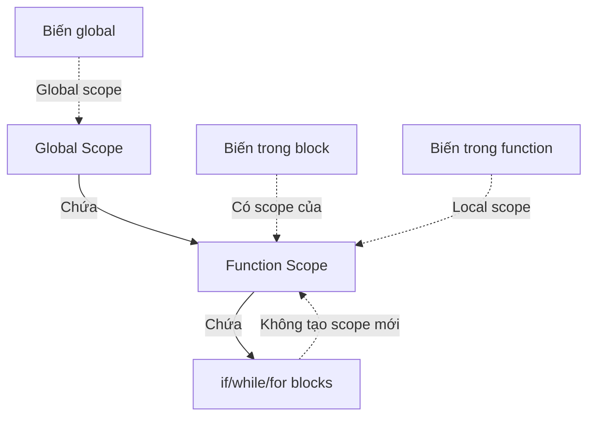

### Python không có Block Scope

Khác với các ngôn ngữ như C++ hay Java, **Python không có Block Scope** (phạm vi khối lệnh). Điều này có nghĩa là:

- Biến được tạo trong khối `if`, `while`, `for` không bị giới hạn trong khối đó
- Các khối lệnh có dấu hai chấm `:` và thụt đầu dòng **không tạo ra scope riêng**
- Biến trong khối này vẫn có scope của hàm chứa nó, hoặc global scope nếu không nằm trong hàm


### Ví dụ minh họa

**Biến trong khối if - Không có hàm bao bọc:**

```python
enemies = ["Skeletons", "Zombies", "Aliens"]
game_level = 3

if game_level < 5:
    new_enemy = enemies[0]

print(new_enemy)  # Hoạt động bình thường, in ra: Skeletons
```

**Giải thích**: Mặc dù `new_enemy` được tạo bên trong khối `if`, nhưng nó vẫn có thể truy cập được từ bên ngoài vì Python không có Block Scope.

**Biến trong khối if - Có hàm bao bọc:**

```python
enemies = ["Skeletons", "Zombies", "Aliens"]

def create_enemy():
    game_level = 3
    if game_level < 5:
        new_enemy = enemies[0]
    
    print(new_enemy)  # Hoạt động bình thường trong hàm

create_enemy()
print(new_enemy)  # LỖI: NameError
```

**Giải thích**: Khi có hàm bao bọc, `new_enemy` có local scope trong hàm `create_enemy()`. Nó có thể truy cập ở bất kỳ đâu trong hàm (kể cả ngoài khối `if`), nhưng không thể truy cập từ bên ngoài hàm.

### Quy tắc quan trọng

**Các khối không tạo scope riêng:**

- Khối `if`/`elif`/`else`
- Vòng lặp `while`
- Vòng lặp `for`
- Bất kỳ khối nào có dấu `:` và thụt đầu dòng

**Scope được quyết định bởi:**

- Hàm (function) - tạo local scope
- Module/File - tạo global scope


### Cảnh báo từ Linter

Khi tạo biến bên trong khối điều kiện, bạn có thể nhận được cảnh báo: **"Local variable might be referenced before assignment"**

```python
def create_enemy():
    game_level = 10
    
    if game_level < 5:
        new_enemy = enemies[0]
    
    print(new_enemy)  # Cảnh báo: new_enemy có thể chưa được gán
```

**Vấn đề**: Nếu điều kiện `if` không đúng, biến `new_enemy` sẽ không bao giờ được tạo, dẫn đến lỗi khi cố gắng sử dụng.

### Giải pháp: Khởi tạo biến trước

```python
def create_enemy():
    game_level = 10
    new_enemy = ""  # Khởi tạo trước
    
    if game_level < 5:
        new_enemy = enemies[0]
    
    print(new_enemy)  # An toàn, không còn cảnh báo
```

**Lợi ích:**

- Đảm bảo biến luôn tồn tại
- Tránh lỗi runtime
- Code rõ ràng và dễ bảo trì hơn


### So sánh với ngôn ngữ khác

```python
# Python - Không có Block Scope
if True:
    x = 10
print(x)  # Hoạt động: 10

# C++/Java - Có Block Scope
// if (true) {
//     int x = 10;
// }
// System.out.println(x);  // LỖI: x không tồn tại
```


### Sơ đồ phạm vi trong Python



**Giải thích sơ đồ:** Các khối lệnh `if`, `while`, `for` không tạo ra scope riêng mà chia sẻ scope với hàm chứa chúng. Chỉ có hàm mới tạo ra local scope thực sự. Biến global có thể được truy cập từ mọi nơi.

### Ghi nhớ

**Nguyên tắc vàng:**

- Muốn tạo local scope → Dùng **function**
- Khối `if`/`while`/`for` → **Không** tạo scope mới
- Khi dùng biến trong khối điều kiện → Nên **khởi tạo trước**

**Lựa chọn với linter warning:**

1. Bỏ qua nếu bạn chắc chắn code đúng
2. Tuân theo và khởi tạo biến trước khi sử dụng (khuyến nghị)

**Liên kết:** [[Block Scope]], [[Local Scope]], [[Global Scope]], [[Python Scope]], [[if statement]], [[while loop]], [[for loop]], [[Linter]], [[Variable Initialization]]

***

Bạn muốn tôi giải thích thêm về cách sử dụng từ khóa `nonlocal` để thao tác với biến trong nested functions không?

