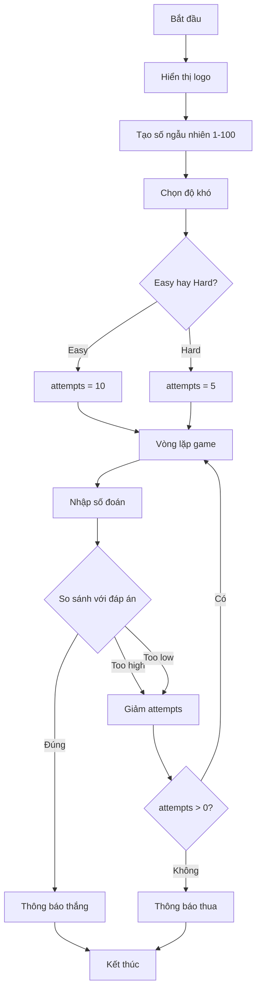

## Dự án: Xây dựng trò chơi đoán số từ đầu

### Giới thiệu

Đây là dự án đầu tiên bạn sẽ hoàn thành **hoàn toàn độc lập** mà không có code mẫu hay gợi ý sẵn. Bạn đã có đủ kiến thức và kỹ năng để tự mình xây dựng game từ đầu đến cuối.

### Yêu cầu chức năng

**Luồng chơi cơ bản:**

1. Hiển thị thông báo chào mừng
2. Chương trình chọn ngẫu nhiên một số từ 1-100
3. Người chơi chọn độ khó: `easy` hoặc `hard`
4. Người chơi đoán số và nhận phản hồi
5. Game kết thúc khi đoán đúng hoặc hết lượt

**Chi tiết độ khó:**

- **Easy**: 10 lần thử
- **Hard**: 5 lần thử

**Phản hồi sau mỗi lần đoán:**

- "Too high" (Quá cao) - nếu số đoán lớn hơn đáp án
- "Too low" (Quá thấp) - nếu số đoán nhỏ hơn đáp án
- Hiển thị số lượt còn lại
- Thông báo chiến thắng hoặc thua


### Ví dụ gameplay

**Chế độ Hard (5 lượt):**

```
Welcome to the Number Guessing Game!
I'm thinking of a number between 1 and 100.
Choose a difficulty. Type 'easy' or 'hard': hard
You have 5 attempts remaining to guess the number.
Make a guess: 50
Too high.
Guess again.
You have 4 attempts remaining to guess the number.
Make a guess: 25
Too low.
Guess again.
You have 3 attempts remaining to guess the number.
Make a guess: 30
Too low.
...
You've run out of guesses, you lose.
```

**Chế độ Easy (10 lượt):**

```
Choose a difficulty. Type 'easy' or 'hard': easy
You have 10 attempts remaining to guess the number.
Make a guess: 50
Too high.
...
Make a guess: 14
You got it! The answer was 14.
```


### Cách tiếp cận dự án

**Bước 1: Chơi thử nhiều lần**

- Chơi ít nhất 3-4 lần trên cả hai chế độ
- Quan sát cách game hoạt động
- Ghi chú lại các tình huống khác nhau

**Bước 2: Phân tích và lập kế hoạch**

Tạo TODO list của riêng bạn. Ví dụ:

- [ ] Hiển thị logo và lời chào
- [ ] Tạo số ngẫu nhiên từ 1-100
- [ ] Hỏi người chơi chọn độ khó
- [ ] Thiết lập số lượt thử dựa trên độ khó
- [ ] Tạo vòng lặp cho phép người chơi đoán
- [ ] So sánh số đoán với đáp án
- [ ] Giảm số lượt sau mỗi lần đoán
- [ ] Kiểm tra điều kiện thắng/thua
- [ ] Hiển thị thông báo kết quả

**Bước 3: Viết comments trước**

```python
# Hiển thị logo

# Tạo số ngẫu nhiên

# Chọn độ khó

# Hàm để kiểm tra đáp án của người chơi

# Thiết lập số lượt thử

# Vòng lặp game
```

**Bước 4: Viết code từng phần**

- Bắt đầu với phần đơn giản nhất
- Test từng phần trước khi tiếp tục
- Xử lý các trường hợp đặc biệt

**Bước 5: Test kỹ lưỡng**

- Test cả hai chế độ
- Test khi đoán đúng lần đầu
- Test khi hết lượt
- Test với input không hợp lệ (nếu muốn)


### Kiến thức cần sử dụng

**Các khái niệm đã học:**

- [[Functions]] - Tổ chức code
- [[Variables]] và [[Scope]] - Quản lý dữ liệu
- [[while loop]] - Vòng lặp game
- [[if/elif/else]] - Logic điều kiện
- [[Random module]] - Tạo số ngẫu nhiên
- [[Input/Output]] - Tương tác người dùng

**Modules cần import:**

```python
import random
```


### Thêm ASCII Art

**Bước 1: Tạo ASCII art**

- Truy cập: [ASCII Art Generator](https://patorjk.com/software/taag/)
- Nhập tên game: "Guess The Number"
- Chọn font ưa thích: Isometric, Ogre, Train, v.v.
- Copy toàn bộ design

**Bước 2: Tạo file art.py**

```python
# art.py
logo = """
  ___                     _____ _            _   _                 _               
 / __|_  _ ___ ______    |_   _| |_  ___    | \ | |_  _ _ __  ___| |__  ___ _ _ 
| (_ | || / -_|_-<_-<      | | | ' \/ -_)   |  \| | || | '  \/ -_) '_ \/ -_) '_|
 \___|\_,_\___/__/__/      |_| |_||_\___|   |_|\_|\_,_|_|_|_\___|_.__/\___|_|  
"""
```

**Lưu ý:** Sử dụng **docstring** (ba dấu ngoặc kép) để giữ nguyên format:

```python
logo = """
[ASCII art ở đây]
"""
```

**Bước 3: Import và sử dụng**

```python
from art import logo

print(logo)
```


### Gợi ý cấu trúc chương trình



**Giải thích sơ đồ:** Luồng xử lý bắt đầu từ hiển thị logo, tạo số ngẫu nhiên, cho phép người chơi chọn độ khó để xác định số lượt thử. Sau đó chương trình vào vòng lặp chính: nhận input, so sánh với đáp án, đưa ra phản hồi và giảm số lượt. Vòng lặp tiếp tục cho đến khi người chơi đoán đúng hoặc hết lượt.

### Hints (Gợi ý nhỏ)

**Tạo số ngẫu nhiên:**

```python
answer = random.randint(1, 100)
```

**Hàm kiểm tra đáp án có thể trả về:**

- Một giá trị để cập nhật số lượt thử
- Hoặc True/False để kiểm tra tiếp tục game

**Điều kiện vòng lặp:**

- Chạy khi còn lượt thử và chưa đoán đúng
- Hoặc sử dụng `while True` với `break` khi cần


### Lời khuyên

**Đừng gian lận:**

- Đừng copy code từ nơi khác
- Tin vào khả năng của bản thân
- Nếu bạn dành 1 giờ để thử, bạn sẽ làm được!

**Nếu gặp khó khăn:**

- Chia nhỏ vấn đề thành các phần nhỏ hơn
- Giải quyết từng phần một
- Sử dụng `print()` để debug
- Vẽ sơ đồ logic trên giấy

**Tự do sáng tạo:**

- Thay đổi lời chào, thông báo theo ý bạn
- Thêm màu sắc (nếu biết)
- Thêm tính năng mới (chơi lại, thống kê, v.v.)
- Quan trọng là giữ đúng chức năng cốt lõi


### Checklist hoàn thành

Trước khi nộp bài, kiểm tra:

- [ ] Game chạy được trên cả hai chế độ
- [ ] Số lượt thử đúng (Easy: 10, Hard: 5)
- [ ] Phản hồi "Too high"/"Too low" chính xác
- [ ] Số lượt giảm sau mỗi lần đoán
- [ ] Thông báo thắng khi đoán đúng
- [ ] Thông báo thua khi hết lượt
- [ ] Code có cấu trúc rõ ràng và comments
- [ ] Test nhiều lần không có lỗi


### Thử thách bản thân

Sau khi hoàn thành, thử thêm các tính năng:

- Chơi lại mà không cần restart chương trình
- Hiển thị số lần đã chơi và tỷ lệ thắng
- Thêm chế độ "expert" với 3 lượt thử
- Cho phép người chơi tự chọn khoảng số (1-50, 1-200, v.v.)

**Liên kết:** [[Number Guessing Game]], [[Final Project]], [[Random Module]], [[Game Loop]], [[User Input]], [[Scope]], [[Functions]], [[ASCII Art]], [[Problem Solving]]

***

Chúc bạn thành công với dự án đầu tiên làm hoàn toàn độc lập! Hãy kiên trì và tin tưởng vào bản thân! 💪

