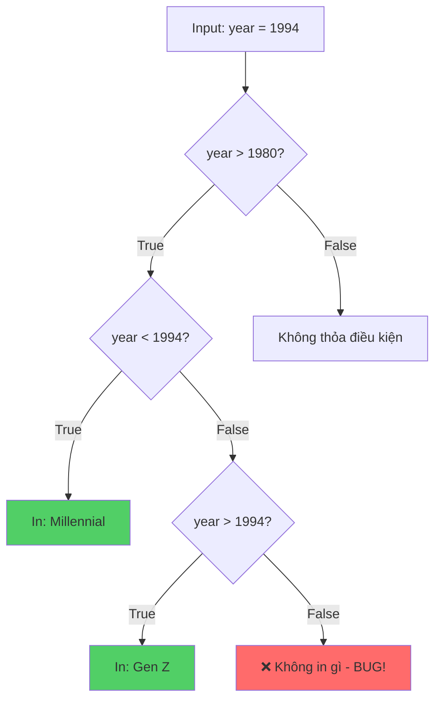

## Kỹ thuật "Đóng vai máy tính" (Play Computer)

### Khái niệm

**Play Computer** là kỹ thuật debug quan trọng: giả lập mình là máy tính, đọc và thực thi code từng dòng một trong đầu để theo dõi luồng logic và phát hiện lỗi.

### Tại sao kỹ thuật này quan trọng?

- Giúp hiểu rõ cách code thực sự hoạt động
- Phát hiện các lỗi logic ẩn
- Đặc biệt hữu ích khi debug các [[điều kiện phức tạp]] (complex conditions)
- Rèn luyện tư duy lập trình có hệ thống


### Ví dụ thực hành: Phân loại thế hệ

**Đoạn code ban đầu:**

```python
year = int(input("What's your year of birth? "))

if year > 1980 and year < 1994:
    print("You are a Millennial.")
elif year > 1994:
    print("You are a Gen Z.")
```

**Vấn đề:**

- Khi nhập năm sinh `1994` → không có gì được in ra
- Code không xử lý được giá trị biên (boundary value)


### Quy trình "Play Computer"

**Bước 1: Giả lập với input cụ thể**

Giả sử `year = 1994`, hãy theo dõi từng bước:

**Bước 2: Kiểm tra điều kiện đầu tiên**

```python
if year > 1980 and year < 1994:
```

- `1994 > 1980` → **True** ✓
- `1994 < 1994` → **False** ✗
- `True and False` → **False**
- Kết quả: Bỏ qua khối lệnh này

**Bước 3: Kiểm tra điều kiện thứ hai**

```python
elif year > 1994:
```

- `1994 > 1994` → **False** ✗
- Kết quả: Bỏ qua khối lệnh này

**Bước 4: Kết luận**

- Không còn điều kiện nào khác
- Không có gì được in ra
- **Nguyên nhân:** Năm 1994 không được "bắt" bởi bất kỳ điều kiện nào


### Phân tích chi tiết

Vấn đề nằm ở **điều kiện biên** (boundary conditions):

- `year > 1980 and year < 1994` → chỉ bắt từ 1981 đến 1993
- `year > 1994` → chỉ bắt từ 1995 trở đi
- **Năm 1994 bị bỏ sót!**


### Giải pháp

**Cách 1: Sửa điều kiện đầu tiên**

```python
year = int(input("What's your year of birth? "))

if year > 1980 and year <= 1994:  # Thêm dấu =
    print("You are a Millennial.")
elif year > 1994:
    print("You are a Gen Z.")
```

**Cách 2: Sửa điều kiện thứ hai**

```python
year = int(input("What's your year of birth? "))

if year > 1980 and year < 1994:
    print("You are a Millennial.")
elif year >= 1994:  # Thêm dấu =
    print("You are a Gen Z.")
```


### Lưu đồ phân tích logic



**Giải thích sơ đồ:** Sơ đồ minh họa luồng xử lý khi input là 1994. Đường màu đỏ cho thấy lỗi xảy ra khi cả hai điều kiện đều False, dẫn đến không có output nào.

### Bài học quan trọng

**Khi debug với "Play Computer":**

- Chọn một giá trị input cụ thể (đặc biệt là [[boundary values]])
- Đánh giá từng điều kiện logic theo thứ tự
- Ghi chú kết quả True/False của mỗi bước
- Theo dõi luồng thực thi (execution flow)
- Tìm ra trường hợp bị bỏ sót

**Các giá trị biên cần test:**

- Giá trị ở ranh giới khoảng (1980, 1994, 1995)
- Giá trị nhỏ nhất và lớn nhất hợp lệ
- Giá trị đặc biệt (0, âm, rất lớn)


### Ghi chú thêm

**Toán tử logic AND:**

- `True and True` → True
- `True and False` → False
- `False and True` → False
- `False and False` → False

**Toán tử so sánh:**

- `>` : lớn hơn (không bao gồm bằng)
- `>=` : lớn hơn hoặc bằng (bao gồm bằng)
- `<` : nhỏ hơn (không bao gồm bằng)
- `<=` : nhỏ hơn hoặc bằng (bao gồm bằng)

***

**Liên kết:** [[Debugging]], [[play computer]], [[boundary values]], [[logical operators]], [[conditional statements]], [[if-elif-else]], [[debugging techniques]]

