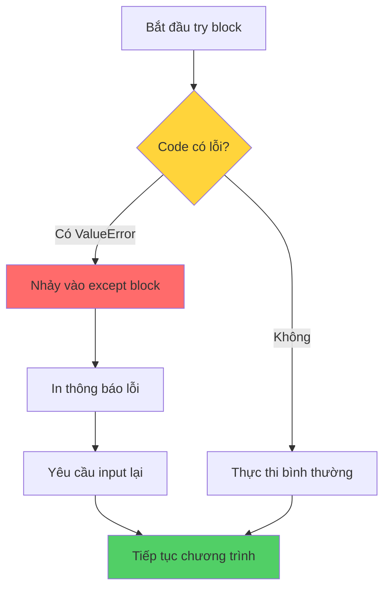

## Sửa lỗi và Xử lý ngoại lệ

### Nguyên tắc cơ bản

**Luôn sửa lỗi trước khi tiếp tục code** - Đây là quy tắc quan trọng nhất khi làm việc với các lỗi từ editor hoặc console.

### Loại 1: Lỗi trong Editor (Syntax Errors)

**Đặc điểm:**

- Editor tự động highlight dòng code bị lỗi
- Dễ phát hiện và sửa chữa
- Xuất hiện ngay khi viết code

**Ví dụ:**

```python
if age > 18:
print("You can vote")  # ❌ Lỗi indentation
```

**Giải pháp:**

```python
if age > 18:
    print("You can vote")  # ✓ Đã indent đúng
```


### Loại 2: Lỗi Runtime (Runtime Errors)

**Đặc điểm:**

- Chỉ xuất hiện khi chạy chương trình
- Phụ thuộc vào input của người dùng
- Cần kỹ năng phân tích cao hơn

**Ví dụ lỗi ValueError:**

```python
age = int(input("How old are you? "))
# Input: "twelve" → ValueError: invalid literal for int()
```


### Kỹ thuật Google Search cho lỗi

**Cách tìm kiếm hiệu quả:**

- Copy phần lỗi **không đặc thù** (không có số dòng, tên biến cụ thể)
- Thêm từ khóa `Python` vào search
- Tìm trên Stack Overflow để có giải đáp chi tiết

**Ví dụ search query:**

```
invalid literal for int() with base 10 Python
```


### Xử lý lỗi với Try-Except

[[Try-except block]] là cấu trúc cho phép "bắt" lỗi và xử lý thay vì để chương trình crash.

**Cú pháp cơ bản:**

```python
try:
    # Code có thể gây lỗi
    age = int(input("How old are you? "))
except ValueError:
    # Xử lý khi có lỗi ValueError
    print("You have typed in an invalid number.")
    print("Please try again with a numerical response such as 15.")
    age = int(input("How old are you? "))
```


### Luồng xử lý Try-Except



**Giải thích sơ đồ:** Khi code trong try block gặp lỗi ValueError, chương trình không crash mà chuyển sang thực thi except block, cho phép xử lý lỗi một cách khéo léo và tiếp tục chạy.

### Các loại Exception phổ biến

- **ValueError** - Giá trị không hợp lệ (ví dụ: chuyển "twelve" thành int)
- **TypeError** - Kiểu dữ liệu không đúng
- **IndexError** - Index vượt quá kích thước list
- **KeyError** - Key không tồn tại trong dictionary
- **ZeroDivisionError** - Chia cho 0


### Loại 3: Lỗi Logic (Logic Bugs)

**Đặc điểm:**

- Không có error message
- Code chạy nhưng kết quả sai
- Khó debug nhất vì không có gợi ý

**Ví dụ - Bug với f-string:**

```python
age = 12
pages = age * 2

# ❌ Không dùng f-string
print("You will need {pages} pages")  
# Output: "You will need {pages}" (in ra tên biến)

# ✓ Dùng f-string đúng cách
print(f"You will need {pages} pages")
# Output: "You will need 24 pages" (in ra giá trị)
```


### Chiến lược debug hiệu quả

**Xây dựng kinh nghiệm:**

- Giải quyết nhiều bugs để tích lũy kinh nghiệm
- Tham gia cộng đồng Stack Overflow
- Giúp người khác debug trên Discord/Forum
- Học từ lỗi của người khác

**Quy trình debug có hệ thống:**

- Đọc kỹ error message
- Google search với từ khóa chính xác
- Kiểm tra syntax và logic
- Test với nhiều input khác nhau
- Sử dụng print() để debug


### Ví dụ tổng hợp

**Code hoàn chỉnh với error handling:**

```python
# Xử lý lỗi indentation
if age > 18:
    print("You can vote")

# Xử lý ValueError với try-except
try:
    age = int(input("How old are you? "))
except ValueError:
    print("Invalid number! Please enter digits only.")
    age = int(input("How old are you? "))

# Sử dụng f-string đúng cách
pages = age * 2
print(f"You will need {pages} pages")
```


### Ghi chú quan trọng

**Về Try-Except:**

- Chỉ bắt exception cụ thể (ValueError, TypeError...)
- Không nên dùng `except:` chung chung (catches all errors)
- Cung cấp feedback rõ ràng cho người dùng
- Có thể lồng nhiều except block cho các lỗi khác nhau

**Về Error Messages:**

- Luôn đọc kỹ error message từ đầu đến cuối
- Chú ý dòng code được chỉ ra trong traceback
- Error message cuối cùng thường là quan trọng nhất

**Về Debugging không có lỗi:**

- Kiểm tra syntax các feature mới (f-string, list comprehension...)
- In ra giá trị biến ở nhiều điểm
- So sánh output thực tế với kỳ vọng
- Chia nhỏ code phức tạp thành các phần đơn giản

***

**Liên kết:** [[Debugging]], [[try-except]], [[ValueError]], [[exception handling]], [[error messages]], [[f-string]], [[Stack Overflow]], [[runtime errors]], [[logic bugs]], [[indentation errors]]

