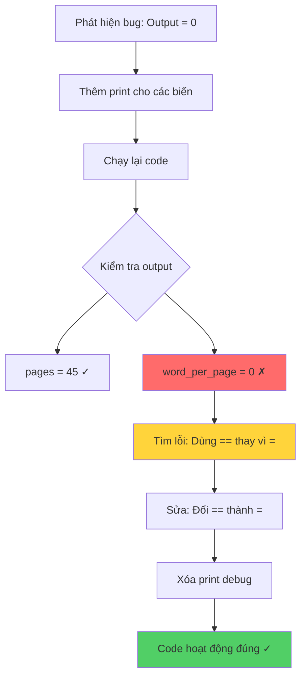

## Debugging - Sử dụng Print Statement

### Khái niệm

**Print là bạn thân nhất của lập trình viên** - Đây là công cụ debug đơn giản nhưng cực kỳ hiệu quả, giúp theo dõi giá trị của biến và luồng thực thi của chương trình.

### Tại sao Print quan trọng?

Print statement giúp:

- Kiểm tra giá trị thực tế của biến tại từng thời điểm
- Xác định chính xác vị trí code bị lỗi
- Theo dõi luồng logic của chương trình
- Phát hiện các giá trị không mong muốn


### Ví dụ: Bug tính tổng số từ

**Đoạn code ban đầu:**

```python
words = 0
pages = int(input("Number of pages: "))
word_per_page == int(input("Number of words per page: "))
total_words = pages * word_per_page
print(total_words)
```

**Vấn đề:**

- Input: 45 pages, 250 words per page
- Output mong đợi: 11,250
- Output thực tế: 0 ❌


### Quy trình Debug với Print

**Bước 1: Thêm print statements để kiểm tra biến**

```python
words = 0
pages = int(input("Number of pages: "))
word_per_page == int(input("Number of words per page: "))

# Thêm print để kiểm tra giá trị
print(f"Pages equals {pages}")
print(f"Words per page equals {word_per_page}")

total_words = pages * word_per_page
print(total_words)
```

**Bước 2: Chạy và phân tích output**

```
Number of pages: 45
Number of words per page: 250
Pages equals 45
Words per page equals 0  ← ⚠️ Phát hiện vấn đề!
0
```

**Phát hiện:** Biến `word_per_page` có giá trị 0 thay vì 250 như đã nhập!

### Phân tích lỗi

**Nguyên nhân:**

```python
word_per_page == int(input("Number of words per page: "))
#             ^^  ← Sai! Đây là toán tử so sánh, không phải gán
```

**Giải thích chi tiết:**

- `==` là [[toán tử so sánh]] (comparison operator)
- `=` là [[toán tử gán]] (assignment operator)
- Dòng code trên đang kiểm tra: "word_per_page có bằng 250 không?"
- Kết quả: False (vì word_per_page = 0 ban đầu)
- Giá trị False không ảnh hưởng gì, biến vẫn giữ giá trị 0


### Giải pháp

**Code đã sửa:**

```python
words = 0
pages = int(input("Number of pages: "))
word_per_page = int(input("Number of words per page: "))  # Sửa == thành =

print(f"Pages equals {pages}")
print(f"Words per page equals {word_per_page}")

total_words = pages * word_per_page
print(total_words)
```

**Kết quả:**

```
Number of pages: 45
Number of words per page: 250
Pages equals 45
Words per page equals 250
11250  ✓
```


### Luồng Debug với Print



**Giải thích sơ đồ:** Quy trình debug bắt đầu bằng việc thêm print statements, phát hiện biến có giá trị sai, xác định nguyên nhân (nhầm toán tử), và cuối cùng sửa lỗi thành công.

### Kỹ thuật sử dụng Print hiệu quả

**In giá trị biến với f-string:**

```python
print(f"Variable name: {variable}")
print(f"x = {x}, y = {y}, result = {result}")
```

**In tại các điểm quan trọng:**

```python
def calculate_total(a, b):
    print(f"Input: a={a}, b={b}")  # Đầu hàm
    result = a * b
    print(f"Result: {result}")  # Trước return
    return result
```

**In với label rõ ràng:**

```python
# ❌ Không tốt
print(x)
print(y)

# ✓ Tốt hơn
print(f"After calculation: x = {x}")
print(f"Before loop: y = {y}")
```


### Các tình huống nên dùng Print

**Debug giá trị biến:**

- Kiểm tra input từ người dùng
- Xác nhận kết quả tính toán
- Theo dõi biến trong vòng lặp

**Debug luồng logic:**

```python
if condition:
    print("Entered if block")  # Kiểm tra có vào if không
    # code
else:
    print("Entered else block")
    # code
```

**Debug vòng lặp:**

```python
for i in range(10):
    print(f"Loop iteration: {i}")
    # code
```


### So sánh toán tử = và ==

**Toán tử gán (=):**

```python
x = 5       # Gán giá trị 5 cho biến x
name = "John"  # Gán chuỗi cho biến name
```

**Toán tử so sánh (==):**

```python
if x == 5:     # Kiểm tra x có bằng 5 không?
    print("x is 5")

result = (x == 10)  # result = False
```


### Best Practices

**Khi debug:**

- Thêm print ở nhiều vị trí để thu hẹp phạm vi lỗi
- Sử dụng label mô tả rõ ràng
- In cả input và output của hàm
- Loại bỏ print statements sau khi debug xong

**Tránh:**

- In quá nhiều thông tin không cần thiết
- Quên xóa print debug trong code production
- Print trong vòng lặp lớn (gây lag)


### Ghi chú thêm

**Các cách debug khác ngoài print:**

- [[Debugger]] tools (PyCharm, VS Code debugger)
- [[Logging]] module (cho production code)
- [[Assert statements]] (kiểm tra giả định)
- [[Breakpoints]] (dừng code tại điểm cụ thể)

**Khi nào dùng print:**

- Debug nhanh các lỗi đơn giản
- Kiểm tra giá trị biến cụ thể
- Học tập và hiểu code
- Không có debugger tool

***

**Liên kết:** [[Debugging]], [[print statement]], [[f-string]], [[assignment operator]], [[comparison operator]], [[debugging techniques]], [[variable inspection]], [[error detection]]

