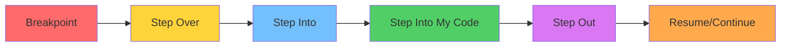
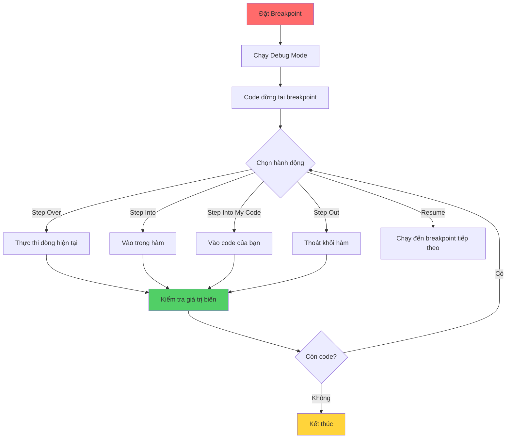

## Debugging - Sử dụng Debugger Tool

### Khái niệm

[[Debugger]] là công cụ debug mạnh mẽ và phức tạp hơn print statement, cho phép dừng code tại bất kỳ điểm nào và kiểm tra chi tiết trạng thái của chương trình.

### So sánh Print vs Debugger

**Print statement:**

- Đơn giản, nhanh chóng
- Phải thêm/xóa code thủ công
- Chỉ xem được những gì bạn in ra

**Debugger:**

- Mạnh mẽ, chuyên nghiệp
- Xem tất cả biến cùng lúc
- Kiểm soát luồng thực thi từng dòng
- Không cần sửa code


### Các công cụ Debugger phổ biến

- **Python Tutor** (pythontutor.com) - Online visualizer
- **Thonny** - Editor có debugger tích hợp
- **PyCharm** - IDE chuyên nghiệp
- **VS Code** - Editor với debug extension


### Breakpoint - Điểm dừng

**Khái niệm:** [[Breakpoint]] là điểm đánh dấu để code dừng lại, cho phép kiểm tra trạng thái chương trình tại vị trí đó.

**Cách tạo breakpoint trong PyCharm:**

- Click vào gutter (lề trái) bên cạnh số dòng
- Xuất hiện chấm đỏ → breakpoint được tạo
- Click lại để vô hiệu hóa (màu tối) hoặc xóa

**Chạy debug mode:**

- Click biểu tượng bug (🐛) thay vì Run
- Code sẽ dừng tại breakpoint đầu tiên


### Ví dụ thực hành

**Code ban đầu:**

```python
import random
from math import add

def mutate(a_list):
    b_list = []
    new_item = 0
    for item in a_list:
        new_item = item * 2
        new_item += random.randint(1, 3)
        new_item = add(new_item, item)
    b_list.append(new_item)
    print(b_list)

mutate([1, 2, 3, 4, 5, 6])
```

**Vấn đề:** Chỉ in ra 1 số thay vì cả list

### Các nút điều khiển Debugger




### Chi tiết các lệnh Debug

**Step Over (Bước qua):**

- Thực thi dòng hiện tại và dừng ở dòng tiếp theo
- Không đi vào bên trong hàm
- Phím tắt: F8

```python
new_item = item * 2  # ← Đang dừng ở đây
new_item += random.randint(1, 3)  # Sẽ dừng ở đây sau Step Over
```

**Step Into (Bước vào):**

- Thực thi và đi vào bên trong hàm được gọi
- Xem chi tiết cách hàm hoạt động
- Áp dụng cho cả library functions (random, math...)
- Phím tắt: F7

```python
new_item += random.randint(1, 3)
# Step Into → Đi vào code của randint() trong random.py
```

**Step Into My Code (Chỉ vào code của tôi):**

- Giống Step Into nhưng chỉ vào code do bạn viết
- Bỏ qua library functions (random, math...)
- Hữu ích cho multi-file projects
- Phím tắt: Alt + Shift + F7

```python
new_item = add(new_item, item)
# Step Into My Code → Vào hàm add() trong math.py (do bạn tạo)
# Không vào random.randint() (library function)
```

**Step Out (Bước ra):**

- Thoát khỏi hàm hiện tại
- Quay về điểm gọi hàm
- Phím tắt: Shift + F8

**Resume Program (Tiếp tục):**

- Chạy code cho đến breakpoint tiếp theo
- Hoặc đến khi kết thúc chương trình


### Luồng hoạt động Debugger



**Giải thích sơ đồ:** Quy trình sử dụng debugger bắt đầu bằng đặt breakpoint, sau đó sử dụng các nút điều khiển để theo dõi từng bước thực thi và kiểm tra giá trị biến cho đến khi tìm ra lỗi.

### Xem thông tin trong Debugger

**Tab Variables (Biến):**

Hiển thị tất cả biến và giá trị hiện tại:

```
a_list = [1, 2, 3, 4, 5, 6]
b_list = []
new_item = 0
item = 1
```

**Inline values (Giá trị trên code):**

```python
new_item = item * 2  # item: 1, new_item: 2
new_item += random.randint(1, 3)  # new_item: 5
```

**Tab Console:**

- Hiển thị output của print statements
- Vẫn hoạt động trong debug mode


### Phát hiện và sửa bug

**Phân tích vấn đề với debugger:**

**Bước 1:** Đặt breakpoint tại dòng 12

```python
b_list.append(new_item)  # ← Breakpoint
```

**Bước 2:** Step Over và quan sát

- `b_list` vẫn rỗng trong suốt vòng lặp
- Chỉ có 1 item được thêm vào cuối cùng
- `append` nằm **ngoài** vòng lặp!

**Bước 3:** Xác định nguyên nhân

```python
for item in a_list:
    new_item = item * 2
    new_item += random.randint(1, 3)
    new_item = add(new_item, item)
b_list.append(new_item)  # ❌ Sai indent - ngoài vòng lặp
print(b_list)
```

**Bước 4:** Sửa lỗi

```python
for item in a_list:
    new_item = item * 2
    new_item += random.randint(1, 3)
    new_item = add(new_item, item)
    b_list.append(new_item)  # ✓ Đúng indent - trong vòng lặp
print(b_list)
```


### Khi nào dùng Debugger?

**Nên dùng khi:**

- Code phức tạp với nhiều biến
- Vòng lặp với logic phức tạp
- Multi-file projects
- Cần xem toàn bộ trạng thái chương trình
- Debug code của người khác

**Có thể dùng print khi:**

- Lỗi đơn giản
- Chỉ cần kiểm tra 1-2 biến
- Debug nhanh
- Không có IDE với debugger


### Các tính năng nâng cao

**Mute breakpoints:**

- Vô hiệu hóa tất cả breakpoints tạm thời
- Không cần xóa từng cái
- Hữu ích khi có nhiều breakpoints

**Conditional breakpoints:**

- Chỉ dừng khi điều kiện thỏa mãn
- Ví dụ: `item == 5` hoặc `len(b_list) > 3`

**Watch expressions:**

- Theo dõi biểu thức cụ thể
- Ví dụ: `len(a_list)`, `sum(b_list)`


### Best Practices

**Đặt breakpoints hiệu quả:**

- Đặt tại điểm bắt đầu vùng nghi ngờ
- Đặt trước/sau vòng lặp
- Đặt tại các điểm quyết định quan trọng (if/else)

**Sử dụng Step commands:**

- Dùng Step Over cho hầu hết các dòng
- Dùng Step Into khi cần xem chi tiết hàm
- Dùng Step Into My Code cho multi-file projects
- Dùng Step Out khi đi lạc vào code không cần thiết

**Quan sát biến:**

- Chú ý biến thay đổi bất thường
- So sánh giá trị thực tế vs kỳ vọng
- Theo dõi biến trong vòng lặp


### Lỗi thường gặp với Indentation

**Lỗi indent phổ biến:**

```python
# ❌ Lỗi 1: Code ngoài vòng lặp
for i in range(5):
    x = i * 2
print(x)  # Chỉ in lần cuối

# ❌ Lỗi 2: Code ngoài if
if condition:
    a = 1
b = a + 1  # Luôn chạy, không phụ thuộc if

# ✓ Đúng
for i in range(5):
    x = i * 2
    print(x)  # In mỗi lần lặp
```


### Ghi chú quan trọng

**Lợi ích của Debugger:**

- Giống như có print cho TẤT CẢ biến
- Kiểm soát thời điểm dừng code
- Xem code của thư viện (nếu cần)
- Không cần sửa code gốc

**Hạn chế:**

- Học hơi phức tạp ban đầu
- Cần IDE hỗ trợ
- Chậm hơn print cho lỗi đơn giản

**Kinh nghiệm:**

- Càng debug nhiều càng thành thạo
- Kết hợp cả print và debugger
- Debug là kỹ năng cốt lõi của lập trình viên

***

**Liên kết:** [[Debugging]], [[debugger]], [[breakpoint]], [[step over]], [[step into]], [[PyCharm]], [[IDE]], [[indentation error]], [[execution flow]], [[variable inspection]], [[debugging tools]]

