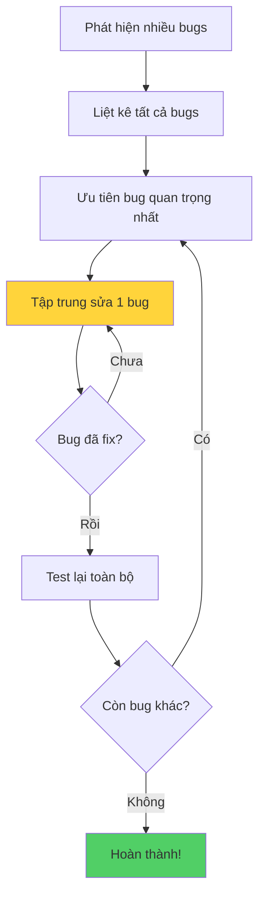

## Debugging - 10 Tips quan trọng (Phần 2)

### Tip 7: Nghỉ ngơi (Take a Break)

**Quan trọng nhất:** Đừng nhìn chằm chằm vào code khi bạn bế tắc!

**Hành động nên làm:**

- Uống tách trà/cà phê
- Ngủ một giấc ngắn
- Để qua đêm và giải quyết vào ngày hôm sau
- Đi dạo, thư giãn

**Tại sao hiệu quả:**

- Não bộ cần thời gian xử lý thông tin
- Sau khi nghỉ ngơi, vấn đề trở nên rõ ràng hơn
- Tránh stress và mệt mỏi kéo dài
- Góc nhìn mới sau khi nghỉ ngơi

> **Kinh nghiệm thực tế:** Nhiều lập trình viên tìm ra giải pháp khi đang tắm, đi bộ, hoặc vừa thức dậy!

### Tip 8: Nhờ người khác giúp (Ask a Friend)

**Không phải "print" mà là bạn thật!**

**Ai có thể giúp bạn:**

- Bạn cùng học khóa
- Thành viên Discord/Forum của khóa học
- Đồng nghiệp developer (nếu có)
- Thậm chí người không biết lập trình

**Tại sao hiệu quả:**

**Góc nhìn mới:**

- Người khác không có những giả định như bạn
- Có "đôi mắt mới" (fresh eyes) nhìn vào code
- Có thể phát hiện lỗi rõ ràng mà bạn bỏ qua

**Lợi ích hai chiều:**

- Bạn được giúp đỡ hôm nay
- Bạn giúp họ vào lần sau
- Cả hai đều rèn luyện kỹ năng debug

**Rubber Duck Debugging:**

- Giải thích code cho người khác (hoặc con vịt cao su)
- Quá trình giải thích giúp bạn tự tìm ra lỗi


### Tip 9: Chạy code thường xuyên (Run Often)

**Nguyên tắc vàng:** Đừng chờ đến khi viết xong hết code mới chạy!

**Thực hành tốt:**

```python
# ✓ Viết một chút
def calculate_total(items):
    total = 0
    # Run ngay → Xác nhận không lỗi syntax
    
    for item in items:
        total += item
    # Run lại → Kiểm tra vòng lặp hoạt động
    
    return total
    # Run cuối cùng → Xác nhận kết quả đúng
```

**Tránh làm:**

```python
# ❌ Viết cả 100 dòng code
# ❌ Không run giữa chừng
# ❌ Run lần đầu → 20 lỗi cùng lúc
# ❌ Không biết bắt đầu từ đâu
```

**Lợi ích:**

- Phát hiện lỗi sớm
- Dễ xác định đoạn code gây lỗi
- Tiết kiệm thời gian debug
- Giảm stress khi code


### Xử lý nhiều bugs cùng lúc

**Khi gặp nhiều lỗi:**

Giải quyết **từng cái một**, đừng làm vội nhiều cái cùng lúc!

**Quy trình:**



**Giải thích sơ đồ:** Quy trình xử lý nhiều bugs yêu cầu sự tập trung - giải quyết từng bug một cách có hệ thống thay vì nhảy qua lại giữa các lỗi khác nhau.

**Ví dụ:**

```python
# Phát hiện 3 bugs:
# 1. IndexError ← Ưu tiên cao nhất (crash code)
# 2. Logic sai ← Ưu tiên vừa
# 3. Typo tên biến ← Ưu tiên thấp

# Sửa bug 1 trước
# Test → OK
# Sửa bug 2
# Test → OK  
# Sửa bug 3
# Test → Hoàn thành!
```


### Tip 10: Stack Overflow

**Khi nào nên dùng Stack Overflow?**

**Tìm kiếm trước (Search first):**

- Hầu hết các lỗi đã có người gặp
- Search trước khi hỏi
- 99% câu hỏi đã được trả lời

**Đặt câu hỏi khi:**

- Đã thử tất cả cách debug
- Đã search toàn bộ Stack Overflow
- Vấn đề thực sự độc nhất, chưa ai gặp
- Đã chuẩn bị đầy đủ thông tin (code, error message, steps to reproduce)

**Cách search hiệu quả:**

```
[Ngôn ngữ] + [Error message] + [Context]

Ví dụ:
"Python IndexError list index out of range for loop"
"Python ValueError int() invalid literal"
```

**Tại sao Stack Overflow quan trọng:**

- Cộng đồng lập trình viên toàn cầu
- Câu trả lời từ chuyên gia
- Nhiều công ty "tê liệt" khi Stack Overflow down
- Công cụ không thể thiếu trong nghề lập trình


### Thông điệp quan trọng về Bugs

**Đừng lo lắng khi tạo ra bugs!**

**Các giai đoạn của lập trình viên:**

**Giai đoạn 1 - Bugs nhỏ (Beginner):**

```
🐛 Bugs đơn giản, dễ thương
   - Syntax errors
   - Typos
   - Indentation
```

**Giai đoạn 2 - Bugs trung bình (Intermediate):**

```
🐛🐛 Logic bugs phức tạp hơn
   - Off-by-one errors
   - Race conditions
   - Memory leaks
```

**Giai đoạn 3 - Bugs lớn (Professional):**

```
🐛🐛🐛 Bugs của chuyên gia
   - System architecture issues
   - Scalability problems
   - Complex concurrency bugs
```


### Tư duy đúng về Bugs

**Bugs KHÔNG có nghĩa bạn là lập trình viên tệ!**

**Sự thật:**

- Mọi lập trình viên đều tạo bugs
- Bugs là phần quan trọng của quá trình học
- Càng nhiều bugs, càng học được nhiều

**Kinh nghiệm cá nhân của giảng viên:**

> "Có thời điểm tôi nghĩ mình không phải là lập trình viên của code, mà là lập trình viên của bugs. Dường như mỗi dòng code tôi viết đều là một bug!"

**Mindset đúng:**

Mỗi bug bạn sửa = 1 rep trong phòng gym 💪

- Càng nhiều reps → Càng mạnh
- Càng sửa nhiều bugs → Càng giỏi lập trình
- Practice makes perfect!


### Tổng hợp 10 Tips Debug

**Review Checklist:**

**Phân tích cơ bản:**

- [ ] Mô tả vấn đề rõ ràng
- [ ] Tái tạo bug một cách nhất quán
- [ ] Play computer - chạy code trong đầu
- [ ] Sửa errors từ editor/console ngay

**Công cụ:**

- [ ] Sử dụng print statement
- [ ] Sử dụng debugger (breakpoints, step through)

**Chiến lược:**

- [ ] Nghỉ ngơi khi bế tắc
- [ ] Nhờ người khác giúp đỡ
- [ ] Run code thường xuyên
- [ ] Search/Ask trên Stack Overflow

**Cam kết:** 99% bugs sẽ được giải quyết nếu bạn đi qua đầy đủ 10 bước này!

### Best Practices tổng hợp

**Trong quá trình viết code:**

```python
# 1. Viết từng phần nhỏ
def process_data(data):
    # 2. Test ngay
    result = []
    
    # 3. Viết tiếp
    for item in data:
        # 4. Test lại
        processed = item * 2
        result.append(processed)
    
    # 5. Test cuối cùng
    return result
```

**Khi gặp bug:**

- Bình tĩnh, đừng panic
- Áp dụng 10 tips theo thứ tự
- Ghi chép lại cách fix (học từ kinh nghiệm)
- Chia sẻ kiến thức với người khác

**Xây dựng thói quen tốt:**

- Code review với đồng nghiệp
- Unit testing cho code quan trọng
- Documentation rõ ràng
- Version control (Git) để theo dõi thay đổi


### Chuẩn bị cho thử thách

**Bài tập tiếp theo:**

- Challenges về debugging
- Rèn luyện kỹ năng thực tế
- Áp dụng tất cả tips đã học

**Tâm thế:**

- Sẵn sàng "flex" programming muscles 💪
- Mỗi challenge = cơ hội học hỏi
- Đừng sợ làm sai, hãy học từ sai lầm


### Triết lý về Debugging

**Quote đáng nhớ:**

> "Debugging is like being the detective in a crime movie where you are also the murderer." - Filipe Fortes

**Ý nghĩa:**

- Bạn vừa là người tạo bug
- Vừa là người phải tìm và sửa bug
- Đó là phần tất yếu của lập trình

**Kết luận:**

Debugging không phải là dấu hiệu của sự yếu kém, mà là cơ hội để:

- Hiểu sâu hơn về code
- Cải thiện kỹ năng phân tích
- Trở thành lập trình viên tốt hơn

Hãy ôm lấy bugs của bạn, học hỏi từ chúng, và tiếp tục tiến bộ mỗi ngày! 🚀

***

**Liên kết:** [[Debugging]], [[debugging tips]], [[Stack Overflow]], [[rubber duck debugging]], [[debugging mindset]], [[error handling]], [[code testing]], [[programming best practices]], [[problem solving]], [[growth mindset]]

