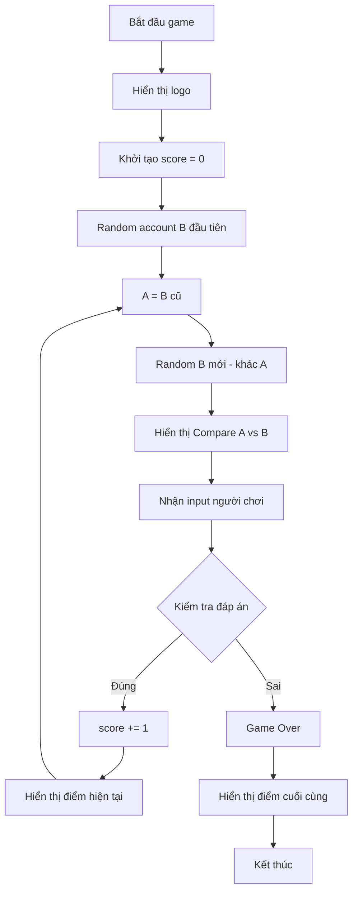

## Ngày 14: Trò chơi Higher or Lower

### Tổng quan dự án

Hôm nay bạn sẽ xây dựng một trò chơi có tên **Higher or Lower** (Cao hơn hay Thấp hơn). Phiên bản gốc so sánh lượng tìm kiếm trung bình hàng tháng trên Google giữa các từ khóa. Phiên bản bạn sẽ làm sẽ so sánh số lượng người theo dõi (followers) trên Instagram.

### Cách chơi

- Trò chơi hiển thị hai tài khoản (A và B)
- Người chơi đoán tài khoản nào có nhiều followers hơn
- Nếu đúng: được 1 điểm và tiếp tục chơi (tài khoản B trước đó trở thành A mới)
- Nếu sai: trò chơi kết thúc và hiển thị điểm số cuối cùng
- Mục tiêu: sống sót càng lâu càng tốt và đạt điểm cao nhất


### Cấu trúc file khởi đầu

Dự án bao gồm 3 file:

- `art.py` - chứa logo và biểu tượng "versus" (so sánh)
- `game_data.py` - chứa dữ liệu người nổi tiếng dưới dạng list các dictionary với 4 key:
    - `name`: tên tài khoản
    - `follower_count`: số followers (triệu người)
    - `description`: mô tả nghề nghiệp
    - `country`: quốc gia
- `main.py` - file chính để viết code game


### Phương pháp tiếp cận

#### Bước 1: Phân tích bài toán

Chơi thử game nhiều lần để hiểu rõ các tình huống:

- Điều gì xảy ra khi đoán đúng?
- Điều gì xảy ra khi đoán sai?
- Luồng dữ liệu hoạt động như thế nào?


#### Bước 2: Tạo TODO list

Chia nhỏ dự án thành các nhiệm vụ cụ thể và chọn nhiệm vụ dễ nhất để bắt đầu.

#### Bước 3: Viết comments (chú thích)

Với mỗi nhiệm vụ, phân tích thành các bước nhỏ và ghi thành comments trong code.

```python
# TODO: Generate random account from game data
# Import random module
# Use random.choice() to select account
```


#### Bước 4: Viết code

- Viết code dưới mỗi comment
- Chạy và test code
- Debug (gỡ lỗi) khi cần thiết
- Lặp lại cho đến khi hoàn thành nhiệm vụ


#### Bước 5: Lặp lại quy trình

Tiếp tục với nhiệm vụ tiếp theo cho đến khi hoàn thiện toàn bộ game.

### Ví dụ minh họa format hiển thị

```
Compare A: Cristiano Ronaldo, a footballer from Portugal
VS
Compare B: Vin Diesel, an actor from USA
Who has more followers? Type 'A' or 'B':
```


### Kỹ năng cần áp dụng

- [[Functions]] (hàm)
- [[Lists]] và [[Dictionaries]] (danh sách và từ điển)
- [[Random module]] (module ngẫu nhiên)
- [[Loops]] (vòng lặp)
- [[Conditional statements]] (câu lệnh điều kiện)
- [[Debugging]] (gỡ lỗi)
- [[Game logic]] (logic game)


### Ghi chú quan trọng

Đây là bài tập thực hành tổng hợp - bạn sẽ tự viết code hoàn toàn từ đầu. Dành ít nhất 1 giờ để:

- Phân tích bài toán
- Viết code
- Test và debug
- Hoàn thiện sản phẩm

Kỹ năng quan trọng nhất của lập trình viên là biết cách chia nhỏ vấn đề phức tạp thành các vấn đề đơn giản hơn, sau đó giải quyết từng cái một từ dễ đến khó.


## Lời giải Higher or Lower Game

Dưới đây là giải pháp hoàn chỉnh cho trò chơi Higher or Lower:

### Code chính (main.py)

```python
import random
from art import logo, vs
from game_data import data
import os

def clear():
    """Xóa màn hình console"""
    os.system('cls' if os.name == 'nt' else 'clear')

def format_data(account):
    """Định dạng dữ liệu account thành chuỗi hiển thị"""
    name = account["name"]
    description = account["description"]
    country = account["country"]
    return f"{name}, a {description}, from {country}"

def check_answer(user_guess, a_followers, b_followers):
    """Kiểm tra câu trả lời của người chơi"""
    if a_followers > b_followers:
        return user_guess == "a"
    else:
        return user_guess == "b"

# Hiển thị logo
print(logo)

# Khởi tạo điểm và game state
score = 0
game_should_continue = True

# Random account B ban đầu
account_b = random.choice(data)

# Vòng lặp game
while game_should_continue:
    # A trở thành B cũ
    account_a = account_b
    # Random B mới (đảm bảo khác A)
    account_b = random.choice(data)
    while account_a == account_b:
        account_b = random.choice(data)
    
    print(f"Compare A: {format_data(account_a)}")
    print(vs)
    print(f"Against B: {format_data(account_b)}")
    
    # Nhận input từ người chơi
    guess = input("Who has more followers? Type 'A' or 'B': ").lower()
    
    # Lấy số followers
    a_follower_count = account_a["follower_count"]
    b_follower_count = account_b["follower_count"]
    
    # Kiểm tra đáp án
    is_correct = check_answer(guess, a_follower_count, b_follower_count)
    
    # Xóa màn hình
    clear()
    print(logo)
    
    # Cập nhật điểm hoặc kết thúc game
    if is_correct:
        score += 1
        print(f"You're right! Current score: {score}")
    else:
        game_should_continue = False
        print(f"Sorry, that's wrong. Final score: {score}")
```


### Giải thích chi tiết

#### Các hàm chính

**`clear()`**

- Xóa màn hình console để game trông gọn gàng hơn
- Sử dụng lệnh `cls` cho Windows và `clear` cho Mac/Linux

**`format_data(account)`**

- Nhận dictionary account làm tham số
- Trả về chuỗi định dạng: "Tên, nghề nghiệp, từ quốc gia"
- Ví dụ: "Cristiano Ronaldo, a footballer, from Portugal"

**`check_answer(user_guess, a_followers, b_followers)`**

- So sánh số followers của A và B
- Kiểm tra xem người chơi đoán đúng hay sai
- Trả về `True` nếu đúng, `False` nếu sai


#### Luồng chương trình



Sơ đồ trên mô tả luồng xử lý của game: bắt đầu với việc random account B, sau đó trong vòng lặp, B cũ trở thành A mới, random B mới khác A, hiển thị so sánh, nhận input, kiểm tra đáp án. Nếu đúng thì tăng điểm và lặp lại, nếu sai thì kết thúc game.

#### Điểm quan trọng

**Tránh trùng lặp account**

```python
while account_a == account_b:
    account_b = random.choice(data)
```

Vòng lặp này đảm bảo A và B luôn khác nhau.

**Xử lý logic so sánh**

- Nếu A > B: người chơi phải chọn 'A'
- Nếu B > A: người chơi phải chọn 'B'

**Cơ chế tiếp nối**

- Sau mỗi lượt đúng, tài khoản B hiện tại trở thành A của lượt tiếp theo
- Điều này tạo cảm giác liên tục và logic cho game


### Cải tiến có thể thêm

- Thêm validation (kiểm tra) input chỉ nhận 'A' hoặc 'B'
- Lưu high score (điểm cao nhất)
- Thêm màu sắc cho terminal
- Hỏi người chơi có muốn chơi lại không

**Liên kết:** [[Random module]], [[While loops]], [[Functions]], [[String formatting]], [[Game logic]], [[User input validation]]

