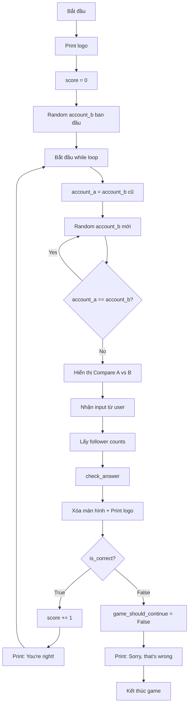

## Hướng dẫn giải chi tiết Higher or Lower Game

### Phương pháp tiếp cận bài toán

Kỹ năng quan trọng nhất trong lập trình là biết cách **chia nhỏ vấn đề lớn thành các vấn đề nhỏ hơn** có thể giải quyết được. Không quan trọng bạn giải như thế nào, miễn là chương trình chạy đúng như mong đợi.

### Phân tích và xác định các vấn đề

Hãy xác định tất cả các vấn đề cần giải quyết:

- Hiển thị ASCII art (logo và biểu tượng VS)
- Tạo random accounts từ game_data
- Format dữ liệu account thành định dạng hiển thị đẹp
- Nhận input từ người chơi
- Kiểm tra câu trả lời đúng/sai
- Đưa ra feedback cho người chơi
- Theo dõi điểm số (score tracking)
- Làm cho game lặp lại được (game loop)
- Chuyển account B thành account A cho round tiếp theo
- Xóa màn hình giữa các lượt chơi


### Giải quyết từng vấn đề

#### Vấn đề 1: Hiển thị ASCII art

```python
from art import logo, vs
print(logo)
```

Đây là bước đơn giản nhất - import và in logo.

#### Vấn đề 2: Tạo random accounts

```python
import random
from game_data import data

account_a = random.choice(data)
account_b = random.choice(data)

# Đảm bảo A và B khác nhau
if account_a == account_b:
    account_b = random.choice(data)
```

Sử dụng `random.choice()` để chọn ngẫu nhiên từ list. Kiểm tra để tránh trùng lặp.

#### Vấn đề 3: Format dữ liệu account

```python
def format_data(account):
    """Định dạng dữ liệu account thành chuỗi có thể in"""
    name = account["name"]
    description = account["description"]
    country = account["country"]
    return f"{name}, a {description}, from {country}"
```

Tạo function (hàm) để tái sử dụng code. Function này:

- Nhận dictionary account làm input
- Trích xuất các giá trị cần thiết
- Trả về string đã format

Sử dụng function:

```python
print(f"Compare A: {format_data(account_a)}")
print(vs)
print(f"Against B: {format_data(account_b)}")
```


#### Vấn đề 4: Nhận input từ người chơi

```python
guess = input("Who has more followers? Type 'A' or 'B': ").lower()
```

Sử dụng `.lower()` để chuyển tất cả thành chữ thường, đảm bảo input nhất quán.

#### Vấn đề 5: Kiểm tra câu trả lời

Đây là phần logic phức tạp nhất. Hãy vẽ bảng phân tích:


| User Guess | Reality | Result |
| :-- | :-- | :-- |
| A | A > B | ✓ Đúng |
| A | B > A | ✗ Sai |
| B | A > B | ✗ Sai |
| B | B > A | ✓ Đúng |

```python
def check_answer(user_guess, a_followers, b_followers):
    """Kiểm tra câu trả lời của người chơi và trả về True/False"""
    if a_followers > b_followers:
        return user_guess == "a"
    else:
        return user_guess == "b"
```

**Logic giải thích:**

- Nếu A > B và user đoán 'a' → return True
- Nếu A > B và user đoán 'b' → return False
- Nếu B > A và user đoán 'b' → return True
- Nếu B > A và user đoán 'a' → return False

Sử dụng function:

```python
a_follower_count = account_a["follower_count"]
b_follower_count = account_b["follower_count"]
is_correct = check_answer(guess, a_follower_count, b_follower_count)
```


#### Vấn đề 6: Feedback và Score tracking

```python
score = 0

if is_correct:
    score += 1
    print(f"You're right! Current score: {score}")
else:
    print(f"Sorry, that's wrong. Final score: {score}")
```

Khởi tạo score = 0 và tăng lên mỗi khi đúng.

#### Vấn đề 7: Game loop

```python
game_should_continue = True

while game_should_continue:
    # Code game ở đây
    
    if is_correct:
        score += 1
        print(f"You're right! Current score: {score}")
    else:
        game_should_continue = False
        print(f"Sorry, that's wrong. Final score: {score}")
```

Sử dụng [[While loops]] với flag variable để điều khiển game.

#### Vấn đề 8: Chuyển B thành A

```python
# Khởi tạo B đầu tiên (ngoài vòng lặp)
account_b = random.choice(data)

while game_should_continue:
    # A trở thành B cũ
    account_a = account_b
    # Tạo B mới
    account_b = random.choice(data)
    
    # Đảm bảo A và B khác nhau
    while account_a == account_b:
        account_b = random.choice(data)
    
    # Phần còn lại của game...
```

**Logic luồng:**

- Lần chơi đầu tiên: Random B → B trở thành A → Random B mới
- Các lần sau: B cũ → A mới → Random B mới


#### Vấn đề 9: Xóa màn hình

```python
# Xóa màn hình sau khi nhận input
print("\n" * 20)
print(logo)
```

Hoặc tạo function chuyên nghiệp hơn:

```python
import os

def clear():
    """Xóa màn hình console"""
    os.system('cls' if os.name == 'nt' else 'clear')

# Sử dụng
clear()
print(logo)
```


### Code hoàn chỉnh tích hợp

```python
import random
from art import logo, vs
from game_data import data

def format_data(account):
    """Định dạng dữ liệu account thành chuỗi có thể in"""
    name = account["name"]
    description = account["description"]
    country = account["country"]
    return f"{name}, a {description}, from {country}"

def check_answer(user_guess, a_followers, b_followers):
    """Kiểm tra câu trả lời và trả về True nếu đúng"""
    if a_followers > b_followers:
        return user_guess == "a"
    else:
        return user_guess == "b"

# Hiển thị logo
print(logo)

# Khởi tạo biến
score = 0
game_should_continue = True
account_b = random.choice(data)

# Vòng lặp game
while game_should_continue:
    # Account B cũ trở thành A
    account_a = account_b
    account_b = random.choice(data)
    
    # Đảm bảo A và B khác nhau
    while account_a == account_b:
        account_b = random.choice(data)
    
    # Hiển thị so sánh
    print(f"Compare A: {format_data(account_a)}")
    print(vs)
    print(f"Against B: {format_data(account_b)}")
    
    # Nhận input
    guess = input("Who has more followers? Type 'A' or 'B': ").lower()
    
    # Lấy follower counts
    a_follower_count = account_a["follower_count"]
    b_follower_count = account_b["follower_count"]
    is_correct = check_answer(guess, a_follower_count, b_follower_count)
    
    # Xóa màn hình
    print("\n" * 20)
    print(logo)
    
    # Kiểm tra và feedback
    if is_correct:
        score += 1
        print(f"You're right! Current score: {score}")
    else:
        game_should_continue = False
        print(f"Sorry, that's wrong. Final score: {score}")
```


### Sơ đồ luồng xử lý



Sơ đồ trên mô tả toàn bộ luồng xử lý từ khi bắt đầu game cho đến khi kết thúc.

### Điểm quan trọng cần nhớ

**Tái sử dụng code với Functions**

- Tạo function cho logic có thể dùng lại
- Viết docstring để giải thích function
- Return giá trị thay vì chỉ print

**Xử lý trùng lặp**

```python
while account_a == account_b:
    account_b = random.choice(data)
```

Vòng lặp này đảm bảo hai account luôn khác nhau.

**Logic chuyển đổi account**

```python
# Ngoài loop
account_b = random.choice(data)

# Trong loop
account_a = account_b  # B cũ thành A mới
account_b = random.choice(data)  # Tạo B mới
```

**Thứ tự thực thi quan trọng**

- Xóa màn hình TRƯỚC KHI đưa feedback
- Print logo SAU KHI xóa màn hình
- Kiểm tra và cập nhật điểm TRƯỚC KHI in feedback


### Bài học rút ra

Kỹ năng phân tích và chia nhỏ bài toán là quan trọng hơn code. Một lập trình viên giỏi biết cách:

- Nhận diện các vấn đề con trong vấn đề lớn
- Xếp hạng độ khó và giải quyết từ dễ đến khó
- Chia nhỏ tiếp các vấn đề phức tạp
- Test code thường xuyên sau mỗi bước
- Tái cấu trúc (refactor) code để dễ đọc và tái sử dụng

**Liên kết:** [[Random module]], [[While loops]], [[Functions]], [[Dictionaries]], [[List operations]], [[String formatting]], [[Conditional logic]], [[Flag variables]], [[Game development]]

