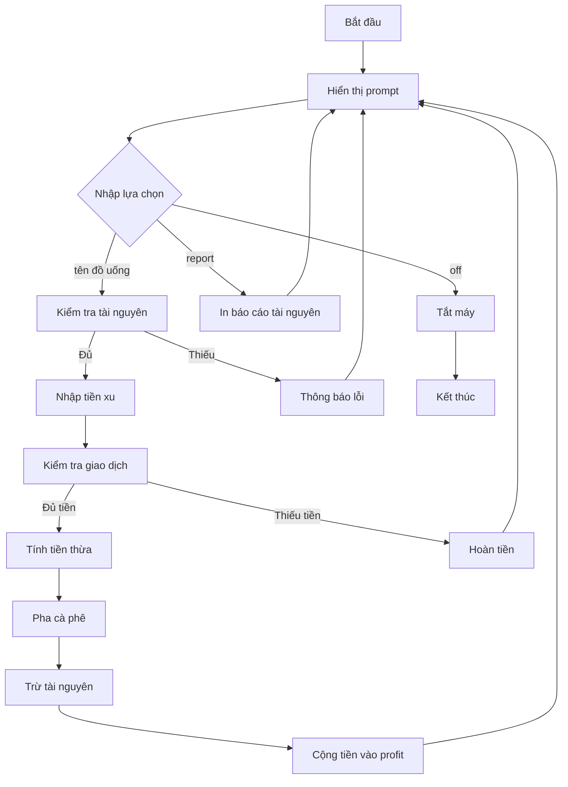

## Hướng Dẫn Lập Trình Coffee Machine - Giải Pháp Chi Tiết

### Lưu Ý Quan Trọng Trước Khi Bắt Đầu

Có vô số cách để giải quyết bài toán Coffee Machine Program. Không có cách nào đúng hay sai - miễn là chương trình hoạt động đúng theo yêu cầu. Bạn có thể sử dụng while loop, for loop, hoặc các cấu trúc dữ liệu khác nhau. Giải pháp dưới đây chỉ là một trong nhiều cách tiếp cận có thể.

### Thiết Lập Ban Đầu

**Cấu trúc dữ liệu có sẵn:**

```python
# Dictionary chứa công thức đồ uống
MENU = {
    "espresso": {
        "ingredients": {"water": 50, "coffee": 18},
        "cost": 1.5
    },
    "latte": {
        "ingredients": {"water": 200, "milk": 150, "coffee": 24},
        "cost": 2.5
    },
    "cappuccino": {
        "ingredients": {"water": 250, "milk": 100, "coffee": 24},
        "cost": 3.0
    }
}

# Dictionary chứa tài nguyên
resources = {
    "water": 300,
    "milk": 200,
    "coffee": 100
}
```

**Điều chỉnh Font trong PyCharm:**

- **Giao diện (UI):** Preferences → Appearance → Font
- **Editor:** Preferences → Editor → Font
- Cân bằng giữa dễ đọc và số dòng hiển thị trên màn hình


### Bước 1: Tạo Prompt Cơ Bản với While Loop

**Yêu cầu:** Hiển thị prompt liên tục sau mỗi lần hoàn thành hành động.

**Giải pháp:**

```python
is_on = True
profit = 0  # Biến lưu tiền kiếm được

while is_on:
    choice = input("What would you like? (espresso/latte/cappuccino): ")
```

**Giải thích:**

- Sử dụng biến `is_on` để kiểm soát vòng lặp
- Biến `profit` theo dõi số tiền máy thu được
- Prompt sẽ lặp lại cho đến khi `is_on = False`


### Bước 2: Tắt Máy (Turn Off Machine)

**Yêu cầu:** Nhập "off" để dừng máy và kết thúc chương trình.

**Code:**

```python
if choice == "off":
    is_on = False
```

**Test:**

- Nhập bất kỳ gì → máy tiếp tục chạy
- Nhập "off" → chương trình dừng lại


### Bước 3: In Báo Cáo (Print Report)

**Yêu cầu:** Nhập "report" để xem tài nguyên và tiền hiện có.

**Code:**

```python
elif choice == "report":
    print(f"Water: {resources['water']}ml")
    print(f"Milk: {resources['milk']}ml")
    print(f"Coffee: {resources['coffee']}g")
    print(f"Money: ${profit}")
```

**Mẹo Multi-line Editing trong PyCharm:**

- **Windows:** Alt + Shift + kéo chuột
- **Mac:** Option + Shift + kéo chuột
- Cho phép chỉnh sửa nhiều dòng cùng lúc

**Lưu ý về Quotes:**

- Dấu ngoặc kép trang trí `" "` (khác nhau đầu/cuối) → không hợp lệ trong code
- Dấu ngoặc kép lập trình `" "` (giống nhau) → đúng cú pháp


### Bước 4: Kiểm Tra Tài Nguyên Đủ

**Yêu cầu:** Xác minh máy có đủ nguyên liệu để pha đồ uống.

**Tạo Function:**

```python
def is_resource_sufficient(order_ingredients):
    """Return True when order can be made, False if insufficient."""
    for item in order_ingredients:
        if order_ingredients[item] >= resources[item]:
            print(f"Sorry, there is not enough {item}.")
            return False
    return True
```

**Logic:**

- Loop qua từng nguyên liệu trong đơn hàng
- So sánh với tài nguyên hiện có
- Nếu bất kỳ nguyên liệu nào thiếu → return `False` ngay lập tức
- Nếu vượt qua tất cả → return `True`

**Gọi Function:**

```python
else:
    drink = MENU[choice]
    if is_resource_sufficient(drink["ingredients"]):
        # Tiếp tục xử lý...
```

**Cách hiểu Return:**

- `return False` dừng function ngay khi thiếu tài nguyên
- Nếu không thiếu gì, vòng lặp kết thúc và `return True`


### Bước 5: Xử Lý Tiền Xu (Process Coins)

**Yêu cầu:** Tính tổng giá trị từ 4 loại xu: quarters, dimes, nickels, pennies.

**Tạo Function:**

```python
def process_coins():
    """Returns the total calculated from coins inserted."""
    print("Please insert coins.")
    total = int(input("How many quarters?: ")) * 0.25
    total += int(input("How many dimes?: ")) * 0.10
    total += int(input("How many nickels?: ")) * 0.05
    total += int(input("How many pennies?: ")) * 0.01
    return total
```

**Giải thích:**

- Dòng đầu tiên tạo biến `total` và gán giá trị đầu tiên
- Các dòng tiếp theo dùng `+=` để cộng dồn
- Function trả về tổng giá trị tiền

**Gọi Function:**

```python
if is_resource_sufficient(drink["ingredients"]):
    payment = process_coins()
```


### Bước 6: Kiểm Tra Giao Dịch Thành Công

**Yêu cầu:** Xác nhận người dùng trả đủ tiền, tính tiền thừa nếu có.

**Tạo Function:**

```python
def is_transaction_successful(money_received, drink_cost):
    """Return True when payment accepted, False if insufficient."""
    if money_received >= drink_cost:
        change = round(money_received - drink_cost, 2)
        print(f"Here is ${change} in change.")
        global profit
        profit += drink_cost
        return True
    else:
        print("Sorry, that's not enough money. Money refunded.")
        return False
```

**Chi Tiết Quan Trọng:**

1. **Global Variable:**
    - Dùng `global profit` để truy cập biến ngoài scope function
    - Không có `global` → tạo biến local mới
2. **Round Function:**
    - `round(number, ndigits)` → làm tròn đến số chữ số thập phân
    - `round(2.4235, 2)` → `2.42`
3. **Return Position:**
    - `return` phải ở cuối function
    - Code sau `return` sẽ không bao giờ chạy (unreachable)

**Gọi Function:**

```python
if is_transaction_successful(payment, drink["cost"]):
    # Tiếp tục pha cà phê...
```


### Bước 7: Pha Cà Phê và Trừ Tài Nguyên

**Yêu cầu:** Trừ nguyên liệu từ resources sau khi giao dịch thành công.

**Tạo Function:**

```python
def make_coffee(drink_name, order_ingredients):
    """Deduct required ingredients from resources."""
    for item in order_ingredients:
        resources[item] -= order_ingredients[item]
    print(f"☕ Here is your {drink_name}. Enjoy!")
```

**Logic:**

- Loop qua từng nguyên liệu
- Trừ số lượng cần dùng từ resources
- In thông báo với emoji (Mac: Edit → Emoji \& Symbols)

**Gọi Function:**

```python
if is_transaction_successful(payment, drink["cost"]):
    make_coffee(choice, drink["ingredients"])
```


### Luồng Xử Lý Hoàn Chỉnh



**Giải thích sơ đồ:**

- Chương trình chạy trong vòng lặp liên tục
- Mỗi lựa chọn đi theo một nhánh logic khác nhau
- Chỉ kết thúc khi nhập "off"
- Sau mỗi hành động (trừ "off"), quay lại hiển thị prompt


### Cấu Trúc Code Hoàn Chỉnh

```python
# Biến global
profit = 0
is_on = True

# Functions
def is_resource_sufficient(order_ingredients):
    # ...

def process_coins():
    # ...

def is_transaction_successful(money_received, drink_cost):
    # ...

def make_coffee(drink_name, order_ingredients):
    # ...

# Main program
while is_on:
    choice = input("What would you like? (espresso/latte/cappuccino): ")
    
    if choice == "off":
        is_on = False
    elif choice == "report":
        # Print report
    else:
        drink = MENU[choice]
        if is_resource_sufficient(drink["ingredients"]):
            payment = process_coins()
            if is_transaction_successful(payment, drink["cost"]):
                make_coffee(choice, drink["ingredients"])
```


### Mẹo Sử Dụng TODO trong PyCharm

**Cú pháp:**

```python
# TODO: 1. Print report of coffee machine resources
# TODO: 2. Check resources are sufficient
```

**Lợi ích:**

- TODO được highlight với màu sắc đặc biệt
- Hiển thị trong tab TODO (View → Tool Windows → TODO)
- Dễ dàng navigate giữa các task
- Giúp chia nhỏ vấn đề lớn thành các bước nhỏ


### Kỹ Thuật Debug và Test

**Test từng bước:**

1. **Test off command:**

```
→ off
(Chương trình dừng)
```

2. **Test report:**

```
→ report
Water: 300ml
Milk: 200ml
Coffee: 100g
Money: $0
```

3. **Test thiếu tiền:**

```
→ latte
quarters: 1
dimes: 0
nickels: 0
pennies: 0
→ "Sorry, not enough money..."
```

4. **Test đủ tiền:**

```
→ latte
quarters: 10
dimes: 2
nickels: 1
pennies: 5
→ "$0.42 in change"
→ "Here is your latte"
```

5. **Test thiếu tài nguyên:**

```
→ report (kiểm tra tài nguyên)
→ latte (order nhiều lần)
→ "Sorry, not enough water"
```


### Shortcut Hữu Ích trong PyCharm

**Chạy chương trình:**

- **Mac:** Control + R
- **Windows:** Shift + F10

**Multi-line editing:**

- **Mac:** Option + Shift + kéo chuột
- **Windows:** Alt + Shift + kéo chuột

**Insert emoji:**

- **Mac:** Edit → Emoji \& Symbols
- **Windows:** Copy từ Google

**Stop and Rerun:**

- Click icon Stop → Rerun
- Tích "Don't ask again" để tự động stop khi rerun


### Các Lỗi Thường Gặp và Cách Fix

**1. Lỗi Quote không đúng:**

```python
# SAI - decorative quotes
print("Hello")

# ĐÚNG - programming quotes
print("Hello")
```

**2. Lỗi Unreachable Code:**

```python
# SAI
def example():
    return True
    print("This never runs")  # Unreachable

# ĐÚNG
def example():
    print("This runs")
    return True
```

**3. Lỗi Global Variable:**

```python
# SAI - tạo local variable mới
def add_profit(cost):
    profit += cost  # Error!

# ĐÚNG - dùng global
def add_profit(cost):
    global profit
    profit += cost
```

**4. Lỗi Dictionary Key:**

```python
# Đảm bảo key tồn tại trước khi truy cập
drink = MENU[choice]  # choice phải là "espresso", "latte", hoặc "cappuccino"
```


### Docstrings và Code Documentation

**Best practice:**

```python
def is_resource_sufficient(order_ingredients):
    """Return True when order can be made, False if insufficient."""
    # Implementation...
```

**Lợi ích:**

- Hiển thị khi hover chuột trên function name
- Giúp người khác (và chính bạn) hiểu function làm gì
- Tự động documentation


### Tối Ưu và Mở Rộng

**Các ý tưởng cải tiến:**

- Thêm nhiều loại đồ uống
- Xử lý input không hợp lệ (error handling)
- Lưu trữ lịch sử giao dịch
- Thêm tính năng refill resources
- Tạo GUI interface
- Xuất báo cáo ra file


### Checklist Hoàn Thành

- [x] Prompt hiển thị liên tục
- [x] Tắt máy với "off"
- [x] In report với "report"
- [x] Kiểm tra tài nguyên đủ
- [x] Xử lý 4 loại tiền xu
- [x] Kiểm tra giao dịch thành công
- [x] Tính tiền thừa (làm tròn 2 chữ số)
- [x] Pha cà phê và trừ tài nguyên
- [x] Cộng tiền vào profit
- [x] Hoàn tiền nếu không đủ
- [x] Code có docstrings
- [x] Test tất cả trường hợp

**Liên kết:** [[Python]], [[While Loop]], [[Function]], [[Dictionary]], [[Global Variable]], [[Return Statement]], [[F-string]], [[Docstring]], [[PyCharm]], [[Coffee Machine Project]], [[Scope]], [[Multi-line Editing]]

