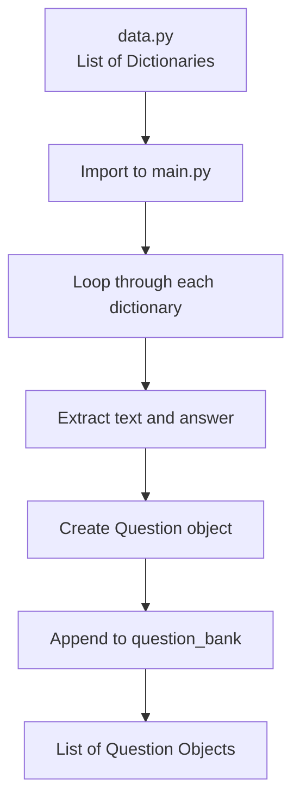

## Quiz Game - Tạo Question Bank

### Khái niệm Question Bank

**Question Bank là gì:**
Danh sách (list) chứa nhiều Question objects để sử dụng trong quiz.

**Ví dụ cấu trúc:**

```python
question_bank = [
    Question("Question 1?", True),
    Question("Question 2?", False),
    Question("Question 3?", True)
]
```

**Lợi ích:**

- Lưu trữ tập trung tất cả câu hỏi
- Dễ dàng truy cập và quản lý
- Có thể loop through để hiển thị câu hỏi


### File data.py - Cấu trúc dữ liệu

**Nội dung file data.py:**

```python
question_data = [
    {"text": "A slug's blood is green.", "answer": "True"},
    {"text": "The loudest animal is the African Elephant.", "answer": "False"},
    {"text": "Approximately one quarter of human bones are in the feet.", "answer": "True"},
    # ... 12 dictionaries in total
]
```

**Cấu trúc:**

- `question_data` = List chứa 12 dictionaries
- Mỗi dictionary có 2 keys: `"text"` và `"answer"`
- `"text"` = Nội dung câu hỏi (string)
- `"answer"` = Đáp án ("True" hoặc "False" - string)


### Code Formatting trong PyCharm

**Vấn đề ban đầu:**

```python
question_data = [
{"text": "Question...", "answer": "True"},  # Yellow warning
{"text": "Question...", "answer": "False"}, # Yellow warning
]
```

**Yellow squiggly lines (Gạch vàng):**

- Cảnh báo formatting không chuẩn
- Dictionaries trong list nên được indent
- Không ảnh hưởng functionality nhưng nên fix

**Cách fix - Auto-indent:**

1. Select toàn bộ nội dung file (Ctrl+A hoặc Cmd+A)
2. Code → Auto-Indent Lines
3. PyCharm tự động format đúng chuẩn

**Kết quả:**

```python
question_data = [
    {"text": "Question...", "answer": "True"},
    {"text": "Question...", "answer": "False"},
]
```

**Red squiggly lines (Gạch đỏ):**

- Dòng quá dài (> 120 characters)
- Cutoff line hiển thị giới hạn

**Cách fix - Break lines:**

```python
# Trước
{"text": "Very long question that exceeds 120 characters...", "answer": "True"}

# Sau - đặt cursor và Enter
{"text": "Very long question that exceeds " 
         "120 characters...", "answer": "True"}
```

Python tự động nối các string liền kề.

**Warnings khác:**

**"Expect new line at end of file":**

- Thêm 1 dòng trống cuối file

**"Unknown word in dictionary":**

- Từ không có trong spell checker (ví dụ: "Backrub")
- Click vào light-bulb icon
- Chọn "Save 'Backrub' to project-level dictionary"

**Kết quả cuối:**
Green checkmark ✓ ở góc phải = Không còn warnings/errors

### Import vào main.py

**Cần import 2 thứ:**

```python
from question_model import Question
from data import question_data
```

**Giải thích:**

- `Question` = Class để tạo question objects
- `question_data` = List of dictionaries chứa data

**Lưu ý:**

- Import class name (PascalCase): `Question`
- Import variable name (snake_case): `question_data`


### Mục tiêu: Tạo Question Bank

**Yêu cầu:**
Chuyển đổi từ list of dictionaries → list of Question objects

**Từ:**

```python
[
    {"text": "A slug's blood is green.", "answer": "True"},
    {"text": "Question 2...", "answer": "False"}
]
```

**Thành:**

```python
[
    Question("A slug's blood is green.", True),
    Question("Question 2...", False)
]
```


### Implementation - Tạo Question Bank

**Bước 1: Tạo empty list**

```python
question_bank = []
```

**Bước 2: Loop through question_data**

```python
for question in question_data:
    # Process each dictionary
```

**Bước 3: Trích xuất data từ dictionary**

```python
for question in question_data:
    question_text = question["text"]
    question_answer = question["answer"]
```

**Giải thích:**

- `question` = Từng dictionary trong loop
- `question["text"]` = Truy cập value qua key "text"
- `question["answer"]` = Truy cập value qua key "answer"

**Ví dụ iteration đầu tiên:**

```python
question = {"text": "A slug's blood is green.", "answer": "True"}
question_text = "A slug's blood is green."
question_answer = "True"
```

**Bước 4: Tạo Question object**

```python
for question in question_data:
    question_text = question["text"]
    question_answer = question["answer"]
    
    new_question = Question(question_text, question_answer)
```

**Hoặc ngắn gọn hơn (không dùng named parameters):**

```python
new_question = Question(question["text"], question["answer"])
```

**Bước 5: Thêm vào question_bank**

```python
for question in question_data:
    question_text = question["text"]
    question_answer = question["answer"]
    new_question = Question(question_text, question_answer)
    
    question_bank.append(new_question)
```


### Code hoàn chỉnh

**File: main.py**

```python
from question_model import Question
from data import question_data

question_bank = []

for question in question_data:
    question_text = question["text"]
    question_answer = question["answer"]
    new_question = Question(question_text, question_answer)
    question_bank.append(new_question)

# Test
print(question_bank)
```

**Output:**

```
[<question_model.Question object at 0x1234>, 
 <question_model.Question object at 0x5678>, 
 ... 
 12 objects total]
```


### Verify kết quả

**Check số lượng:**

```python
print(len(question_bank))  # Output: 12
```

**Test access attributes:**

```python
print(question_bank[0].text)    # First question text
print(question_bank[0].answer)  # First question answer
```


### Dictionaries vs Objects - So sánh

**Dictionaries (Before):**

```python
# Truy cập bằng string keys
question_data[0]["text"]
question_data[0]["answer"]

# Dễ typo
question_data[0]["txt"]  # Lỗi runtime, không warning
```

**Nhược điểm:**

- String keys dễ gõ sai
- Không có autocomplete
- Lỗi chỉ phát hiện khi chạy (runtime)
- Khó maintain với code base lớn

**Objects (After):**

```python
# Truy cập bằng attributes
question_bank[0].text
question_bank[0].answer

# Autocomplete hỗ trợ
question_bank[0].t  # → PyCharm gợi ý .text

# Typo được phát hiện ngay
question_bank[0].txt  # PyCharm highlight warning ngay
```

**Ưu điểm:**

- IDE hỗ trợ autocomplete
- Phát hiện lỗi sớm (compile time)
- Code rõ ràng, dễ đọc
- Foolproof - khó mắc lỗi hơn


### Data Flow - Từ file đến objects



**Giải thích sơ đồ:**

1. **data.py** chứa raw data dạng dictionaries
2. **Import** data vào main.py
3. **Loop** qua từng dictionary
4. **Extract** text và answer từ dictionary
5. **Create** Question object với data đó
6. **Append** object vào question_bank list
7. **Kết quả:** List chứa Question objects thay vì dictionaries

### Best Practices

**Khi làm việc với data từ bên ngoài:**

**✓ Nên:**

- Convert sang objects sớm nhất có thể
- Sử dụng objects trong phần còn lại của code
- Tận dụng IDE autocomplete và type checking

**✗ Tránh:**

- Sử dụng dictionaries với string keys khắp nơi
- Truy cập data trực tiếp bằng keys nhiều lần
- Không validate data structure


### Data từ Internet

**Thực tế:**
Data từ API hoặc files thường ở dạng:

- JSON (tương tự dictionaries)
- CSV (tables)
- XML

**Quy trình chuyển đổi:**

```python
# 1. Nhận data (dictionary format)
raw_data = fetch_from_api()

# 2. Convert sang objects
processed_data = []
for item in raw_data:
    obj = MyClass(item["field1"], item["field2"])
    processed_data.append(obj)

# 3. Sử dụng objects trong code
for obj in processed_data:
    print(obj.field1)  # Safe, autocomplete works
```


### Code ngắn gọn hơn - List Comprehension

**Alternative approach:**

```python
question_bank = [
    Question(question["text"], question["answer"]) 
    for question in question_data
]
```

**Giải thích:**

- Cú pháp ngắn gọn của Python
- Tạo list trong 1 dòng
- Tương đương với for loop + append

**Lưu ý:**
Đây là kỹ thuật nâng cao, sẽ học chi tiết sau.

### Tổng kết

**Đã hoàn thành:**
✓ Format data.py đúng chuẩn
✓ Import Question class và question_data
✓ Loop through dictionaries
✓ Extract data từ mỗi dictionary
✓ Tạo Question objects
✓ Build question_bank - list of objects

**Lợi ích đạt được:**

- Code an toàn hơn (type-safe)
- IDE support tốt hơn
- Dễ maintain và mở rộng
- Ít lỗi runtime

**Bước tiếp theo:**
Tạo QuizBrain class để quản lý logic của quiz game.

***

**Liên kết:** [[Question Bank]], [[Question Model]], [[Data Structures]], [[Dictionaries]], [[Objects]], [[Loop]], [[List]], [[Import]], [[PyCharm]], [[Code Formatting]], [[Autocomplete]], [[Type Safety]], [[Quiz Game]], [[OOP]], [[Data Conversion]]

