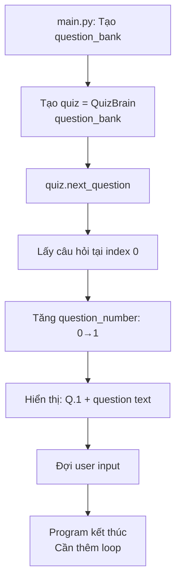

## Quiz Game - Tạo QuizBrain Class

### Mục tiêu QuizBrain

**Vai trò:**
QuizBrain class quản lý toàn bộ logic của quiz game.

**Chức năng chính:**

- Hiển thị câu hỏi tiếp theo cho user
- Kiểm tra câu trả lời đúng/sai
- Theo dõi vị trí hiện tại trong quiz
- Xác định khi nào quiz kết thúc

**Tại sao cần class riêng:**
Tách biệt logic quiz khỏi data và main code → Code tổ chức tốt hơn, dễ maintain.

### Attributes của QuizBrain

**Hai attributes cần thiết:**

**1. question_number (Số thứ tự câu hỏi):**

- Theo dõi user đang ở câu hỏi thứ mấy
- Default value = 0 (bắt đầu từ câu đầu tiên)
- Tăng dần sau mỗi câu

**2. question_list (Danh sách câu hỏi):**

- Nhận question_bank từ bên ngoài
- Được truyền vào khi khởi tạo QuizBrain
- Là list of Question objects


### Method next_question()

**Chức năng:**

- Lấy câu hỏi từ list dựa trên question_number hiện tại
- Hiển thị câu hỏi cho user
- Yêu cầu user nhập True hoặc False

**Output mong muốn:**

```
Q.1: A slug's blood is green. (True/False): 
```

**Format:**

- `Q.[số]` - Hiển thị số thứ tự câu hỏi
- `[question_text]` - Nội dung câu hỏi
- `(True/False):` - Yêu cầu nhập đáp án


### Implementation - QuizBrain Class

**File: quiz_brain.py**

**Bước 1: Tạo class và constructor**

```python
class QuizBrain:
    def __init__(self, q_list):
        self.question_number = 0  # Default value
        self.question_list = q_list
```

**Giải thích:**

- `question_number` = Bắt đầu từ 0 (để access list index)
- `question_list` = Nhận từ parameter `q_list`
- Không cần truyền question_number vì có default value

**Bước 2: Tạo method next_question()**

```python
class QuizBrain:
    def __init__(self, q_list):
        self.question_number = 0
        self.question_list = q_list
    
    def next_question(self):
        current_question = self.question_list[self.question_number]
        self.question_number += 1
        input(f"Q.{self.question_number}: {current_question.text} (True/False): ")
```

**Phân tích chi tiết:**

**Dòng 1: Lấy câu hỏi hiện tại**

```python
current_question = self.question_list[self.question_number]
```

- `self.question_list` = List of Question objects
- `self.question_number` = Index (bắt đầu từ 0)
- `current_question` = Question object tại index đó

**Ví dụ:**

- `question_number = 0` → Lấy câu hỏi đầu tiên
- `question_number = 1` → Lấy câu hỏi thứ hai

**Dòng 2: Tăng question_number**

```python
self.question_number += 1
```

- Tương đương: `self.question_number = self.question_number + 1`
- Chuẩn bị cho lần gọi tiếp theo
- Cũng để hiển thị số câu hỏi đúng (bắt đầu từ 1 thay vì 0)

**Dòng 3: Hiển thị và nhận input**

```python
input(f"Q.{self.question_number}: {current_question.text} (True/False): ")
```

**f-string breakdown:**

- `f"..."` = Formatted string
- `{self.question_number}` = Số câu hỏi (đã tăng lên, nên hiển thị 1, 2, 3...)
- `{current_question.text}` = Access attribute `text` của Question object
- `(True/False):` = Prompt cho user


### Tại sao tăng question_number sau khi lấy question?

**Logic:**

```python
# question_number = 0
current_question = self.question_list[0]  # Lấy câu đầu tiên
self.question_number += 1                  # Tăng lên 1
input(f"Q.{1}: ...")                       # Hiển thị "Q.1"
```

**Lợi ích:**

1. **Access đúng index:** List bắt đầu từ index 0
2. **Hiển thị đúng số thứ tự:** User thấy Q.1, Q.2... (không phải Q.0)
3. **Chuẩn bị lần gọi sau:** question_number sẵn sàng cho câu tiếp theo

**Alternative (không tốt):**

```python
input(f"Q.{self.question_number + 1}: ...")
```

- Phải cộng 1 mỗi lần hiển thị
- Không update question_number cho lần sau
- Dài dòng và dễ quên


### Sử dụng QuizBrain trong main.py

**Import QuizBrain:**

```python
from quiz_brain import QuizBrain
```

**Tạo quiz object:**

```python
quiz = QuizBrain(question_bank)
```

**Giải thích:**

- `quiz` = QuizBrain object
- `question_bank` = List of Question objects đã tạo trước đó
- Được truyền vào constructor → Lưu trong `self.question_list`

**Gọi method để hiển thị câu hỏi:**

```python
quiz.next_question()
```


### Code hoàn chỉnh

**File: quiz_brain.py**

```python
class QuizBrain:
    
    def __init__(self, q_list):
        self.question_number = 0
        self.question_list = q_list
    
    def next_question(self):
        current_question = self.question_list[self.question_number]
        self.question_number += 1
        input(f"Q.{self.question_number}: {current_question.text} (True/False): ")
```

**File: main.py**

```python
from question_model import Question
from data import question_data
from quiz_brain import QuizBrain

question_bank = []

for question in question_data:
    question_text = question["text"]
    question_answer = question["answer"]
    new_question = Question(question_text, question_answer)
    question_bank.append(new_question)

quiz = QuizBrain(question_bank)
quiz.next_question()
```


### Test chương trình

**Chạy main.py:**

```
Q.1: A slug's blood is green. (True/False): True
```

**Output giải thích:**

- `Q.1` - Hiển thị đúng (không phải Q.0)
- Question text hiển thị
- Đợi user nhập True/False

**Sau khi nhập:**
Chương trình kết thúc (chỉ hiển thị 1 câu hỏi).

**Bước tiếp theo:**
Cần loop để tiếp tục hỏi các câu còn lại.

### Flow hoạt động - Sơ đồ



**Giải thích luồng:**

1. **main.py** tạo question_bank từ data
2. Khởi tạo **QuizBrain** với question_bank
3. Gọi **next_question()** method
4. Method lấy câu hỏi đầu tiên (index 0)
5. Tăng question_number lên 1
6. Hiển thị câu hỏi với số thứ tự đúng
7. Đợi user nhập câu trả lời
8. Kết thúc (cần thêm logic loop)

### Accessing Question attributes

**Question object structure:**

```python
current_question = Question("Some text", "True")
# current_question.text = "Some text"
# current_question.answer = "True"
```

**Trong next_question():**

```python
current_question = self.question_list[self.question_number]
# current_question is a Question object
print(current_question.text)    # Access text attribute
print(current_question.answer)  # Access answer attribute
```

**Lợi ích của objects:**

- Rõ ràng: `.text` thay vì `["text"]`
- Autocomplete hoạt động
- Typo-proof: IDE cảnh báo nếu sai


### Vấn đề hiện tại và giải pháp

**Vấn đề:**
Chương trình chỉ hỏi 1 câu rồi dừng.

**Nguyên nhân:**
Không có loop để tiếp tục gọi `next_question()`.

**Giải pháp (bài sau):**

- Tạo loop while để hỏi liên tục
- Check khi nào hết câu hỏi
- Hiển thị kết quả cuối cùng

**Preview code (sẽ implement sau):**

```python
while quiz.still_has_questions():
    quiz.next_question()
```


### Key Concepts

**Default values:**

```python
self.question_number = 0  # Không cần parameter
```

Mọi QuizBrain object đều bắt đầu từ 0.

**Parameter values:**

```python
self.question_list = q_list  # Cần parameter
```

Mỗi QuizBrain có thể có list khác nhau.

**Method gọi method:**

```python
def next_question(self):
    # Có thể gọi methods khác của chính class
    self.other_method()
```

**Attribute modification:**

```python
self.question_number += 1  # Thay đổi attribute trong method
```

Methods có thể thay đổi state của object.

### Tổng kết

**Đã hoàn thành:**
✓ Tạo QuizBrain class
✓ Thêm attributes: question_number và question_list
✓ Implement method next_question()
✓ Hiển thị câu hỏi với format đúng
✓ Tăng question_number tự động

**QuizBrain hiện có:**

- Attributes để track state
- Method để hiển thị câu hỏi
- Logic để tăng question number

**Còn thiếu:**

- Loop để hỏi tất cả câu hỏi
- Check điều kiện kết thúc
- Kiểm tra câu trả lời
- Tính điểm

**Bước tiếp theo:**
Thêm logic để quiz tiếp tục chạy cho đến hết câu hỏi.

***

**Liên kết:** [[QuizBrain]], [[Class]], [[Attributes]], [[Methods]], [[Default Values]], [[Question Number]], [[Question List]], [[next_question]], [[Input]], [[F-string]], [[Quiz Game]], [[Self]], [[Object State]], [[List Indexing]], [[Python OOP]]

