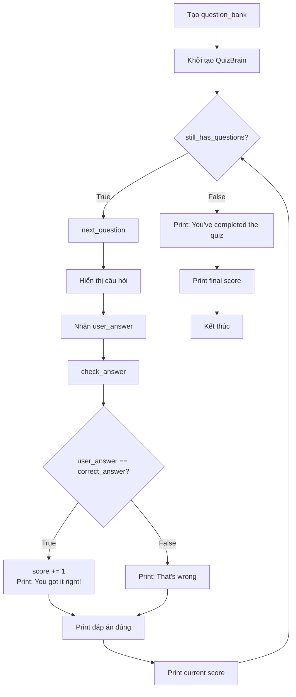

## Quiz Game - Kiểm tra Câu trả lời và Tính điểm

### Vấn đề hiện tại

**Tình trạng:**
Quiz hiển thị câu hỏi và nhận input, nhưng không kiểm tra đúng/sai. User nhập gì cũng được, không có feedback.

**Cần thêm:**

- Kiểm tra câu trả lời
- Theo dõi điểm số (score)
- Thông báo đúng/sai
- Hiển thị điểm sau mỗi câu
- Hiển thị điểm cuối cùng


### Thêm Score Attribute

**Mục đích:**
Theo dõi số câu trả lời đúng của user.

**Implementation:**

```python
class QuizBrain:
    
    def __init__(self, q_list):
        self.question_number = 0
        self.question_list = q_list
        self.score = 0  # Default value = 0
```

**Đặc điểm:**

- Default value = 0 (bắt đầu không có điểm)
- Tăng 1 mỗi khi trả lời đúng
- Được track xuyên suốt quiz


### Lưu User Input

**Thay đổi trong next_question():**

**Trước:**

```python
def next_question(self):
    current_question = self.question_list[self.question_number]
    self.question_number += 1
    input(f"Q.{self.question_number}: {current_question.text} (True/False): ")
```

**Sau:**

```python
def next_question(self):
    current_question = self.question_list[self.question_number]
    self.question_number += 1
    user_answer = input(f"Q.{self.question_number}: {current_question.text} (True/False): ")
    self.check_answer(user_answer, current_question.answer)
```

**Thay đổi:**

1. Lưu input vào biến `user_answer`
2. Gọi method `check_answer()` với 2 parameters:
    - `user_answer` - Câu trả lời của user
    - `current_question.answer` - Đáp án đúng

### Tạo Method check_answer()

**Chức năng:**
So sánh câu trả lời của user với đáp án đúng, cập nhật điểm và hiển thị feedback.

**Code hoàn chỉnh:**

```python
def check_answer(self, user_answer, correct_answer):
    if user_answer.lower() == correct_answer.lower():
        self.score += 1
        print("You got it right!")
    else:
        print("That's wrong.")
    print(f"The correct answer was: {correct_answer}.")
    print(f"Your current score is: {self.score}/{self.question_number}")
    print("\n")
```

**Phân tích từng phần:**

**1. Parameters:**

```python
def check_answer(self, user_answer, correct_answer):
```

- `user_answer` - Input từ user
- `correct_answer` - Đáp án đúng từ Question object

**2. So sánh với .lower():**

```python
if user_answer.lower() == correct_answer.lower():
```

**Lý do dùng .lower():**

- User có thể nhập: "True", "true", "TRUE"
- Data có thể lưu: "True" hoặc "true"
- `.lower()` chuyển tất cả về chữ thường để so sánh
- "True".lower() = "true"
- "TRUE".lower() = "true"
→ Đảm bảo so sánh chính xác

**3. Tăng điểm nếu đúng:**

```python
self.score += 1
```

Chỉ tăng khi user trả lời đúng.

**4. Hiển thị feedback:**

```python
if user_answer.lower() == correct_answer.lower():
    print("You got it right!")
else:
    print("That's wrong.")
```

Thông báo ngay lập tức đúng hay sai.

**5. Hiển thị đáp án đúng:**

```python
print(f"The correct answer was: {correct_answer}.")
```

**Vị trí:**
Ngoài if/else block → Hiển thị cho cả đúng và sai.

**Lý do:**

- Nếu đúng: Xác nhận lại cho user
- Nếu sai: Cho user biết đáp án

**6. Hiển thị điểm hiện tại:**

```python
print(f"Your current score is: {self.score}/{self.question_number}")
```

**Format:** `3/5` nghĩa là đúng 3 câu trong tổng 5 câu đã trả lời.

**Components:**

- `self.score` - Số câu đúng
- `self.question_number` - Tổng số câu đã trả lời

**7. Thêm khoảng trống:**

```python
print("\n")
```

**Lý do:**

- Tạo khoảng cách giữa các câu hỏi
- Dễ nhìn, dễ đọc
- Không xóa màn hình (vẫn thấy câu hỏi cũ)


### Output sau mỗi câu hỏi

**Ví dụ trả lời đúng:**

```
Q.1: A slug's blood is green. (True/False): True
You got it right!
The correct answer was: True.
Your current score is: 1/1

Q.2: ...
```

**Ví dụ trả lời sai:**

```
Q.3: Question text here. (True/False): False
That's wrong.
The correct answer was: True.
Your current score is: 2/3

Q.4: ...
```


### Hiển thị Final Score

**Yêu cầu:**
Sau khi hoàn thành quiz, hiển thị:

- "You've completed the quiz"
- "Your final score was: X/Y"

**Vị trí code:**
Trong `main.py`, sau while loop.

**Implementation:**

```python
# File: main.py

while quiz.still_has_questions():
    quiz.next_question()

print("You've completed the quiz")
print(f"Your final score was: {quiz.score}/{quiz.question_number}")
```

**Alternative:**

```python
print("You've completed the quiz")
print(f"Your final score was: {quiz.score}/{len(question_bank)}")
```

**So sánh 2 cách:**


| Cách | Code | Kết quả |
| :-- | :-- | :-- |
| 1 | `quiz.question_number` | 12 (số câu đã trả lời) |
| 2 | `len(question_bank)` | 12 (tổng số câu trong bank) |

**Lưu ý:**
Cả hai đều cho kết quả giống nhau vì đã trả lời hết câu hỏi. Nhưng `quiz.question_number` phản ánh chính xác vị trí hiện tại của quiz.

### Code hoàn chỉnh - QuizBrain

```python
class QuizBrain:
    
    def __init__(self, q_list):
        self.question_number = 0
        self.score = 0
        self.question_list = q_list
    
    def still_has_questions(self):
        return self.question_number < len(self.question_list)
    
    def next_question(self):
        current_question = self.question_list[self.question_number]
        self.question_number += 1
        user_answer = input(f"Q.{self.question_number}: {current_question.text} (True/False): ")
        self.check_answer(user_answer, current_question.answer)
    
    def check_answer(self, user_answer, correct_answer):
        if user_answer.lower() == correct_answer.lower():
            self.score += 1
            print("You got it right!")
        else:
            print("That's wrong.")
        print(f"The correct answer was: {correct_answer}.")
        print(f"Your current score is: {self.score}/{self.question_number}")
        print("\n")
```


### Code hoàn chỉnh - main.py

```python
from question_model import Question
from data import question_data
from quiz_brain import QuizBrain

question_bank = []

for question in question_data:
    question_text = question["text"]
    question_answer = question["answer"]
    new_question = Question(question_text, question_answer)
    question_bank.append(new_question)

quiz = QuizBrain(question_bank)

while quiz.still_has_questions():
    quiz.next_question()

print("You've completed the quiz")
print(f"Your final score was: {quiz.score}/{quiz.question_number}")
```


### Flow hoàn chỉnh của Quiz Game



**Giải thích sơ đồ:**

1. Tạo question_bank từ data
2. Khởi tạo QuizBrain với question_bank
3. Loop: Kiểm tra còn câu hỏi không
4. Hiển thị câu hỏi và nhận input
5. Kiểm tra đáp án
6. Cập nhật điểm nếu đúng
7. Hiển thị feedback và điểm hiện tại
8. Quay lại bước 3 cho đến hết câu hỏi
9. Hiển thị thông báo hoàn thành và điểm cuối

### Ví dụ chạy đầy đủ

```
Q.1: A slug's blood is green. (True/False): True
You got it right!
The correct answer was: True.
Your current score is: 1/1

Q.2: The loudest animal is the African Elephant. (True/False): False
You got it right!
The correct answer was: False.
Your current score is: 2/2

Q.3: Approximately one quarter of human bones are in the feet. (True/False): False
That's wrong.
The correct answer was: True.
Your current score is: 2/3

...

Q.12: [Last question] (True/False): True
You got it right!
The correct answer was: True.
Your current score is: 10/12

You've completed the quiz
Your final score was: 10/12
```


### String comparison với .lower()

**Vấn đề không dùng .lower():**

```python
"True" == "true"  # False - khác case
"TRUE" == "True"  # False - khác case
```

**Giải pháp:**

```python
"True".lower() == "true".lower()  # True - cùng "true"
"TRUE".lower() == "true".lower()  # True - cùng "true"
"true".lower() == "true".lower()  # True - cùng "true"
```

**Case-insensitive comparison:**
Không phân biệt chữ hoa/thường → Linh hoạt hơn cho user input.

### Accessing Object Attributes từ bên ngoài

**Trong main.py:**

```python
print(quiz.score)           # Access score attribute
print(quiz.question_number)  # Access question_number attribute
```

**Điều kiện:**

- Attributes phải là public (không có `__` ở đầu)
- Object đã được khởi tạo
- Attributes tồn tại trong class

**Lợi ích:**
Có thể lấy thông tin từ object mà không cần method getter.

### Best Practices đã áp dụng

**✓ Default values cho attributes:**

```python
self.score = 0  # Mọi quiz bắt đầu từ 0
```

**✓ Method với clear purpose:**

`check_answer()` - Tên rõ ràng, làm đúng 1 việc.

**✓ Immediate feedback:**

Print ngay sau khi user trả lời.

**✓ Case-insensitive comparison:**

`.lower()` tạo user experience tốt hơn.

**✓ Formatting output:**

Khoảng trống giữa câu hỏi, score format X/Y.

**✓ Final summary:**

Báo cáo cuối giúp user biết kết quả tổng thể.

### Tổng kết

**Đã hoàn thành:**
✓ Thêm score attribute
✓ Tạo method check_answer()
✓ So sánh user_answer với correct_answer
✓ Hiển thị feedback (đúng/sai)
✓ Hiển thị đáp án đúng
✓ Hiển thị điểm hiện tại sau mỗi câu
✓ Hiển thị điểm cuối khi hoàn thành

**Quiz Game hoàn chỉnh với:**

- Question model class
- Question bank từ data
- QuizBrain với full logic
- Loop qua tất cả câu hỏi
- Kiểm tra đáp án và tính điểm
- Feedback và scoring system
- Final score report

**Kỹ năng OOP đã học:**

- Tạo custom classes
- Attributes với default values
- Methods với parameters
- Object attribute access
- Class interaction (Question + QuizBrain)
- State management (score, question_number)

**Project hoàn thiện!**
Quiz Game giờ đây hoàn toàn functional với tất cả tính năng cần thiết.

***

**Liên kết:** [[check_answer]], [[Score]], [[User Input]], [[String Comparison]], [[lower method]], [[Feedback]], [[Final Score]], [[Quiz Game]], [[QuizBrain]], [[Attributes]], [[Methods]], [[Object State]], [[OOP]], [[Python]], [[f-string]], [[Case Insensitive]]

