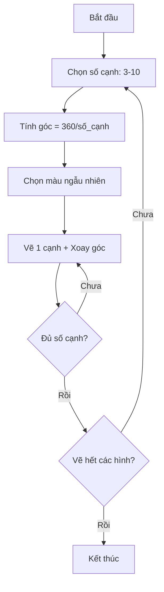

## Thử Thách 3: Vẽ Các Hình Đa Giác Với Màu Ngẫu Nhiên

### Mô Tả Bài Tập

Thử thách này có độ khó cao hơn - vẽ tất cả các hình đa giác từ 3 đến 10 cạnh:

- Triangle (tam giác - 3 cạnh)
- Square (hình vuông - 4 cạnh)
- Pentagon (ngũ giác - 5 cạnh)
- Hexagon (lục giác - 6 cạnh)
- Heptagon (thất giác - 7 cạnh)
- Octagon (bát giác - 8 cạnh)
- Nonagon (cửu giác - 9 cạnh)
- Decagon (thập giác - 10 cạnh)

**Yêu cầu:**

- Mỗi cạnh dài 100 đơn vị
- Mỗi hình có màu ngẫu nhiên khác nhau
- Tất cả các hình được vẽ chồng lên nhau


### Công Thức Tính Góc

**Khái niệm then chốt:** Để vẽ đa giác, turtle cần xoay ở mỗi góc. Vậy xoay bao nhiêu độ?

**Công thức:**

$$
\text{Góc xoay} = \frac{360}{\text{Số cạnh}}
$$

**Ví dụ minh họa:**

- Hình vuông (4 cạnh): $360 \div 4 = 90°$
- Ngũ giác (5 cạnh): $360 \div 5 = 72°$
- Lục giác (6 cạnh): $360 \div 6 = 60°$

**Lý do:** Để quay một vòng tròn hoàn chỉnh cần 360 độ, nên chia đều cho số cạnh để tìm góc xoay tại mỗi đỉnh.

### Giải Pháp Bước 1: Vẽ Một Hình

Trước tiên, viết code vẽ một hình cụ thể (ví dụ: ngũ giác):

```python
from turtle import Turtle, Screen

tim = Turtle()

num_sides = 5
angle = 360 / num_sides

for _ in range(num_sides):
    tim.forward(100)
    tim.right(angle)

screen = Screen()
screen.exitonclick()
```


### Giải Pháp Bước 2: Tạo Function

Để vẽ nhiều hình khác nhau, đóng gói logic vào function:

```python
from turtle import Turtle, Screen

tim = Turtle()

def draw_shape(num_sides):
    angle = 360 / num_sides
    for _ in range(num_sides):
        tim.forward(100)
        tim.right(angle)

# Vẽ ngũ giác
draw_shape(5)

screen = Screen()
screen.exitonclick()
```

**Ưu điểm của function:**

- Tính góc chỉ một lần cho mỗi hình
- Dễ dàng gọi lại với số cạnh khác nhau
- Code sạch và dễ bảo trì


### Giải Pháp Bước 3: Vẽ Tất Cả Các Hình

Sử dụng vòng lặp để vẽ từ tam giác đến thập giác:

```python
from turtle import Turtle, Screen

tim = Turtle()

def draw_shape(num_sides):
    angle = 360 / num_sides
    for _ in range(num_sides):
        tim.forward(100)
        tim.right(angle)

# Vẽ từ 3 cạnh đến 10 cạnh
for shape_side_n in range(3, 11):
    draw_shape(shape_side_n)

screen = Screen()
screen.exitonclick()
```

**Lưu ý về range():**

- `range(3, 11)` tạo số từ 3 đến 10 (11 bị loại trừ)
- Stop number luôn bị excluded (không bao gồm)


### Giải Pháp Bước 4: Thêm Màu Ngẫu Nhiên

**Tìm kiếm màu sắc:**

Sử dụng Google với từ khóa "turtle colors python" để tìm danh sách màu có sẵn. Website Trinket cung cấp bảng màu interactive với tên màu của turtle.

**Tạo danh sách màu:**

```python
from turtle import Turtle, Screen
import random

tim = Turtle()

# Danh sách màu
colors = ["red", "blue", "green", "yellow", "purple", 
          "orange", "pink", "brown", "gray", "cyan"]

def draw_shape(num_sides):
    angle = 360 / num_sides
    for _ in range(num_sides):
        tim.forward(100)
        tim.right(angle)

# Vẽ từ 3 cạnh đến 10 cạnh với màu ngẫu nhiên
for shape_side_n in range(3, 11):
    tim.color(random.choice(colors))
    draw_shape(shape_side_n)

screen = Screen()
screen.exitonclick()
```

**Giải thích:**

- `random.choice(colors)`: Chọn ngẫu nhiên một màu từ danh sách
- Đổi màu trước mỗi lần vẽ hình mới
- Mỗi hình sẽ có màu khác nhau


### Code Hoàn Chỉnh

```python
from turtle import Turtle, Screen
import random

tim = Turtle()
tim.speed("fastest")  # Tăng tốc độ vẽ

colors = ["CornflowerBlue", "DarkOrchid", "IndianRed", 
          "DeepSkyBlue", "LightSeaGreen", "wheat", 
          "SlateGray", "SeaGreen"]

def draw_shape(num_sides):
    angle = 360 / num_sides
    for _ in range(num_sides):
        tim.forward(100)
        tim.right(angle)

for shape_side_n in range(3, 11):
    tim.color(random.choice(colors))
    draw_shape(shape_side_n)

screen = Screen()
screen.exitonclick()
```


### Kỹ Năng Áp Dụng

**1. Functions (Hàm):**

- Tạo function với parameter để tái sử dụng code
- Đóng gói logic phức tạp vào function

**2. Loops (Vòng lặp):**

- Vòng lặp lồng nhau (nested loops)
- Vòng lặp bên ngoài: chọn số cạnh
- Vòng lặp bên trong: vẽ từng cạnh của hình

**3. Random Module:**

- Import module để tạo tính ngẫu nhiên
- Sử dụng `random.choice()` để chọn từ danh sách

**4. Google Search Skills:**

- Tìm kiếm thông tin bổ sung từ web
- Sử dụng từ khóa chính xác để tìm tài nguyên


### Sơ Đồ Luồng Xử Lý



**Giải thích sơ đồ:**

- Vòng lặp ngoài lặp qua số cạnh từ 3 đến 10
- Với mỗi số cạnh, tính góc xoay tương ứng
- Chọn màu ngẫu nhiên cho hình mới
- Vòng lặp trong vẽ từng cạnh cho đến khi hoàn thành hình
- Tiếp tục cho đến khi vẽ xong tất cả các hình


### Điểm Khó Của Thử Thách

Thử thách này phức tạp hơn các bài trước vì yêu cầu:

- Hiểu công thức toán học (góc đa giác)
- Sử dụng functions với parameters
- Kết hợp nhiều modules (turtle và random)
- Quản lý nested loops (vòng lặp lồng nhau)
- Tìm kiếm và áp dụng tài nguyên bên ngoài


### Ghi Chú Thêm

**Tối ưu hóa:**

- Có thể thêm `tim.speed("fastest")` để tăng tốc độ vẽ
- Danh sách màu có thể mở rộng với nhiều màu hơn

**Biến thể có thể thử:**

- Thay đổi độ dài cạnh cho mỗi hình
- Vẽ các hình ở vị trí khác nhau
- Tạo pattern xoay hình

**Liên kết:** [[Turtle Graphics]], [[Functions]], [[Random Module]], [[Nested Loops]], [[Range Function]], [[Polygon]], [[Angle Calculation]], [[random.choice()]], [[Code Refactoring]], [[Google Search Skills]]

