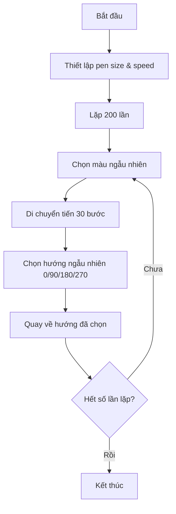

## Thử Thách 4: Random Walk - Bước Đi Ngẫu Nhiên

### Mô Tả Bài Tập

Thử thách này yêu cầu lập trình turtle thực hiện "random walk" (bước đi ngẫu nhiên):

- Turtle di chuyển ngẫu nhiên theo 4 hướng: Bắc, Đông, Nam, Tây
- Mỗi bước di chuyển cùng một khoảng cách
- Màu sắc thay đổi ngẫu nhiên sau mỗi bước
- Độ dày của nét vẽ tăng lên
- Tốc độ vẽ được tăng tốc


### Random Walk Trong Đời Thực

Random walk là khái niệm được sử dụng rộng rãi trong toán học và nhiều lĩnh vực khác để mô phỏng các tình huống thực tế:

**Ứng dụng thực tế:**

- Tình trạng tài chính của người chơi cờ bạc
- Đường đi của phân tử trong chất lỏng hoặc khí
- Hành trình tìm kiếm thức ăn của động vật
- Nghiên cứu não bộ (brain research)
- Vật lý (Physics)
- Điêu khắc (sculpture making)

**Tham khảo:** Wikipedia có bài viết chi tiết về random walk với nhiều ứng dụng khác nhau.

### Giải Pháp Bước 1: Thiết Lập Hướng Di Chuyển

Định nghĩa 4 hướng cơ bản bằng góc:

```python
from turtle import Turtle, Screen
import random

tim = Turtle()

# Màu sắc từ thử thách trước
colors = ["CornflowerBlue", "DarkOrchid", "IndianRed", 
          "DeepSkyBlue", "LightSeaGreen", "wheat", 
          "SlateGray", "SeaGreen"]

# 4 hướng: Đông, Bắc, Tây, Nam
directions = [0, 90, 180, 270]
```

**Giải thích các hướng:**

- 0° = Hướng Đông (East)
- 90° = Hướng Bắc (North)
- 180° = Hướng Tây (West)
- 270° = Hướng Nam (South)


### Giải Pháp Bước 2: Logic Random Walk

Tạo vòng lặp để turtle di chuyển ngẫu nhiên:

```python
for _ in range(200):
    tim.forward(30)
    tim.setheading(random.choice(directions))
```

**Phương thức `setheading()`:**

- Đặt hướng của turtle về một góc cụ thể
- Khác với `right()` hay `left()` (xoay tương đối)
- `setheading()` đặt góc tuyệt đối

**Lựa chọn thay thế:**
Thay vì `setheading()`, có thể dùng:

```python
tim.right(random.choice([0, 90, 180, 270]))
# hoặc
tim.left(random.choice([0, 90, 180, 270]))
```


### Giải Pháp Bước 3: Thêm Màu Ngẫu Nhiên

Thay đổi màu sau mỗi bước:

```python
for _ in range(200):
    tim.color(random.choice(colors))
    tim.forward(30)
    tim.setheading(random.choice(directions))
```


### Giải Pháp Bước 4: Tăng Độ Dày Nét Vẽ

Tra cứu documentation tìm thấy phương thức `pensize()` hoặc `width()`:

```python
tim.pensize(15)  # Hoặc tim.width(15)

for _ in range(200):
    tim.color(random.choice(colors))
    tim.forward(30)
    tim.setheading(random.choice(directions))
```

**Phương thức `pensize()`:**

- Đặt độ dày của nét vẽ (pen width)
- Nhận giá trị số nguyên (ví dụ: 15)
- Có thể gọi bằng `pensize()` hoặc `width()`


### Giải Pháp Bước 5: Tăng Tốc Độ Vẽ

Sử dụng phương thức `speed()` để tăng tốc animation:

```python
tim.speed("fastest")
tim.pensize(15)

for _ in range(200):
    tim.color(random.choice(colors))
    tim.forward(30)
    tim.setheading(random.choice(directions))
```

**Các mức tốc độ có sẵn:**

- "slowest" (chậm nhất)
- "slow" (chậm)
- "normal" (bình thường)
- "fast" (nhanh)
- "fastest" (nhanh nhất)

Hoặc sử dụng giá trị số nguyên từ 1-10 (với 0 là tắt animation).

### Code Hoàn Chỉnh

```python
from turtle import Turtle, Screen
import random

tim = Turtle()

colors = ["CornflowerBlue", "DarkOrchid", "IndianRed", 
          "DeepSkyBlue", "LightSeaGreen", "wheat", 
          "SlateGray", "SeaGreen"]

directions = [0, 90, 180, 270]

tim.pensize(15)
tim.speed("fastest")

for _ in range(200):
    tim.color(random.choice(colors))
    tim.forward(30)
    tim.setheading(random.choice(directions))

screen = Screen()
screen.exitonclick()
```


### Sơ Đồ Luồng Random Walk



**Giải thích sơ đồ:**

- Thiết lập các thuộc tính pen trước khi vẽ
- Vòng lặp thực hiện 200 bước di chuyển
- Mỗi bước: chọn màu → di chuyển → chọn hướng mới
- Hướng được chọn hoàn toàn ngẫu nhiên, không phụ thuộc hướng trước


### Điểm Quan Trọng Cần Lưu Ý

**Về số lần lặp:**

- 200 lần là đủ để tạo hình ảnh đẹp
- Có thể điều chỉnh thành 300, 500 tùy ý
- Số càng lớn, hình càng phức tạp nhưng mất nhiều thời gian

**Về khoảng cách mỗi bước:**

- 30 pixels là khoảng cách hợp lý
- Có thể thay đổi nhưng không nên quá lớn hoặc quá nhỏ
- Khoảng cách nhất quán giúp pattern đẹp hơn

**Về màu sắc:**

- Hiện tại chọn từ danh sách có sẵn
- Bài học sau sẽ học cách tạo màu hoàn toàn ngẫu nhiên (RGB random)


### Kỹ Năng Áp Dụng

**1. Sử dụng Documentation:**

- Tìm phương thức `pensize()` để thay đổi độ dày
- Tìm phương thức `speed()` để tăng tốc
- Đọc hiểu cách sử dụng từ tài liệu

**2. Random Module:**

- `random.choice()` để chọn phần tử ngẫu nhiên từ list
- Áp dụng cho cả màu sắc và hướng di chuyển

**3. Turtle Control:**

- `setheading()`: Đặt hướng tuyệt đối
- `pensize()`: Điều chỉnh độ dày nét
- `speed()`: Kiểm soát tốc độ animation


### Mở Rộng Và Cải Tiến

**Câu hỏi tiếp theo:**
Làm sao để tạo màu hoàn toàn ngẫu nhiên thay vì chọn từ danh sách có sẵn?

**Gợi ý:** Sử dụng RGB color values để generate màu tùy ý (sẽ học ở bài tiếp theo).

### Ghi Chú Thêm

**Đặc điểm của Random Walk:**

- Không có mục tiêu cụ thể
- Mỗi bước độc lập với bước trước
- Tạo pattern organic (tự nhiên), không có quy luật cứng nhắc
- Mô phỏng chuyển động không định hướng trong tự nhiên

**So sánh các phương thức xoay:**

- `right(angle)` / `left(angle)`: Xoay tương đối so với hướng hiện tại
- `setheading(angle)`: Đặt hướng tuyệt đối (0° = Đông)

**Liên kết:** [[Turtle Graphics]], [[Random Walk]], [[random.choice()]], [[setheading()]], [[pensize()]], [[speed()]], [[Random Module]], [[Turtle Animation]], [[Mathematical Modeling]], [[Wikipedia Random Walk]]

