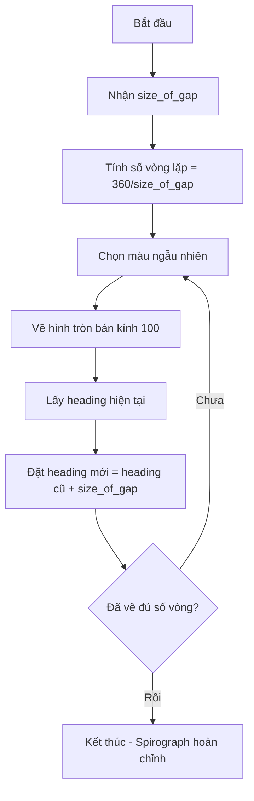

## Thử Thách 5: Vẽ Spirograph (Hình Xoắn Ốc)

### Mô Tả Bài Tập

Thử thách cuối cùng trước dự án chính: tạo spirograph - loại hình học được vẽ bằng đồ chơi có bánh răng hình tròn.

**Yêu cầu:**

- Vẽ nhiều hình tròn với bán kính 100
- Mỗi hình tròn xoay một góc nhỏ so với hình trước
- Sử dụng màu RGB ngẫu nhiên
- Kết quả cuối tạo thành hình xoắn ốc đầy màu sắc

**Kỹ năng cần áp dụng:**

- Đọc documentation để tìm phương thức vẽ hình tròn
- Xác định cách thay đổi góc nghiêng (tilt) của mỗi hình tròn
- Tính toán số lần lặp để hoàn thành spirograph


### Tìm Phương Thức Vẽ Hình Tròn

Trong documentation, phần "Turtle motion" có phương thức `circle()`:

```python
tim.circle(radius)
```

**Tham số:**

- `radius`: Bán kính của hình tròn (ví dụ: 100)

**Hành vi:**

- Turtle vẽ hình tròn theo đường dẫn
- Sau khi vẽ xong, turtle quay về vị trí ban đầu
- Hướng mặc định: về phía Đông (0°)


### Giải Pháp Bước 1: Vẽ Một Hình Tròn

```python
import turtle as t
import random

t.colormode(255)
tim = t.Turtle()
tim.speed("fastest")

def random_color():
    r = random.randint(0, 255)
    g = random.randint(0, 255)
    b = random.randint(0, 255)
    return (r, g, b)

# Vẽ một hình tròn màu ngẫu nhiên
tim.color(random_color())
tim.circle(100)

screen = t.Screen()
screen.exitonclick()
```


### Làm Việc Với Heading (Hướng)

**Phương thức `heading()`:**

Lấy hướng hiện tại của turtle (tính bằng độ):

```python
current_heading = tim.heading()
print(current_heading)  # Output: 0.0 (hướng Đông)
```

**Phương thức `setheading()`:**

Đặt hướng mới cho turtle:

```python
tim.setheading(angle)  # Đặt hướng về góc cụ thể
```


### Giải Pháp Bước 2: Xoay Góc Giữa Các Hình Tròn

Để tạo hiệu ứng spirograph, cần xoay turtle một góc nhỏ sau mỗi lần vẽ:

```python
# Vẽ hình tròn đầu tiên
tim.color(random_color())
tim.circle(100)

# Xoay 10 độ
current_heading = tim.heading()
tim.setheading(current_heading + 10)

# Vẽ hình tròn thứ hai
tim.color(random_color())
tim.circle(100)
```

**Rút gọn code:**

```python
tim.setheading(tim.heading() + 10)
```


### Giải Pháp Bước 3: Lặp Vẽ Nhiều Hình Tròn

Sử dụng vòng lặp để vẽ nhiều hình tròn:

```python
for _ in range(100):
    tim.color(random_color())
    tim.circle(100)
    tim.setheading(tim.heading() + 10)
```

**Vấn đề:** Vòng lặp 100 lần có thể vẽ quá nhiều (các hình tròn chồng lên nhau nhiều lần).

### Tính Toán Số Vòng Lặp Chính Xác

**Logic toán học:**

Để tạo spirograph hoàn chỉnh mà không vẽ thừa:

- Một vòng tròn đầy đủ = 360°
- Mỗi lần xoay = `size_of_gap` độ
- Số lần cần vẽ = $\frac{360}{\text{size\_of\_gap}}$

**Ví dụ:**

- Nếu xoay 5° mỗi lần: $360 \div 5 = 72$ hình tròn
- Nếu xoay 10° mỗi lần: $360 \div 10 = 36$ hình tròn


### Giải Pháp Bước 4: Tạo Function Linh Hoạt

```python
def draw_spirograph(size_of_gap):
    for _ in range(360 // size_of_gap):
        tim.color(random_color())
        tim.circle(100)
        tim.setheading(tim.heading() + size_of_gap)

# Gọi function với khoảng cách 5 độ
draw_spirograph(5)
```


### Xử Lý Lỗi Float vs Integer

**Vấn đề:**

```python
for _ in range(360 / size_of_gap):  # ❌ Lỗi!
```

Phép chia `/` trong Python luôn trả về float, ngay cả khi chia hết:

```python
360 / 5  # Kết quả: 72.0 (float)
```

Nhưng `range()` chỉ chấp nhận integer (số nguyên), không chấp nhận float.

**Giải pháp 1: Ép kiểu về int**

```python
for _ in range(int(360 / size_of_gap)):  # ✅ Hoạt động
```

**Giải pháp 2: Dùng floor division**

```python
for _ in range(360 // size_of_gap):  # ✅ Tốt hơn
```

Floor division `//` luôn trả về integer, không cần ép kiểu.

### Code Hoàn Chỉnh

```python
import turtle as t
import random

t.colormode(255)
tim = t.Turtle()
tim.speed("fastest")

def random_color():
    r = random.randint(0, 255)
    g = random.randint(0, 255)
    b = random.randint(0, 255)
    return (r, g, b)

def draw_spirograph(size_of_gap):
    for _ in range(int(360 / size_of_gap)):
        tim.color(random_color())
        tim.circle(100)
        tim.setheading(tim.heading() + size_of_gap)

draw_spirograph(5)

screen = t.Screen()
screen.exitonclick()
```


### Sơ Đồ Luồng Vẽ Spirograph



**Giải thích sơ đồ:**

- Function nhận tham số `size_of_gap` để xác định mật độ spirograph
- Tính số lần lặp dựa trên 360° chia cho khoảng cách góc
- Mỗi vòng lặp: chọn màu → vẽ tròn → xoay góc
- Lặp lại cho đến khi hoàn thành một vòng tròn 360°


### Phân Tích Chi Tiết

**Tại sao cần `setheading()` thay vì `right()` hay `left()`?**

```python
# Cách 1: Dùng setheading (✅ Rõ ràng)
tim.setheading(tim.heading() + size_of_gap)

# Cách 2: Dùng left/right (✅ Cũng được)
tim.left(size_of_gap)
```

Cả hai cách đều hoạt động, nhưng `setheading()` rõ ràng hơn về ý định: đặt turtle về một góc tuyệt đối mới.

**Vai trò của `size_of_gap`:**

- Khoảng cách nhỏ (ví dụ: 1°): Spirograph dày đặc, nhiều hình tròn
- Khoảng cách lớn (ví dụ: 30°): Spirograph thưa thớt, ít hình tròn
- Khoảng cách phải là ước số của 360 để spirograph khép kín hoàn hảo

**Ví dụ với các khoảng cách khác nhau:**

```python
draw_spirograph(1)   # 360 hình tròn - cực kỳ dày đặc
draw_spirograph(5)   # 72 hình tròn - vừa phải
draw_spirograph(10)  # 36 hình tròn - thoáng hơn
draw_spirograph(20)  # 18 hình tròn - thưa thớt
```


### Các Phương Thức Turtle Quan Trọng

**`circle(radius)`:**

- Vẽ hình tròn với bán kính cho trước
- Turtle di chuyển theo chu vi hình tròn
- Sau khi vẽ xong, về vị trí ban đầu

**`heading()`:**

- Trả về góc hướng hiện tại (0-360)
- Không thay đổi gì, chỉ lấy thông tin
- 0° = Đông, 90° = Bắc, 180° = Tây, 270° = Nam

**`setheading(angle)`:**

- Đặt turtle về hướng tuyệt đối
- Không di chuyển, chỉ xoay tại chỗ
- Hữu ích khi cần góc cụ thể


### Lỗi Thường Gặp và Cách Sửa

**Lỗi 1: Float object cannot be interpreted as an integer**

```python
# ❌ Sai
for _ in range(360 / size_of_gap):

# ✅ Đúng - Cách 1
for _ in range(int(360 / size_of_gap)):

# ✅ Đúng - Cách 2 (khuyến nghị)
for _ in range(360 // size_of_gap):
```

**Lỗi 2: Spirograph không khép kín**

Nguyên nhân: `size_of_gap` không phải ước số của 360.

```python
# ❌ Không khép kín hoàn hảo
draw_spirograph(7)   # 360/7 = 51.43...

# ✅ Khép kín hoàn hảo
draw_spirograph(5)   # 360/5 = 72
draw_spirograph(10)  # 360/10 = 36
```

**Lỗi 3: Vẽ quá chậm**

Giải pháp: Đặt `speed("fastest")`

```python
tim.speed("fastest")  # Tăng tốc độ tối đa
```


### Tùy Chỉnh Spirograph

**Thay đổi bán kính:**

```python
def draw_spirograph(size_of_gap, radius=100):
    for _ in range(int(360 / size_of_gap)):
        tim.color(random_color())
        tim.circle(radius)  # Tùy chỉnh bán kính
        tim.setheading(tim.heading() + size_of_gap)
```

**Thay đổi độ dày nét:**

```python
tim.pensize(2)  # Nét mỏng hơn
# hoặc
tim.pensize(5)  # Nét dày hơn
```

**Vẽ nhiều spirograph chồng nhau:**

```python
draw_spirograph(5)
draw_spirograph(10)
draw_spirograph(15)
```


### Ý Nghĩa Toán Học

**Công thức số vòng lặp:**

$$
\text{Số vòng lặp} = \frac{360°}{\text{Khoảng cách góc}}
$$

**Ví dụ tính toán:**

- Khoảng cách 3°: $360 \div 3 = 120$ hình tròn
- Khoảng cách 8°: $360 \div 8 = 45$ hình tròn
- Khoảng cách 12°: $360 \div 12 = 30$ hình tròn

**Điều kiện khép kín hoàn hảo:**

Spirograph chỉ khép kín hoàn hảo khi `size_of_gap` là ước số của 360:

- Ước số của 360: 1, 2, 3, 4, 5, 6, 8, 9, 10, 12, 15, 18, 20, 24, 30, 36, 40, 45, 60, 72, 90, 120, 180, 360


### Chuẩn Bị Cho Dự Án Cuối

Thử thách này là bước cuối trước dự án chính: vẽ tranh triệu đô theo phong cách Damien Hirst (Hirst Spot Painting).

**Kỹ năng đã học:**

- Vẽ hình tròn với `circle()`
- Quản lý heading/direction
- Tính toán số vòng lặp toán học
- Xử lý float/int conversion
- Tạo màu RGB ngẫu nhiên
- Tối ưu tốc độ vẽ

**Những kỹ năng này sẽ áp dụng cho dự án final.**

### Ghi Chú Thêm

**Spirograph trong lịch sử:**

- Đồ chơi nổi tiếng từ những năm 1960
- Sử dụng bánh răng cơ học để vẽ pattern
- Tạo ra các hình học đẹp mắt và đối xứng

**Ứng dụng lập trình:**

- Minh họa toán học về góc và vòng tròn
- Tạo nghệ thuật generative (sinh tạo)
- Thực hành vòng lặp và functions

**Tips thực hành:**

- Thử nhiều giá trị `size_of_gap` khác nhau
- Kết hợp nhiều spirograph trên cùng canvas
- Thay đổi bán kính để tạo hiệu ứng độc đáo

**Liên kết:** [[Turtle Graphics]], [[circle()]], [[heading()]], [[setheading()]], [[Floor Division]], [[Float vs Integer]], [[Range Function]], [[Spirograph]], [[Geometric Patterns]], [[Random Colors]], [[Function Parameters]], [[Mathematical Calculations]]

