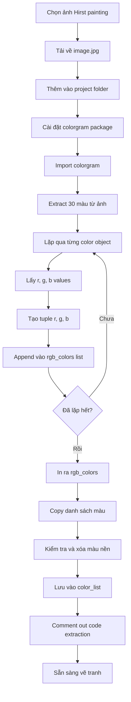

## Dự Án Final: Tranh Damien Hirst Spot Painting

### Giới Thiệu Nghệ Thuật Đương Đại

Nghệ thuật đương đại (Contemporary Art) đôi khi gây tranh cãi và khó hiểu. Một ví dụ nổi tiếng là tác phẩm "Where Should We Go Dancing Tonight?" của Goldschmied và Chiari - trưng bày các mẩu giấy, chai lọ và đầu thuốc lá trên sàn. Nhân viên dọn dẹp bảo tàng đã nhầm lẫn và vứt bỏ tác phẩm này vì tưởng là rác!

**Sách tham khảo:** "The \$12 Million Stuffed Shark" - cuốn sách phân tích kinh tế học của nghệ thuật đương đại, giải thích tại sao các tác phẩm có giá trị cao như vậy.

### Nghệ Sĩ Damien Hirst

Damien Hirst là nghệ sĩ đương đại nổi tiếng với các tác phẩm có giá trị "điên rồ":

**Các tác phẩm nổi tiếng:**

- Con cá mập ngâm formaldehyde: \$12 triệu USD (bị mốc và chuyển màu xanh)
- Hộp sọ nạm kim cương: \$50 triệu USD
- Cánh bướm ghép trên canvas: \$8.5 triệu USD
- Tranh chấm tròn (Spot Paintings): £1.275 triệu bảng Anh (~\$1.5 triệu USD)

**Điều kỳ lạ về Spot Paintings:**

- Một bức tranh chỉ có 25 chấm tròn được bán với giá £0.5 triệu
- Giá trị không phụ thuộc vào số lượng chấm
- Các chấm màu sắc được sắp xếp ngẫu nhiên trên canvas


### Mục Tiêu Dự Án

Sử dụng Python để:

- Phân tích bảng màu (color palette) từ tranh Damien Hirst
- Trích xuất màu sắc bằng package `colorgram`
- Tạo tranh spot painting ngẫu nhiên với bảng màu tương tự
- Kết quả có thể đẹp ngang ngửa (hoặc hơn!) tác phẩm gốc


### Package Colorgram

**Colorgram là gì?**

Thư viện Python cho phép trích xuất màu sắc từ hình ảnh.

**Cách hoạt động:**

Từ một hình ảnh, colorgram có thể trích xuất N màu phổ biến nhất và tạo thành color palette.

**Ví dụ sử dụng:**

```python
import colorgram

# Trích xuất 6 màu từ ảnh
colors = colorgram.extract('image.jpg', 6)
```

**Tham số:**

- `'image.jpg'`: Đường dẫn đến file ảnh
- `6`: Số lượng màu cần trích xuất


### Chuẩn Bị Dự Án

**Bước 1: Chọn và tải ảnh**

- Google search: "Hirst spot painting"
- Chọn một bức tranh với bảng màu bạn thích
- Tải xuống và lưu tên: `image.jpg`

**Bước 2: Tạo project PyCharm**

```
Tên project: hirst-painting
```

**Bước 3: Thêm ảnh vào project**

- Kéo file `image.jpg` vào thư mục project
- Đảm bảo `image.jpg` cùng cấp với `main.py`

```
hirst-painting/
├── image.jpg
└── main.py
```

**Bước 4: Cài đặt package colorgram**

Trong PyCharm:

- File → Preferences → Project → Project Interpreter
- Click nút `+` (plus)
- Tìm kiếm `colorgram`
- Click Install Package


### Thử Thách: Trích Xuất Màu Sắc

**Mục tiêu:**

Sử dụng colorgram để tạo danh sách các màu dưới dạng RGB tuples:

```python
[(r1, g1, b1), (r2, g2, b2), (r3, g3, b3), ...]
```

**Yêu cầu:**

- In ra danh sách các màu
- Mỗi màu là một tuple với 3 giá trị (red, green, blue)
- Format phù hợp để sử dụng với turtle module


### Giải Pháp Bước 1: Trích Xuất Màu Cơ Bản

```python
import colorgram

# Trích xuất 30 màu từ ảnh
colors = colorgram.extract('image.jpg', 30)

print(colors)
```

**Lưu ý về hiệu suất:**

- Ảnh 512x512 mất khoảng 0.66 giây
- Ảnh lớn hơn sẽ mất nhiều thời gian hơn

**Kết quả:**

```
[Color(rgb=Rgb(r=..., g=..., b=...), ...)]
```


### Giải Pháp Bước 2: Lấy Giá Trị RGB

Colorgram trả về color objects với nhiều format (RGB và HSL). Chúng ta chỉ cần RGB:

```python
import colorgram

colors = colorgram.extract('image.jpg', 30)
rgb_colors = []

for color in colors:
    rgb_colors.append(color.rgb)

print(rgb_colors)
```

**Kết quả:**

```
[Rgb(r=245, g=243, b=238), Rgb(r=246, g=242, b=244), ...]
```

Vẫn chưa đúng format! Cần chuyển thành tuple thuần túy.

### Giải Pháp Bước 3: Tạo RGB Tuples

```python
import colorgram

colors = colorgram.extract('image.jpg', 30)
rgb_colors = []

for color in colors:
    r = color.rgb.r
    g = color.rgb.g
    b = color.rgb.b
    new_color = (r, g, b)
    rgb_colors.append(new_color)

print(rgb_colors)
```

**Kết quả cuối cùng:**

```python
[(245, 243, 238), (246, 242, 244), (202, 164, 110), ...]
```

✅ Đây chính là format cần thiết để sử dụng với turtle!

### Làm Sạch Dữ Liệu Màu

**Vấn đề:** Các màu đầu tiên thường là màu nền (background) - thường là trắng hoặc gần trắng.

**Cách kiểm tra màu:**

Sử dụng W3Schools RGB Color Picker:

```
https://www.w3schools.com/colors/colors_rgb.asp
```

**Nguyên tắc:**

- Các giá trị gần 255 (ví dụ: 245, 246, 250) → Màu trắng/nền
- Cần loại bỏ các màu này khỏi danh sách

**Ví dụ kiểm tra:**

```python
(245, 243, 238)  # → Gần trắng, xóa
(246, 242, 244)  # → Gần trắng, xóa
(241, 234, 231)  # → Gần trắng, xóa
(202, 164, 110)  # → Màu cát, giữ lại ✅
```


### Code Hoàn Chỉnh - Trích Xuất Màu

```python
import colorgram

# Trích xuất 30 màu
colors = colorgram.extract('image.jpg', 30)
rgb_colors = []

for color in colors:
    r = color.rgb.r
    g = color.rgb.g
    b = color.rgb.b
    new_color = (r, g, b)
    rgb_colors.append(new_color)

print(rgb_colors)
```

**Sau khi chạy code:**

1. Copy toàn bộ list màu đã in ra
2. Paste vào `main.py` và lưu thành biến `color_list`
3. Xóa hoặc comment out các màu nền (màu trắng)
4. Comment out code trích xuất màu (không cần chạy lại mỗi lần)

### Code Cuối Cùng - Main.py

```python
# import colorgram
# 
# colors = colorgram.extract('image.jpg', 30)
# rgb_colors = []
# 
# for color in colors:
#     r = color.rgb.r
#     g = color.rgb.g
#     b = color.rgb.b
#     new_color = (r, g, b)
#     rgb_colors.append(new_color)
# 
# print(rgb_colors)

# Danh sách màu đã trích xuất và làm sạch
color_list = [
    (202, 164, 110), (149, 75, 50), (222, 201, 136),
    (53, 93, 123), (170, 154, 41), (138, 31, 20),
    (134, 163, 184), (197, 92, 73), (47, 121, 86),
    (73, 43, 35), (145, 178, 149), (14, 98, 70),
    (232, 176, 165), (160, 142, 158), (54, 45, 50),
    (101, 75, 77), (183, 205, 171), (36, 60, 74),
    (19, 86, 89), (82, 148, 129), (147, 17, 19),
    (27, 68, 102), (12, 70, 64), (107, 127, 153),
    (176, 192, 208), (168, 99, 102)
]
```


### Tại Sao Comment Out Code Trích Xuất?

**Lý do:**

- Quá trình trích xuất màu chỉ cần chạy một lần
- Mỗi lần chạy lại sẽ mất thời gian không cần thiết
- Đã có danh sách màu sạch trong `color_list`
- Giữ code để tham khảo sau này

**Khi nào cần chạy lại:**

Chỉ khi muốn đổi sang ảnh Hirst spot painting khác.

### Cấu Trúc Dữ Liệu

**List of Tuples:**

```python
color_list = [
    (r1, g1, b1),  # Màu 1
    (r2, g2, b2),  # Màu 2
    (r3, g3, b3),  # Màu 3
    ...
]
```

**Đặc điểm:**

- List: Có thể lặp qua các màu
- Tuple: Mỗi màu là immutable (không đổi)
- Format: Phù hợp với `turtle.color()`


### Bước Tiếp Theo

Trong bài học tiếp theo, sẽ sử dụng `color_list` này để:

- Vẽ các chấm tròn (dots) trên canvas
- Sắp xếp theo lưới (grid)
- Chọn màu ngẫu nhiên từ danh sách
- Tạo tranh Hirst spot painting hoàn chỉnh


### Kiến Thức Đã Áp Dụng

**1. External Packages:**

- Cài đặt package không có trong Standard Library
- Import và sử dụng package bên ngoài

**2. Data Extraction:**

- Trích xuất dữ liệu từ ảnh
- Xử lý và chuyển đổi format dữ liệu

**3. Object Attributes:**

- Truy cập thuộc tính của object: `color.rgb.r`
- Hiểu cấu trúc dữ liệu phức tạp

**4. Data Cleaning:**

- Loại bỏ dữ liệu nhiễu (màu nền)
- Kiểm tra và xác thực màu sắc

**5. Lists và Tuples:**

- Tạo list chứa tuples
- Append phần tử vào list


### Sơ Đồ Quy Trình Trích Xuất Màu



**Giải thích sơ đồ:**

- Quy trình tuyến tính từ chọn ảnh đến có danh sách màu sạch
- Vòng lặp xử lý từng màu riêng biệt
- Bước data cleaning quan trọng để có kết quả tốt
- Sau khi hoàn tất, không cần chạy lại code extraction


### Tips và Lưu Ý

**Về việc chọn ảnh:**

- Chọn ảnh có độ phân giải tốt
- Bảng màu đa dạng và rõ nét
- Tránh ảnh có quá nhiều màu nền

**Về số lượng màu:**

- 30 màu là con số hợp lý
- Sau khi xóa màu nền, còn ~25 màu
- Đủ để tạo tranh đa dạng

**Về performance:**

- Chỉ chạy extraction một lần
- Lưu kết quả vào biến
- Comment out code không dùng

**Về testing màu:**

- Luôn kiểm tra màu trên RGB tool
- Đảm bảo không có màu nền
- Các giá trị R, G, B nên khác biệt rõ rệt


### Ghi Chú Thêm

**Về colorgram package:**

- Phân tích tần suất xuất hiện màu
- Trả về màu theo thứ tự phổ biến
- Hỗ trợ cả RGB và HSL color spaces

**Về RGB format:**

- Turtle cần tuple format: `(r, g, b)`
- Mỗi giá trị từ 0-255
- Đã set `colormode(255)` ở bài trước

**Chuẩn bị cho bài tiếp:**

- Đã có `color_list` sẵn sàng
- Sẽ học cách vẽ grid of dots
- Sử dụng `random.choice()` để chọn màu
- Tạo tranh hoàn chỉnh

**Liên kết:** [[Colorgram Package]], [[RGB Tuples]], [[Data Extraction]], [[Image Processing]], [[External Packages]], [[PyCharm Package Installation]], [[List Comprehension]], [[Data Cleaning]], [[Damien Hirst]], [[Contemporary Art]], [[Spot Painting]], [[Color Palette]], [[W3Schools RGB Tool]]

