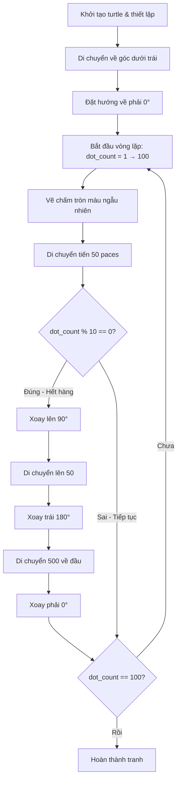

## Dự Án Final: Hoàn Thành Hirst Spot Painting

### Yêu Cầu Dự Án

Sử dụng turtle và `color_list` đã trích xuất để tạo tranh chấm tròn (spot painting):

**Đặc tả kỹ thuật:**

- Lưới 10x10 chấm tròn (100 dots total)
- Mỗi chấm có kích thước 20
- Khoảng cách giữa các chấm: 50 paces
- Màu sắc ngẫu nhiên từ `color_list`


### Thiết Lập Ban Đầu

```python
import turtle as t
import random

t.colormode(255)
tim = t.Turtle()

color_list = [
    (202, 164, 110), (149, 75, 50), (222, 201, 136),
    # ... (danh sách màu từ bài trước)
]

screen = t.Screen()
screen.exitonclick()
```


### Phương Thức `dot()` - Vẽ Chấm Tròn

**Tra cứu documentation:** Turtle có phương thức `dot()` để vẽ chấm tròn.

**Cú pháp:**

```python
turtle.dot(size, color)
```

**Tham số:**

- `size`: Kích thước của chấm (số nguyên)
- `color`: Màu sắc (tuple RGB hoặc string)

**Ví dụ vẽ một chấm:**

```python
tim.dot(20, random.choice(color_list))
```


### Giải Pháp Bước 1: Vẽ Một Hàng Dots

```python
import turtle as t
import random

t.colormode(255)
tim = t.Turtle()
tim.speed("fastest")

color_list = [(202, 164, 110), (149, 75, 50), (222, 201, 136)]

# Vẽ 10 chấm theo hàng ngang
for _ in range(10):
    tim.dot(20, random.choice(color_list))
    tim.forward(50)

screen = t.Screen()
screen.exitonclick()
```

**Vấn đề:**

- Turtle vẽ đường khi di chuyển
- Bắt đầu từ giữa màn hình
- Chỉ vẽ được 1 hàng


### Giải Pháp Bước 2: Định Vị Điểm Bắt Đầu

Để bắt đầu từ góc dưới trái màn hình:

```python
# Di chuyển đến vị trí bắt đầu
tim.setheading(225)  # Hướng về góc dưới trái
tim.forward(250)     # Di chuyển 250 paces
tim.setheading(0)    # Quay lại hướng Đông (phải)

for _ in range(10):
    tim.dot(20, random.choice(color_list))
    tim.forward(50)
```

**Giải thích góc 225°:**

- Góc giữa 180° (Tây) và 270° (Nam)
- $\frac{180 + 270}{2} = 225°$
- Hướng chéo về phía dưới bên trái


### Giải Pháp Bước 3: Vẽ Nhiều Hàng (Logic Xuống Dòng)

**Ý tưởng:** Sau mỗi 10 chấm, turtle cần:

1. Xoay lên trên (90°)
2. Di chuyển 50 paces
3. Xoay sang trái (180°)
4. Di chuyển 500 paces (10 × 50) về đầu hàng
5. Xoay phải (0°) để vẽ hàng mới
```python
tim.setheading(225)
tim.forward(300)
tim.setheading(0)
tim.speed("fastest")

for _ in range(10):
    tim.dot(20, random.choice(color_list))
    tim.forward(50)

# Xuống dòng
tim.setheading(90)   # Xoay lên
tim.forward(50)
tim.setheading(180)  # Xoay trái
tim.forward(500)     # Về đầu hàng (10 × 50)
tim.setheading(0)    # Xoay phải để vẽ tiếp
```


### Giải Pháp Bước 4: Tự Động Xuống Dòng

Sử dụng modulo operator `%` để phát hiện khi nào cần xuống dòng:

```python
number_of_dots = 100
tim.setheading(225)
tim.forward(300)
tim.setheading(0)
tim.speed("fastest")

for dot_count in range(1, number_of_dots + 1):
    tim.dot(20, random.choice(color_list))
    tim.forward(50)
    
    # Kiểm tra nếu đã vẽ xong 1 hàng (10, 20, 30, ...)
    if dot_count % 10 == 0:
        tim.setheading(90)
        tim.forward(50)
        tim.setheading(180)
        tim.forward(500)
        tim.setheading(0)
```

**Giải thích logic:**

```python
dot_count % 10 == 0
```

- Khi `dot_count = 10`: $10 \% 10 = 0$ ✅ Xuống dòng
- Khi `dot_count = 20`: $20 \% 10 = 0$ ✅ Xuống dòng
- Khi `dot_count = 11`: $11 \% 10 = 1$ ❌ Tiếp tục vẽ
- Khi `dot_count = 100`: $100 \% 10 = 0$ ✅ Xuống dòng (bug!)


### Xử Lý Bug: Range và Dot Cuối

**Vấn đề 1: Thiếu dot cuối cùng**

```python
for dot_count in range(1, number_of_dots):  # ❌ Chỉ chạy 99 lần
```

**Giải pháp:**

```python
for dot_count in range(1, number_of_dots + 1):  # ✅ Chạy 100 lần
```

**Vấn đề 2: Xuống dòng thừa ở dot thứ 100**

Dot cuối cùng (100) kích hoạt xuống dòng không cần thiết. Tuy nhiên, vì tranh đã hoàn thành nên không ảnh hưởng kết quả.

### Giải Pháp Bước 5: Tối Ưu Hóa

**Loại bỏ đường vẽ:**

```python
tim.penup()  # Nhấc bút lên, không vẽ đường khi di chuyển
```

**Ẩn turtle:**

```python
tim.hideturtle()  # Ẩn hình turtle (mũi tên)
```

**Tăng tốc độ:**

```python
tim.speed("fastest")  # Tốc độ vẽ nhanh nhất
```

**Lợi ích của `hideturtle()`:**

- Giao diện sạch đẹp hơn
- Tăng tốc độ vẽ đáng kể (theo documentation)
- Có thể gọi giữa quá trình vẽ


### Code Hoàn Chỉnh

```python
import turtle as t
import random

t.colormode(255)
tim = t.Turtle()
tim.speed("fastest")
tim.penup()
tim.hideturtle()

color_list = [
    (202, 164, 110), (149, 75, 50), (222, 201, 136),
    (53, 93, 123), (170, 154, 41), (138, 31, 20),
    (134, 163, 184), (197, 92, 73), (47, 121, 86),
    (73, 43, 35), (145, 178, 149), (14, 98, 70),
    (232, 176, 165), (160, 142, 158), (54, 45, 50),
    (101, 75, 77), (183, 205, 171), (36, 60, 74),
    (19, 86, 89), (82, 148, 129), (147, 17, 19),
    (27, 68, 102), (12, 70, 64), (107, 127, 153),
    (176, 192, 208), (168, 99, 102)
]

# Di chuyển đến vị trí bắt đầu
tim.setheading(225)
tim.forward(300)
tim.setheading(0)

number_of_dots = 100

for dot_count in range(1, number_of_dots + 1):
    tim.dot(20, random.choice(color_list))
    tim.forward(50)
    
    if dot_count % 10 == 0:
        tim.setheading(90)
        tim.forward(50)
        tim.setheading(180)
        tim.forward(500)
        tim.setheading(0)

screen = t.Screen()
screen.exitonclick()
```


### Sơ Đồ Luồng Vẽ Tranh



**Giải thích sơ đồ:**

- Turtle bắt đầu từ góc dưới trái
- Vẽ từ trái sang phải, từ dưới lên trên
- Sau mỗi 10 chấm, thực hiện chuỗi di chuyển "xuống dòng"
- Lặp cho đến khi vẽ đủ 100 chấm


### Phân Tích Chi Tiết Logic Xuống Dòng

**Tại sao cần di chuyển 500 paces?**

```
Mỗi chấm cách nhau 50 paces
10 chấm = 9 khoảng cách + 1 lần forward cuối
Tổng: 10 × 50 = 500 paces
```

**Trình tự di chuyển:**

```
Vị trí kết thúc hàng (phải)
    ↓ (90°, forward 50)
Vị trí trên đầu hàng kế
    ← (180°, forward 500)
Vị trí đầu hàng mới (trái)
    → (0°)
Sẵn sàng vẽ hàng mới
```


### Tính Toán Vị Trí Bắt Đầu

**Tại sao cần `setheading(225)` và `forward(300)`?**

Để bắt đầu từ góc dưới trái và có đủ không gian cho lưới 10x10:

```
Lưới 10x10:
- Chiều rộng: 9 × 50 = 450 paces
- Chiều cao: 9 × 50 = 450 paces

Cần di chuyển turtle từ giữa (0, 0) xuống dưới bên trái:
- Hướng 225° = hướng chéo dưới trái
- Khoảng cách 300 paces (có thể điều chỉnh)
```

**Điều chỉnh vị trí:**

Có thể thử nghiệm với các giá trị khác:

```python
tim.forward(250)  # Gần hơn
tim.forward(350)  # Xa hơn
```


### Các Phương Thức Turtle Đã Sử Dụng

**1. `dot(size, color)`:**

- Vẽ chấm tròn đặc
- Không cần `pendown()`
- Không để lại đường nối

**2. `penup()` và `pendown()`:**

- `penup()`: Nhấc bút, không vẽ khi di chuyển
- `pendown()`: Hạ bút, vẽ khi di chuyển
- Chỉ cần `penup()` khi vẽ dots

**3. `hideturtle()` và `showturtle()`:**

- `hideturtle()`: Ẩn hình turtle
- `showturtle()`: Hiện hình turtle
- Tăng tốc độ render

**4. `speed()`:**

- "fastest": Nhanh nhất
- "fast": Nhanh
- "normal": Bình thường
- "slow": Chậm
- "slowest": Chậm nhất

**5. `setheading(angle)`:**

- Đặt hướng tuyệt đối
- 0° = Đông, 90° = Bắc, 180° = Tây, 270° = Nam

**6. `forward(distance)`:**

- Di chuyển tiến theo hướng hiện tại
- Kết hợp với `penup()` để di chuyển không vẽ


### Kỹ Thuật Lập Trình Quan Trọng

**1. Modulo Operator `%`:**

```python
if dot_count % 10 == 0:  # Kiểm tra bội số của 10
```

Dùng để phát hiện khi nào cần xuống dòng.

**2. Range với offset:**

```python
range(1, number_of_dots + 1)  # 1 đến 100, bao gồm 100
```

Thay vì `range(number_of_dots)` (0-99), dùng 1-100 để logic rõ ràng hơn.

**3. Sequential movements:**

```python
tim.setheading(90)   # Bước 1
tim.forward(50)      # Bước 2
tim.setheading(180)  # Bước 3
tim.forward(500)     # Bước 4
tim.setheading(0)    # Bước 5
```

Chia nhỏ chuyển động phức tạp thành các bước đơn giản.

**4. Random selection:**

```python
random.choice(color_list)  # Chọn màu ngẫu nhiên
```

Tạo tính đa dạng và ngẫu nhiên trong tranh.

### Debugging Tips

**Tip 1: Giữ đường vẽ khi debug**

```python
# Khi debug - để xem đường đi
# tim.penup()  # Comment out

# Khi hoàn thiện - ẩn đường
tim.penup()  # Uncomment
```

**Tip 2: Giữ turtle visible khi debug**

```python
# Khi debug - xem turtle di chuyển
# tim.hideturtle()  # Comment out

# Khi hoàn thiện - ẩn turtle
tim.hideturtle()  # Uncomment
```

**Tip 3: Dùng speed chậm khi debug**

```python
# Khi debug
tim.speed("slow")

# Khi hoàn thiện
tim.speed("fastest")
```


### Cải Tiến Và Mở Rộng

**1. Thay đổi kích thước lưới:**

```python
rows = 10
columns = 10
number_of_dots = rows * columns
```

**2. Tùy chỉnh spacing:**

```python
spacing = 50
# Thay đổi tất cả forward(50) và forward(500)
tim.forward(spacing)
tim.forward(columns * spacing)
```

**3. Tùy chỉnh kích thước dot:**

```python
dot_size = 20
tim.dot(dot_size, random.choice(color_list))
```

**4. Tạo function tái sử dụng:**

```python
def draw_hirst_painting(rows, columns, dot_size, spacing):
    # Logic vẽ tranh
    pass
```


### Kết Quả Cuối Cùng

**Thành tựu:**

- Tranh 10x10 chấm tròn màu sắc
- Sử dụng bảng màu của Damien Hirst
- Code hoàn toàn từ scratch
- Áp dụng nhiều kỹ thuật lập trình

**Giá trị học được:**

- Turtle graphics nâng cao
- Logic lưới 2D (grid logic)
- Modulo operator
- Random selection
- Code optimization
- Debugging techniques


### Ghi Chú Thêm

**Về tranh Hirst:**

- Mỗi lần chạy tạo tranh khác nhau
- Màu sắc ngẫu nhiên nhưng palette nhất quán
- "Generative art" - nghệ thuật sinh tạo

**Về performance:**

- `hideturtle()` tăng tốc đáng kể
- `penup()` cần thiết để tránh vẽ đường
- `speed("fastest")` giảm thời gian render

**Về code quality:**

- Code rõ ràng, dễ đọc
- Logic tách biệt (setup, vẽ, xuống dòng)
- Có thể refactor thành functions

**Kết luận dự án:**

Đây là dự án tổng hợp tất cả kiến thức đã học:

- Module imports
- Functions
- Loops (for, range)
- Conditionals (if)
- Lists và Tuples
- Random module
- Turtle graphics
- External packages (colorgram)
- Data extraction và processing

**Liên kết:** [[Turtle dot()]], [[penup()]], [[hideturtle()]], [[Modulo Operator]], [[Grid Logic]], [[2D Positioning]], [[Sequential Movements]], [[Range Offset]], [[Generative Art]], [[Damien Hirst]], [[Spot Painting]], [[Random Selection]], [[Code Optimization]], [[Debugging Techniques]]

