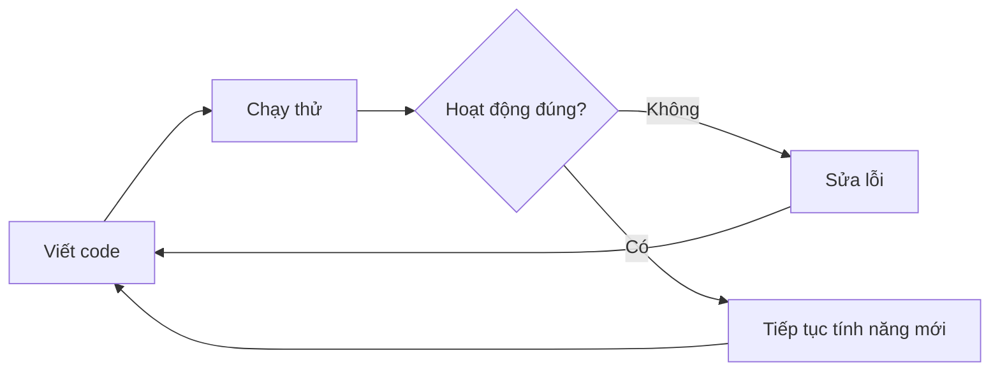

## Xây Dựng Ứng Dụng Etch-A-Sketch

### Mô Tả Thách Thức

Xây dựng ứng dụng vẽ tương tác giống đồ chơi Etch-A-Sketch cổ điển với các tính năng:

- Phím **W**: Di chuyển về phía trước
- Phím **S**: Di chuyển về phía sau
- Phím **A**: Xoay ngược chiều kim đồng hồ (trái)
- Phím **D**: Xoay theo chiều kim đồng hồ (phải)
- Phím **C**: Xóa toàn bộ hình vẽ và đưa rùa về giữa màn hình

Có thể vẽ các đường thẳng, đường cong, hoặc hình dạng phức tạp bằng cách kết hợp các phím.

### Thiết Lập Ban Đầu

```python
from turtle import Turtle, Screen

tim = Turtle()
screen = Screen()
screen.listen()
```


### Tạo Các Hàm Điều Khiển

**Di chuyển tiến và lùi:**

```python
def move_forwards():
    tim.forward(10)

def move_backwards():
    tim.backward(10)
```

**Xoay trái và phải - Cách 1 (sử dụng heading):**

```python
def turn_left():
    new_heading = tim.heading() + 10
    tim.setheading(new_heading)

def turn_right():
    new_heading = tim.heading() - 10
    tim.setheading(new_heading)
```

**Xoay trái và phải - Cách 2 (sử dụng left/right):**

```python
def turn_left():
    tim.left(10)

def turn_right():
    tim.right(10)
```


### Giải Thích Heading System

Hệ thống **heading (hướng)** trong turtle hoạt động theo góc độ:

- **0°**: Hướng Đông (phải)
- **90°**: Hướng Bắc (lên)
- **180°**: Hướng Tây (trái)
- **270°**: Hướng Nam (xuống)

Để xoay trái (ngược chiều kim đồng hồ), cộng thêm độ vào heading hiện tại. Để xoay phải (theo chiều kim đồng hồ), trừ đi độ từ heading hiện tại.

### Hàm Xóa Màn Hình

```python
def clear():
    tim.clear()      # Xóa tất cả hình vẽ của turtle này
    tim.penup()      # Nhấc bút lên để không vẽ khi di chuyển
    tim.home()       # Về vị trí gốc (0, 0) - giữa màn hình
    tim.pendown()    # Đặt bút xuống để sẵn sàng vẽ tiếp
```

**Lưu ý quan trọng:**

- `clear()`: Xóa hình vẽ của turtle cụ thể (không xóa turtle)
- `Screen.clear()`: Xóa toàn bộ màn hình bao gồm cả turtle
- `penup()` và `pendown()`: Ngăn việc vẽ đường khi turtle di chuyển về home


### Gắn Kết Event Listeners

```python
screen.onkey(move_forwards, "w")
screen.onkey(move_backwards, "s")
screen.onkey(turn_left, "a")
screen.onkey(turn_right, "d")
screen.onkey(clear, "c")

screen.exitonclick()
```


### Code Hoàn Chỉnh

```python
from turtle import Turtle, Screen

tim = Turtle()
screen = Screen()

def move_forwards():
    tim.forward(10)

def move_backwards():
    tim.backward(10)

def turn_left():
    tim.left(10)

def turn_right():
    tim.right(10)

def clear():
    tim.clear()
    tim.penup()
    tim.home()
    tim.pendown()

screen.listen()
screen.onkey(move_forwards, "w")
screen.onkey(move_backwards, "s")
screen.onkey(turn_left, "a")
screen.onkey(turn_right, "d")
screen.onkey(clear, "c")

screen.exitonclick()
```


### Các Phương Thức Turtle Quan Trọng

- `forward(distance)`: Di chuyển tiến về phía trước
- `backward(distance)`: Di chuyển lùi về phía sau
- `left(angle)`: Xoay trái theo góc độ
- `right(angle)`: Xoay phải theo góc độ
- `heading()`: Lấy hướng hiện tại (góc độ)
- `setheading(angle)`: Đặt hướng theo góc độ cụ thể
- `clear()`: Xóa tất cả hình vẽ của turtle
- `home()`: Di chuyển về vị trí gốc (0, 0)
- `penup()`: Nhấc bút lên (không vẽ khi di chuyển)
- `pendown()`: Đặt bút xuống (vẽ khi di chuyển)


### Kỹ Năng Đọc Documentation

Khi làm việc với thư viện mới, cần:

- Kiên nhẫn đọc và tìm kiếm phương thức phù hợp
- Thử nghiệm từng phương thức để hiểu cách hoạt động
- Chạy code thường xuyên sau mỗi thay đổi
- So sánh các phương thức tương tự để chọn cách tốt nhất
- Học từ lỗi và điều chỉnh code

**Ví dụ**: Có hai phương thức `clear()` trong documentation:

- `Turtle.clear()`: Chỉ xóa hình vẽ của turtle cụ thể
- `Screen.clear()`: Xóa toàn bộ màn hình bao gồm turtle


### Quy Trình Phát Triển



Chu trình phát triển phần mềm là quá trình lặp đi lặp lại: viết code → chạy thử → kiểm tra → sửa lỗi → tiếp tục. Đừng nản lòng khi gặp lỗi - học nhiều nhất khi mắc nhiều lỗi và phải vật lộn với vấn đề.

### Ghi Chú Thêm

**Lợi ích của event listeners:**

- Tạo ứng dụng tương tác với người dùng
- Dễ dàng thêm/thay đổi phím điều khiển
- Code rõ ràng, dễ bảo trì

**Hạn chế của `onkey()`:**

- Chỉ nhận hàm không có tham số (no arguments)
- Phải tạo riêng hàm cho mỗi hành động

**Liên kết:** [[Event Listeners]], [[Turtle Graphics]], [[Etch-A-Sketch]], [[Turtle Methods]], [[Screen Methods]], [[Heading System]], [[Documentation Reading]]

