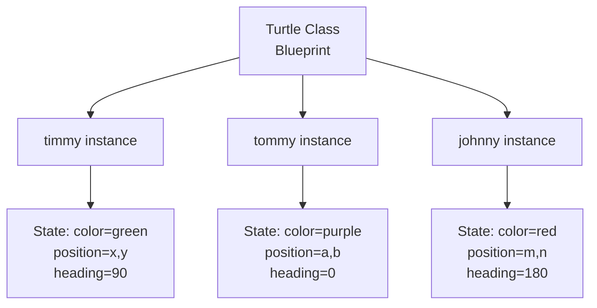

## Multiple Instances \& Object State

### Mục Tiêu: Xây Dựng Turtle Racing Game

Để tạo trò chơi đua rùa, cần có nhiều con rùa chạy đua trên cùng một đường đua và xác định con nào về đích trước. Nhưng làm sao để tạo nhiều turtle objects từ một blueprint?

### Khái Niệm Class và Object

**Class (Lớp)** là bản thiết kế (blueprint) định nghĩa:

- Một đối tượng nên trông như thế nào (appearance)
- Một đối tượng có thể làm gì (behavior)
- Những gì nó có (attributes)
- Những gì nó có thể thực hiện (methods)

**Object (Đối tượng)** là thực thể được tạo ra từ class:

```python
from turtle import Turtle

# Tạo object từ class Turtle
timmy = Turtle()
```

Trong ví dụ này:

- `Turtle` là class (blueprint)
- `timmy` là object được xây dựng từ class đó


### Multiple Instances - Tạo Nhiều Đối Tượng

Một class có thể tạo ra nhiều objects khác nhau. Mỗi object là một **instance (thể hiện)** riêng biệt của class đó.

```python
from turtle import Turtle

# Tạo nhiều turtle instances
timmy = Turtle()
tommy = Turtle()
johnny = Turtle()
jenny = Turtle()
benny = Turtle()
```

**Đặc điểm quan trọng:**

- Mỗi instance hoạt động hoàn toàn độc lập với nhau
- Mặc dù cùng là turtle objects, nhưng `timmy` và `tommy` là hai thực thể riêng biệt
- Giống như con người - bạn và tôi đều là human objects, nhưng là những individuals khác nhau


### Object State - Trạng Thái Đối Tượng

**State (Trạng thái)** là tập hợp các giá trị của attributes và actions mà một object đang có/thực hiện tại một thời điểm cụ thể.

Mỗi instance có thể có state khác nhau về:

**1. Attributes (Thuộc tính):**

```python
timmy = Turtle()
tommy = Turtle()

# State khác nhau về màu sắc
timmy.color("green")
tommy.color("purple")

# Timmy có state: color = "green"
# Tommy có state: color = "purple"
```

**2. Methods đang thực hiện:**

```python
# Timmy đang di chuyển (executing a method)
timmy.forward(100)

# Tommy đứng yên (not executing any method)
# Tommy is stationary
```


### Sơ Đồ Minh Họa: Class và Multiple Instances




### So Sánh State Giữa Các Instances

| Instance | Color State | Position State | Action State |
| :-- | :-- | :-- | :-- |
| timmy | green | (x, y) | Moving forward |
| tommy | purple | (a, b) | Stationary |
| johnny | blue | (m, n) | Turning left |

### Ứng Dụng Trong Turtle Racing Game

Trong trò chơi đua rùa, mỗi con rùa sẽ:

- Là một instance riêng biệt của Turtle class
- Có state riêng về vị trí trên đường đua
- Di chuyển với tốc độ khác nhau (state về speed)
- Hoạt động độc lập với các con rùa khác
- Cạnh tranh để về đích trước

**Ví dụ trong game:**

- Turtle 1: màu đỏ, vị trí (0, 100), đang di chuyển với speed=5
- Turtle 2: màu xanh, vị trí (0, 50), đang di chuyển với speed=8
- Turtle 3: màu vàng, vị trí (0, 0), đang di chuyển với speed=3


### Tại Sao Multiple Instances Quan Trọng?

**Lợi ích:**

- Tái sử dụng code: Chỉ cần một class, tạo nhiều objects
- Quản lý dễ dàng: Mỗi object độc lập, dễ theo dõi và điều khiển
- Linh hoạt: Mỗi instance có thể có state và behavior khác nhau
- Mô phỏng thực tế: Giống cách thế giới thực hoạt động (nhiều objects cùng loại nhưng khác nhau)

**Ứng dụng thực tế:**

- Game: Nhiều enemies, nhiều players
- Quản lý học sinh: Mỗi học sinh là một Student object
- E-commerce: Mỗi sản phẩm là một Product object
- Social media: Mỗi user là một User object


### Ghi Chú Thêm

Khái niệm **independence (tính độc lập)** là chìa khóa để hiểu multiple instances. Mỗi instance:

- Không ảnh hưởng đến instances khác
- Có memory space riêng
- Có thể thay đổi state mà không làm thay đổi state của instances khác

Trong bài học tiếp theo, sẽ thấy rõ hơn cách multiple instances hoạt động trong thực tế khi xây dựng turtle racing game với nhiều con rùa chạy đua độc lập với nhau.

**Liên kết:** [[Object-Oriented Programming]], [[Class]], [[Instance]], [[Object State]], [[Multiple Instances]], [[Turtle Racing Game]], [[Attributes]], [[Methods]], [[Independence]]

